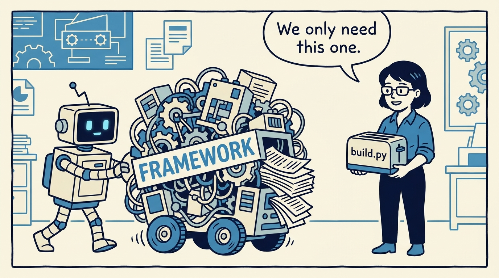
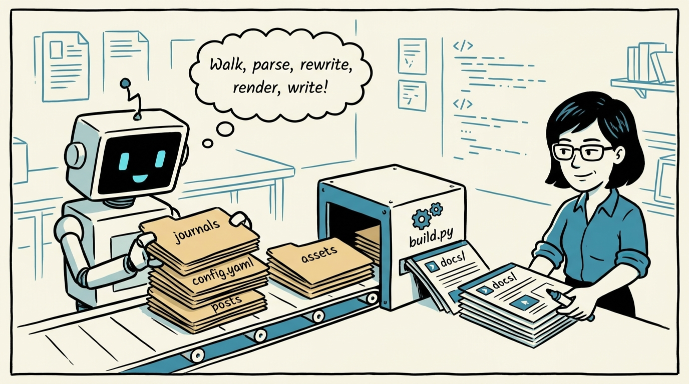
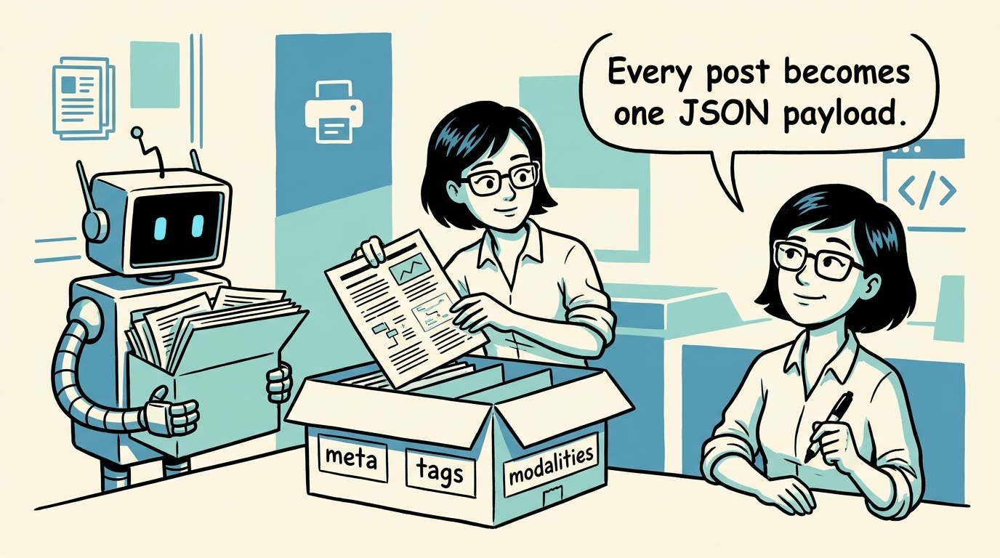
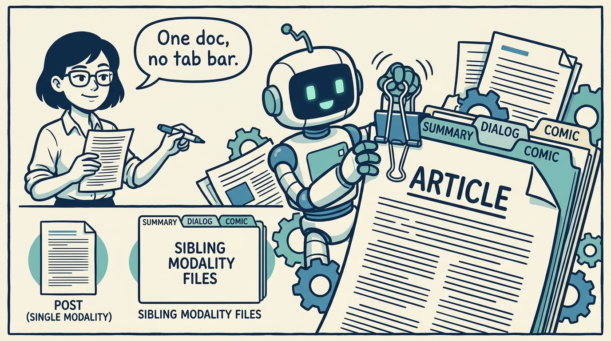
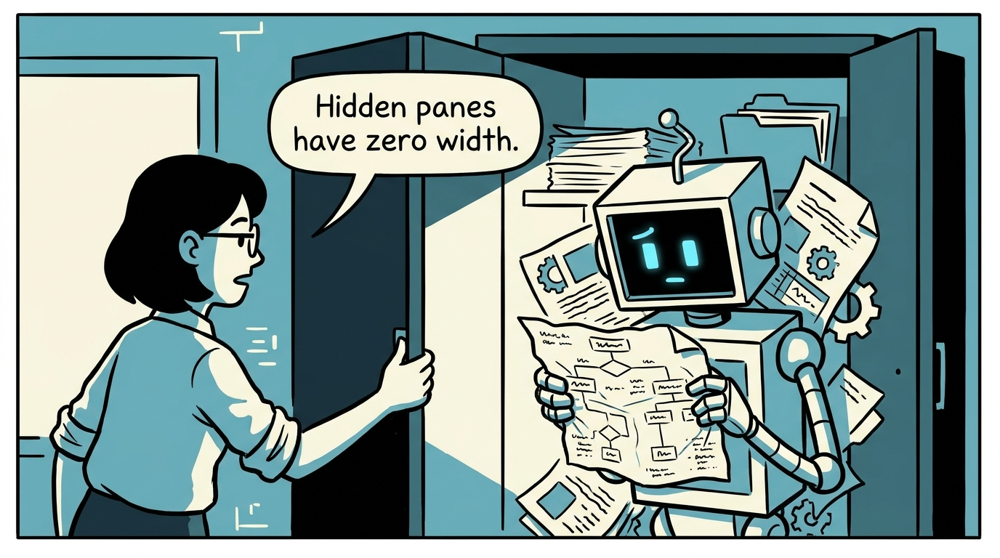
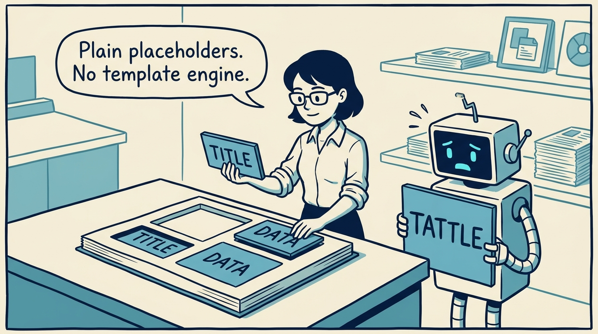
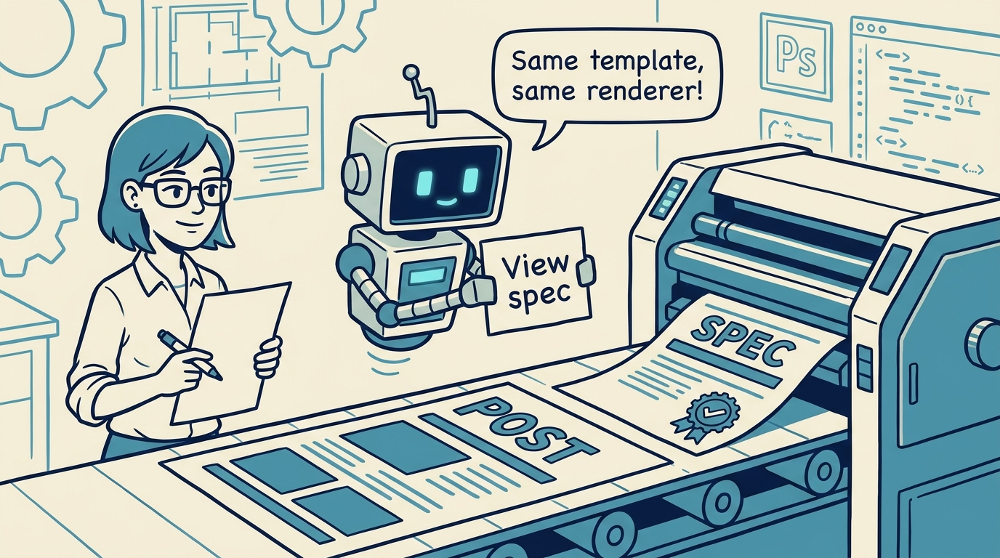
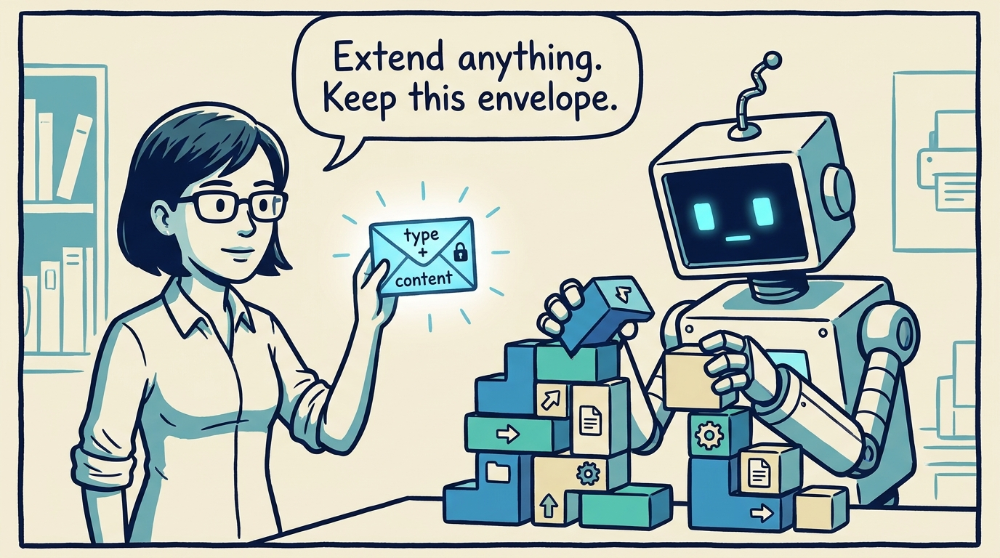

<!-- comic-style
{
  "cast": "MAYA: a pragmatic engineer-author, short dark hair, glasses, rolled-up sleeves, calm and slightly amused, often holding a marker or a printed page. REX: an over-eager boxy robot AI assistant, one bent antenna, glowing rectangular eyes, perpetually carrying or printing too many documents.",
  "style": "Clean two-tone explainer comic, thick ink outlines, flat colors with blue/teal accents on a light cream background, generous white space, hand-lettered speech bubbles with SHORT readable text (max 8 words per bubble), simple geometric office/library/print-shop settings mixing documents with software symbols, no photorealism, no dense text, no title text."
}
-->

How a deliberately small build turns markdown folders into a published journal — in eight panels.

**Panel 1:** *The generator does not try to be a framework — it reads a narrow shape and writes predictable HTML.*

**Panel 2:** *Walk the journals, parse config, read posts, rewrite paths, resolve links, write docs/.*

**Panel 3:** *Each post ships as JSON: meta, tags, and a list of modalities with their blocks.*

**Panel 4:** *Sibling summary.md, dialog.md, and comics.md become tabs; alone, the article looks like a plain page.*

**Panel 5:** *Mermaid and D3 measure their container — so non-default tabs render on first activation, not before.*

**Panel 6:** *No Jinja, no React — just __PLACEHOLDER__ substitution, easy to inspect but unforgiving of typos.*

**Panel 7:** *A spec.md becomes a sibling .spec.html page — same template, same renderer, status chip included.*

**Panel 8:** *The contract to preserve: every block is {type, content} — modalities wrap above it, never inside it.*
