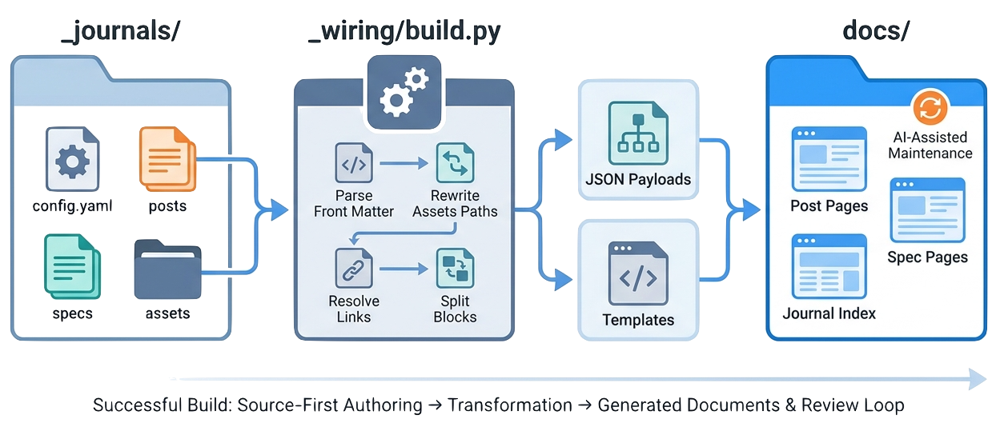

> The journal build is intentionally small: Python collects source into structured JSON payloads, templates embed those payloads, and browser-side JavaScript renders markdown, links, images, diagrams, and custom blocks.

The build pipeline is the implementation heart of [Spec-Driven Journals](https://github.com/zeljkoobrenovic/spec-driven-journals).

It is deliberately modest. The generator does not try to be a general static-site framework. It reads a narrow source shape, writes predictable HTML files, and lets shared templates handle browser-side rendering.

The previous articles describe what authors edit. This article describes what the system does with that source. Read it as a set of contracts rather than as a line-by-line walkthrough of every helper function.

## The Pipeline

At a high level, `_wiring/build.py` does this:

1. Walk `_journals/`.
2. Skip directories without `config.yaml`.
3. Parse each journal config.
4. Read the posts listed in each section.
5. Parse front matter and markdown body.
6. Collect sibling modality files (`summary.md`, `dialog.md`, `comics.md`) when present.
7. Rewrite `assets/...` paths in every modality body.
8. Resolve double-bracket permalink cross-links.
9. Split custom fenced blocks from markdown.
10. Merge per-post assets into generated journal assets.
11. Render post pages (with modality tabs), spec pages, and the journal index.
12. Write output under `docs/<journal>/`.

The successful build line looks like:

```text
[built] spec-driven-journals -> docs/spec-driven-journals
```

In Spec-Driven Journals, that generated output is published as the [Spec-Driven Journals site](https://zeljkoobrenovic.github.io/spec-driven-journals/), while the source and generator live in the [Spec-Driven Journals repository](https://github.com/zeljkoobrenovic/spec-driven-journals).


*Illustration placeholder: `journal-build-pipeline.png` should show `_journals/`, `config.yaml`, posts, specs, and assets flowing through `_wiring/build.py` into JSON payloads, templates, and generated `docs/` pages.*

## Config Is Parsed By A Tiny YAML Subset

Spec-Driven Journals does not depend on PyYAML.

`build.py` includes a small parser that supports the config shape Spec-Driven Journals uses:

- scalar key/value pairs
- lists of strings
- lists of mappings
- quoted strings

That is enough for `config.yaml`, but it is not a full YAML implementation. This is a deliberate tradeoff: fewer dependencies, less install friction, and a smaller contract.

The implication is practical. If a future journal needs advanced YAML features, either avoid them or improve the parser deliberately.

## Posts Become Payloads

Each post becomes a JSON payload shaped like this:

```json
{
  "meta": {},
  "tags": [],
  "modalities": [
    {
      "key": "index",
      "label": "Article",
      "meta": {},
      "blocks": [
        {"type": "markdown", "content": "..."}
      ]
    }
  ]
}
```

The `meta` object comes from front matter. `tags` is parsed from the comma-separated `tags:` field. `modalities` holds one entry per doc the post ships — the article plus any sibling `summary.md`, `dialog.md`, or `comics.md` (registry: `_MODALITIES` in `build.py`; list order is tab order). Each modality's `blocks` contains markdown plus any custom block types extracted by the build.

A plain post has exactly one modality, and the renderer shows no tab bar — the page looks like a single-article page. With more than one modality, the renderer shows a tab bar; the article is the default tab, non-default tabs render lazily on first activation, and the URL hash (`#summary`, `#dialog`, `#comics`) deep-links a tab.

This payload is embedded into the generated HTML inside:

```html
<script id="data" type="application/json">...</script>
```

The browser-side renderer reads that JSON and builds the page.

## Templates Use Placeholder Substitution

The templates are not Jinja, React, or a server-side rendering framework.

They use plain string placeholders:

| Template | Important placeholders |
| --- | --- |
| `_templates/index.html` | `__TITLE__`, `__DESCRIPTION__`, `__JOURNAL__`, `__LOGO_HTML__`, `__DATA_JSON__` |
| `_templates/post.html` | `__TITLE__`, `__SECTION_HTML__`, `__BYLINE__`, `__LOGO_HTML__`, `__POST_NAV__`, `__DATA_JSON__` |

This keeps the Python side easy to inspect. It also means template changes should be made carefully: a misspelled placeholder is not caught by a template engine.

## Specs Are Rendered With The Same Template

When a post folder has `spec.md`, the build renders a sibling page:

```text
docs/<journal>/<permalink>.spec.html
```

The post page gets a "View spec" link in the byline. The spec page uses the same post template, the same markdown renderer, and the same cross-link logic. Internally the spec payload is a single-modality payload, which is why spec pages never show a tab bar — the renderer has one code path for both cases.

Spec front matter controls the status chip:

```markdown
---
status: draft
revised: 2026-05-22
---
```

If a spec is marked `drifted` or `superseded`, the post's spec link is decorated so readers see that the contract may no longer match.

## Navigation Comes From Config Order

The build creates previous/next navigation from the flattened post order in `config.yaml`.

This is why the per-post folder layout matters. All listed paths end in `index.md`, so sorting by basename does not disturb config order. The config becomes the reading sequence.

## Rendering Happens In The Browser

`_templates/post.html` contains a small markdown renderer.

It supports:

- ATX headings
- paragraphs
- blockquotes
- fenced code blocks
- inline code
- bold, italic, strikethrough
- links
- images
- ordered and unordered lists
- horizontal rules
- GitHub-flavored tables

The renderer treats post content as trusted. Raw HTML is allowed to pass through because some posts embed custom HTML.

That trust assumption is important. Spec-Driven Journals is not currently designed for untrusted public user submissions.

## Why The Split Works

The Python side handles filesystem and source concerns:

- read files
- parse config
- rewrite asset paths
- resolve cross-links
- copy assets
- emit generated HTML

The browser side handles presentation concerns:

- render markdown
- render tags
- render modality tabs and lazily render non-default panes
- initialize Mermaid
- render force graphs
- render bubble charts
- handle custom block renderers

Lazy pane rendering is not an optimization detail: Mermaid, force-graph, and D3 measure their container's width, which is zero inside a hidden element. Panes therefore render on first activation, after they become visible.

This split keeps the build script small and makes renderer changes visible in one template.

## What To Preserve

The most important implementation contract is the block envelope:

```json
{"type": "...", "content": "..."}
```

New block types can be added, but the dispatcher expects that envelope. Changing it would require coordinated changes in `build.py` and `_templates/post.html`. The modality layer wraps *above* this envelope — adding a modality never touches the block contract.

The system is easy to extend because the contract is small. It stays easy only if extensions keep that contract clear.
