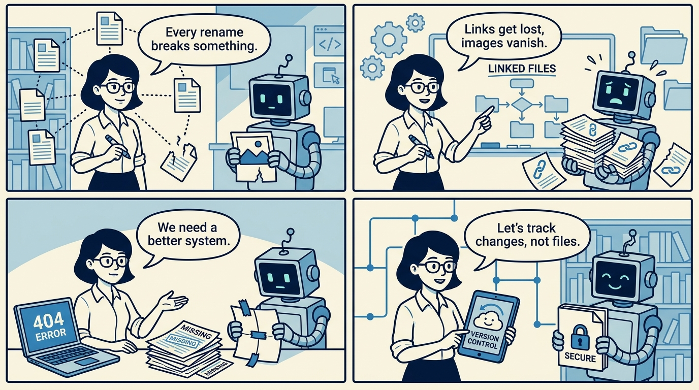
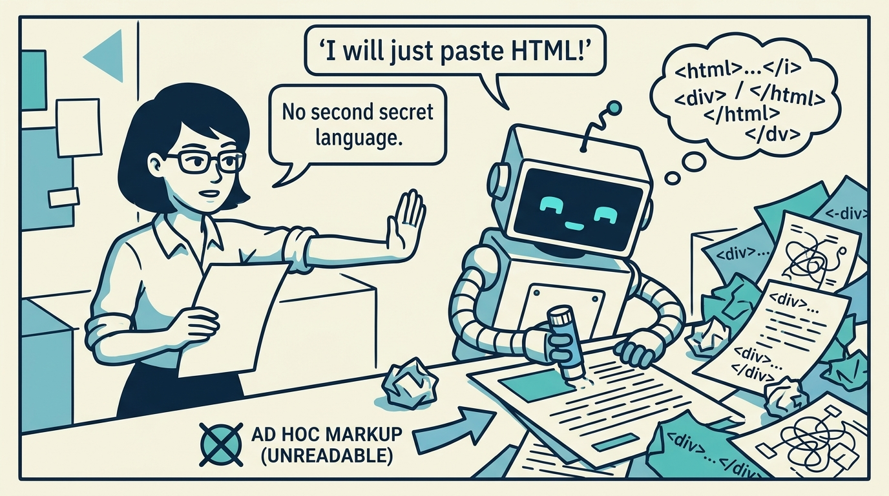
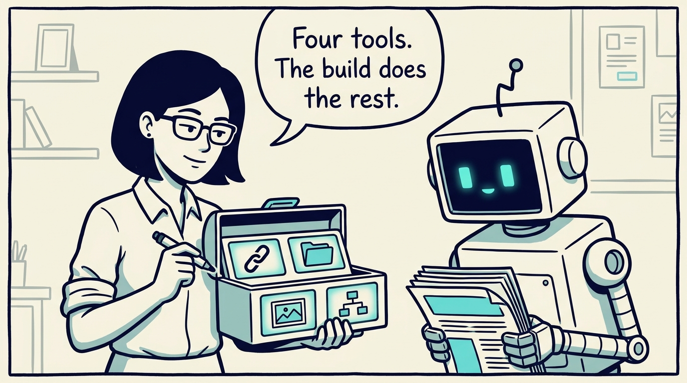
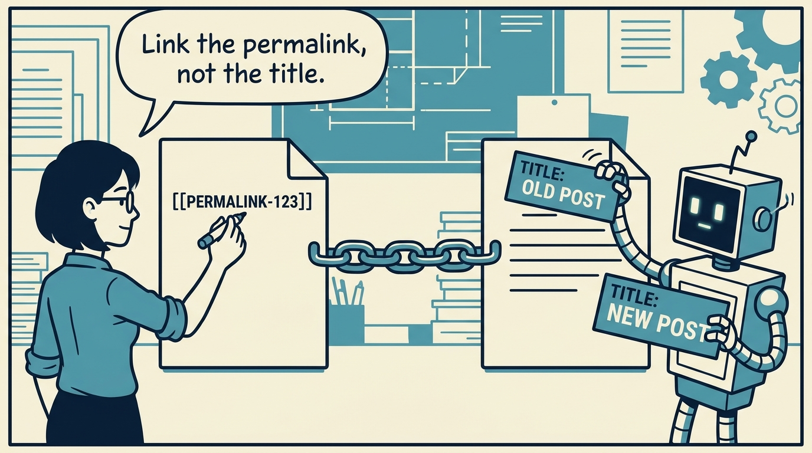
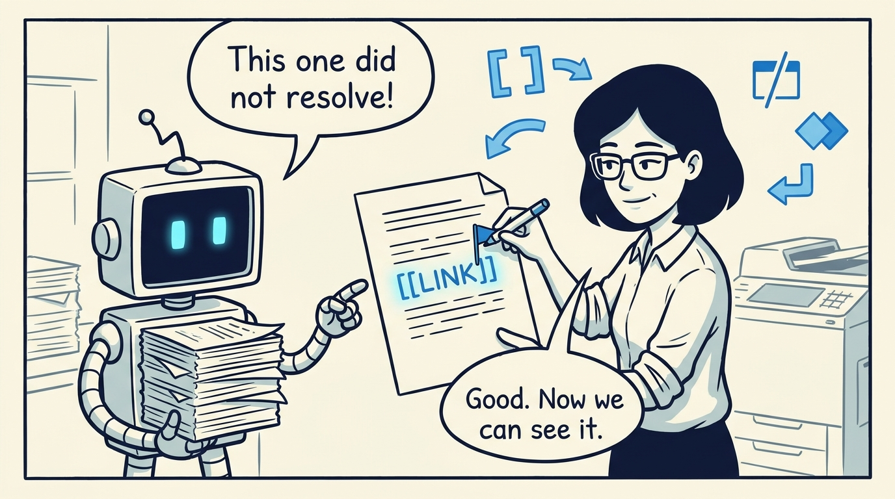
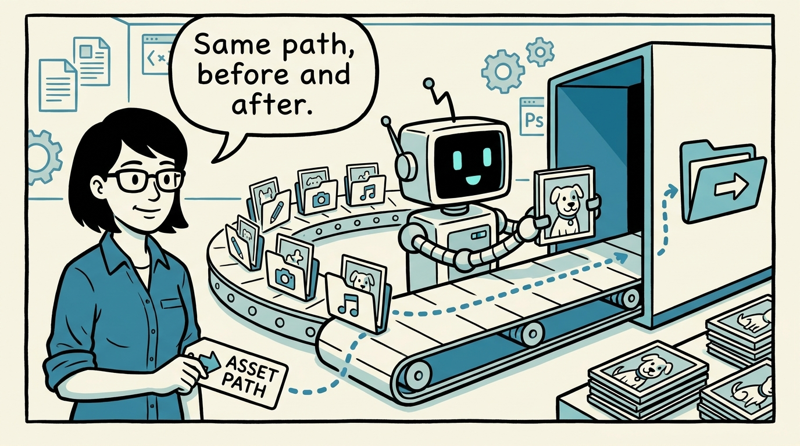
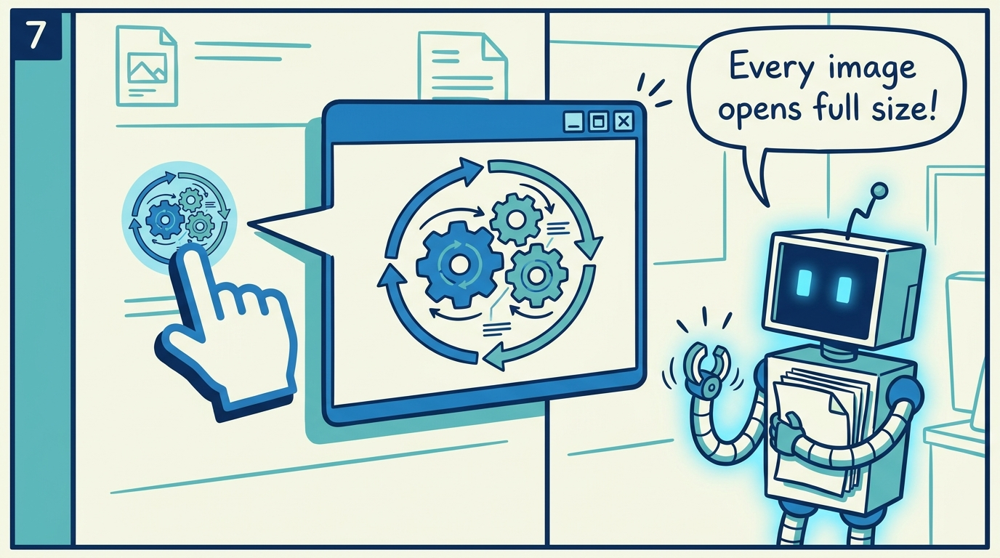
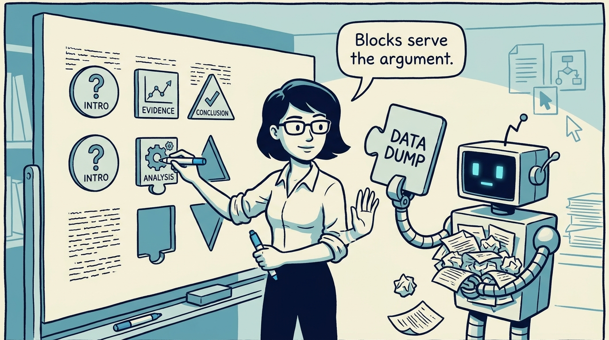

<!-- comic-style
{
  "cast": "MAYA: a pragmatic engineer-author, short dark hair, glasses, rolled-up sleeves, calm and slightly amused, often holding a marker or a printed page. REX: an over-eager boxy robot AI assistant, one bent antenna, glowing rectangular eyes, perpetually carrying or printing too many documents.",
  "style": "Clean two-tone explainer comic, thick ink outlines, flat colors with blue/teal accents on a light cream background, generous white space, hand-lettered speech bubbles with SHORT readable text (max 8 words per bubble), simple geometric office/library/print-shop settings mixing documents with software symbols, no photorealism, no dense text, no title text."
}
-->

How posts stay navigable while staying plain markdown — in eight panels.

**Panel 1:** *Left alone, links rot and image paths break.*

**Panel 2:** *The tempting fix: undocumented markup pasted into posts.*

**Panel 3:** *The idea: a deliberately small content model on top of markdown.*

**Panel 4:** *Double-bracket links resolve by permalink; titles can change freely.*

**Panel 5:** *Broken links stay visible — a TODO, not a silent failure.*

**Panel 6:** *Per-post assets merge at build time; the written path never changes.*

**Panel 7:** *Images render as links to themselves — click for full detail.*

**Panel 8:** *Four block types, one fixed contract — rich content supports the argument, never replaces it.*
