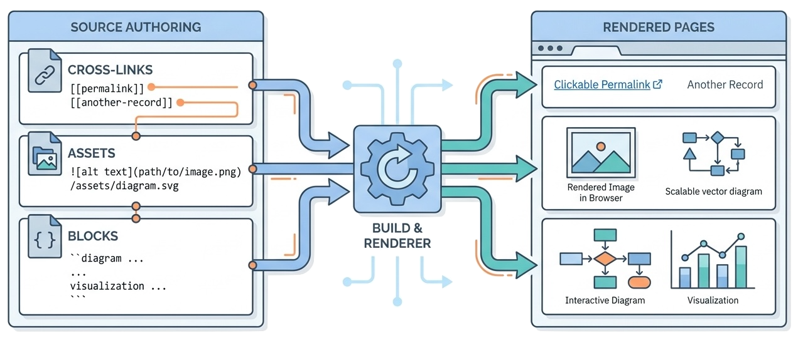

> Spec-driven journals stay navigable through stable cross-links, simple asset paths, generated clickable images, and a small set of custom block types for diagrams and visualizations.

Spec-Driven Journals uses a small content model, but it is not limited to plain paragraphs.

Posts can link to other records by permalink, include images and media, render tables, and use custom block fences for diagrams and visualizations. The goal is to keep authoring simple while making generated pages useful.

Everything in this article applies to every modality file in a post folder, not only `index.md`. A `summary.md`, `dialog.md`, or `comics.md` goes through the same pipeline: the same cross-link resolution, the same asset-path rewriting, and the same block fences.

Read this after [[anatomy-of-a-journal]]. Once the folder structure is clear, this article explains what can go inside the post body and how the build and renderer treat it.

## Content Features At A Glance

| Feature | Author writes | Generated result |
| --- | --- | --- |
| Cross-record links | Double-bracket permalink references. | Stable same-journal or cross-journal links using the target title. |
| Asset paths | `assets/...` paths in markdown or HTML attributes. | Paths rewritten and per-post assets copied into generated journal assets. |
| Markdown images | Standard markdown image syntax. | A rendered image wrapped in a link to the same file. |
| Custom blocks | Recognized fenced blocks such as Mermaid or force graphs. | Typed JSON blocks rendered by browser-side JavaScript. |


*Illustration placeholder: `links-assets-blocks-rendering-map.png` should show cross-links, asset paths, markdown images, and custom block fences becoming rendered links, clickable images, diagrams, and visualizations.*

## Cross-Record Links

Use double brackets for record links: two opening square brackets, the target permalink, and two closing square brackets.

For example, a source reference to the `spec-driven-authoring` permalink becomes a link to the corresponding foundation record after the build.

The build resolves that to a normal markdown link using the target post's `title:` and `permalink:`.

If the target is in the same journal, the output link points to:

```text
target.html
```

If the target is in another journal, the output link points to:

```text
../other-journal/target.html
```

If the target cannot be resolved, the literal double-bracket token stays visible. That is useful because unresolved links become authoring TODOs instead of silently disappearing.

## Why Links Use Permalinks

Cross-links use `permalink`, not file path or title.

That gives posts stable identities:

| Source reference | Why it works |
| --- | --- |
| the `markdown-records` permalink | The permalink is stable even if the title changes. |
| the `spec-driven-authoring` permalink | The build can resolve across journals. |
| a missing permalink | The unresolved token stays visible for follow-up. |

The build uses the target title as link text. Rewording a title updates link text on the next build without changing source links.

## Asset Paths

Post bodies should use paths relative to the journal root:

```markdown

```

For per-post assets, put the source file next to the post:

```text
_journals/<journal>/posts/<slug>/assets/images/diagram.png
```

During build, per-post assets are merged into:

```text
docs/<journal>/assets/
```

The same `assets/images/...` reference then works from the generated post page.

## Clickable Images

Markdown images render as images wrapped in links to the same file:

```html
<a class="image-link" href="assets/images/diagram.png" target="_blank">
  
</a>
```

That means readers can click an image and open it in a new tab.

Hero images defined through `logo:` are also wrapped in links. This is useful for diagrams, screenshots, and generated illustrations where the scaled page version may hide detail.

## Supported Markdown

The renderer supports the subset used by the journals:

- headings
- paragraphs
- blockquotes
- fenced code
- inline code
- bold and italic text
- strikethrough
- links and images
- ordered and unordered lists
- horizontal rules
- GitHub-flavored tables

The renderer is intentionally small. If Spec-Driven Journals needs richer markdown, update `_templates/post.html` deliberately rather than adding ad hoc generated HTML.

## Custom Block Types

The build recognizes custom fences and lifts them out of markdown into typed blocks.

| Block type | Opening fence | Role |
| --- | --- | --- |
| `mermaid` | `---begin mermaid---` | Mermaid diagrams rendered by Mermaid.js. |
| `force-graph` | `---begin force-graph---` | Network graphs rendered by the force-graph library. |
| `bubble-chart` | `---begin bubble-chart---` | Circle-packing charts rendered by D3. |
| `wardley-map` | `---begin wardley-map---` | Wardley maps passed through to the upstream web component. |

Each block is emitted as:

```json
{"type": "mermaid", "content": "..."}
```

The template renderer dispatches on `type`.

## Adding A New Block Type

To add a new block type:

1. Add a fence definition to `_BLOCK_FENCES` in `_wiring/build.py`.
2. Add a build-side parser if raw content needs transformation.
3. Add a renderer entry in `_templates/post.html`.
4. Rebuild affected journals.
5. Add an example post or documentation if the block changes author behavior.

Do not change the `{type, content}` envelope unless you are intentionally changing the renderer contract.

## Good Authoring Habits

Use cross-links when referring to durable records. Use ordinary links for external pages and one-off references. Keep image paths under `assets/...`. Give images meaningful alt text. Keep custom blocks small enough that a reader can still understand the surrounding article.

Rich content should support the argument. It should not become a second undocumented language inside the post.

After these content mechanics are clear, [[spec-driven-authoring-workflow]] explains how to move a substantive article from spec to generated review.
