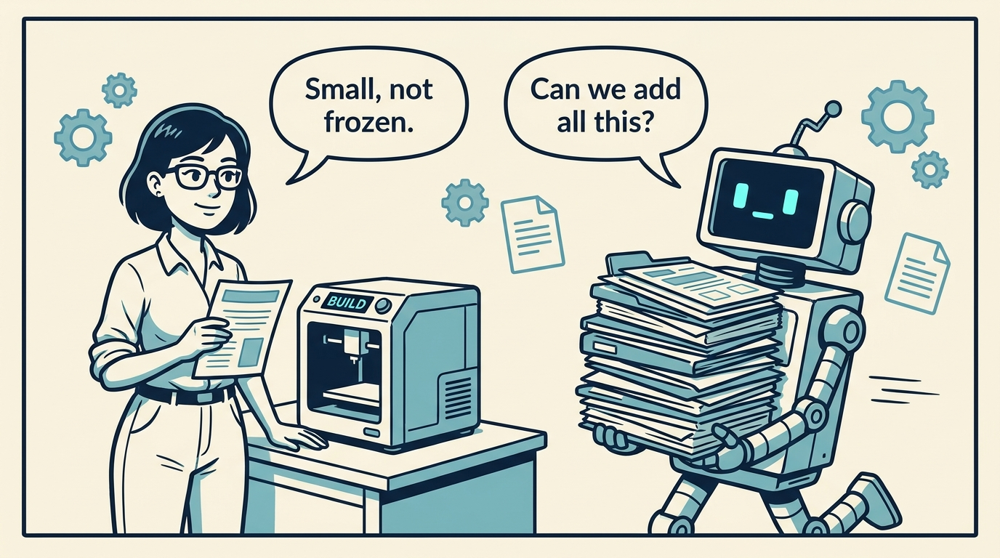
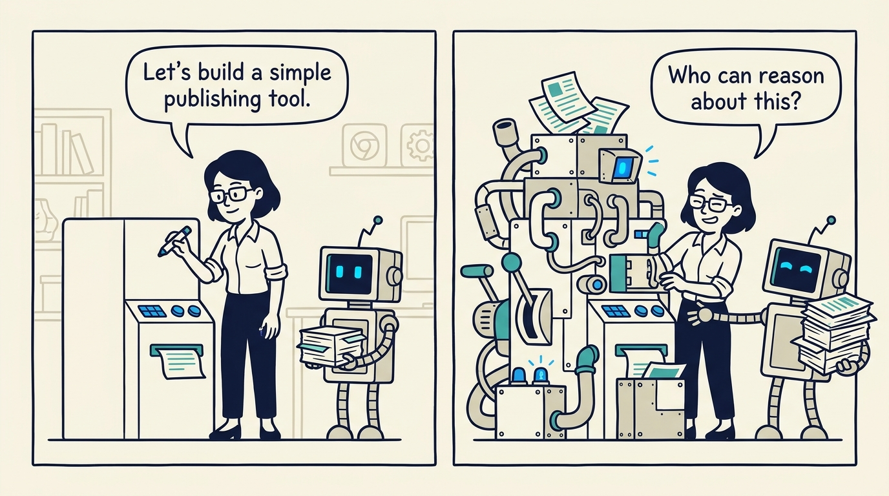
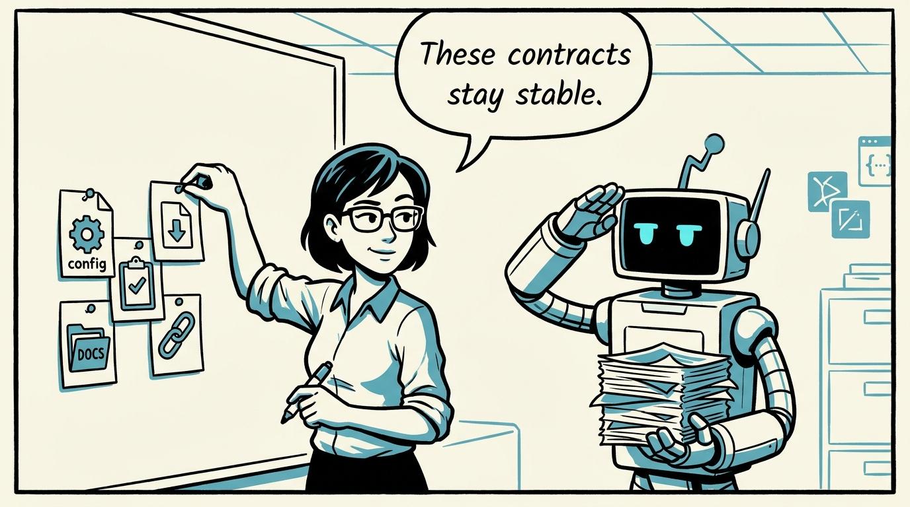
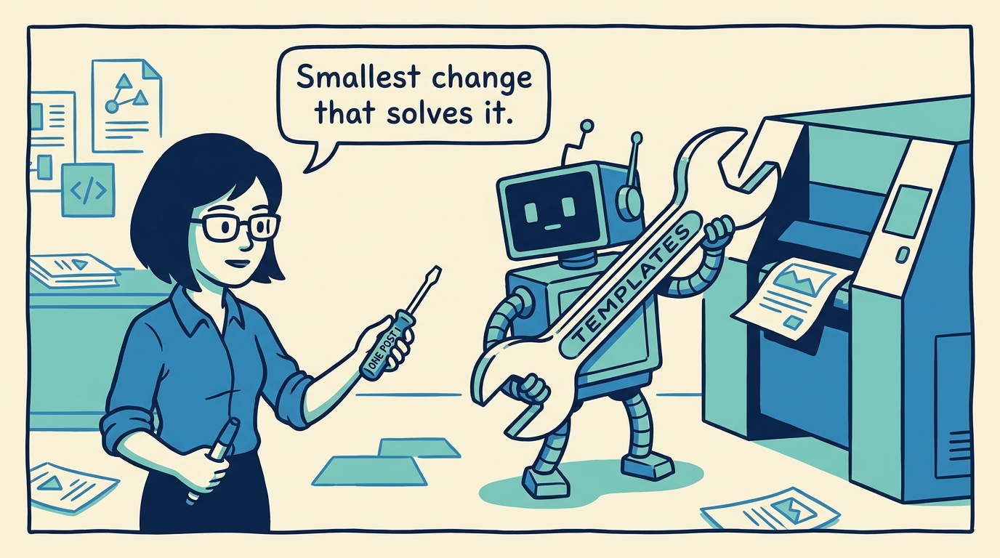
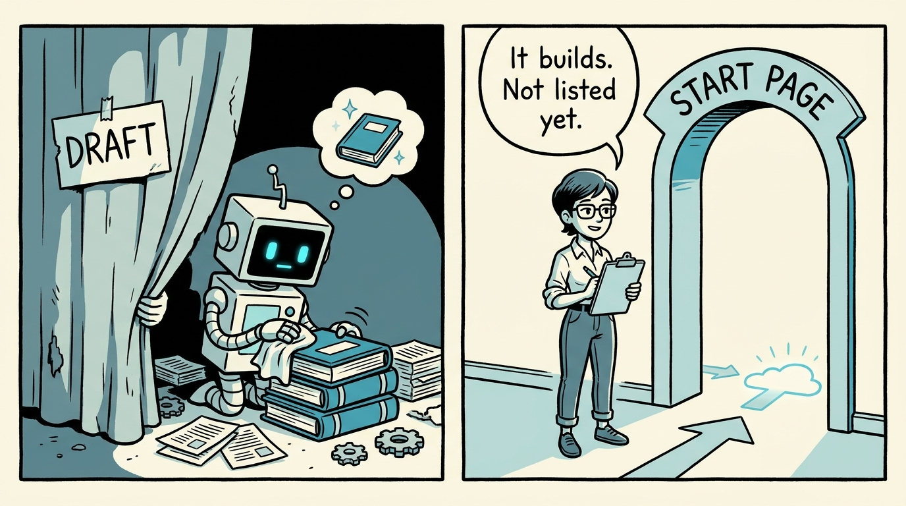
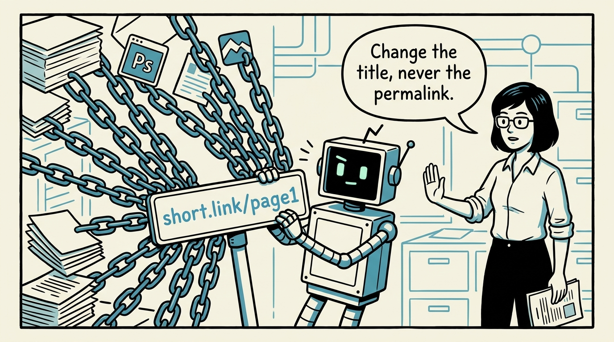
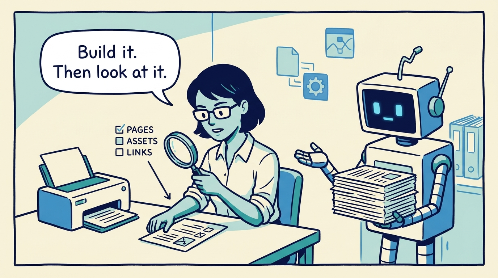
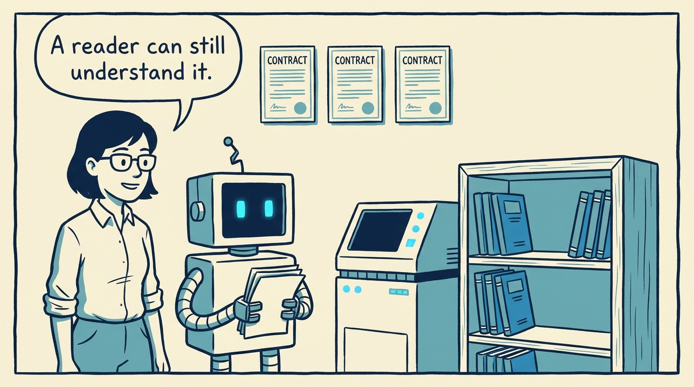

<!-- comic-style
{
  "cast": "MAYA: a pragmatic engineer-author, short dark hair, glasses, rolled-up sleeves, calm and slightly amused, often holding a marker or a printed page. REX: an over-eager boxy robot AI assistant, one bent antenna, glowing rectangular eyes, perpetually carrying or printing too many documents.",
  "style": "Clean two-tone explainer comic, thick ink outlines, flat colors with blue/teal accents on a light cream background, generous white space, hand-lettered speech bubbles with SHORT readable text (max 8 words per bubble), simple geometric office/library/print-shop settings mixing documents with software symbols, no photorealism, no dense text, no title text."
}
-->

How to grow a deliberately small publishing system without turning it into a hidden framework — in eight panels.

**Panel 1:** *Spec-Driven Journals is intentionally small — but it is not frozen.*

**Panel 2:** *The failure mode: extensions that turn a readable system into a hidden framework.*

**Panel 3:** *The core idea: protect a short list of contracts — config, front matter, specs, docs output, cross-links.*

**Panel 4:** *For each need, pick the lowest-impact change — a post before a format, a journal before a template.*

**Panel 5:** *A journal can build perfectly and stay off the start page — drafting and promoting are separate.*

**Panel 6:** *Titles can change freely; a published permalink cannot — every citation makes it more expensive.*

**Panel 7:** *No test suite yet — the habit is scoped builds plus inspecting rendered pages, assets, and links.*

**Panel 8:** *Extended, not complicated: the strength worth preserving is that a reader can understand the system.*
