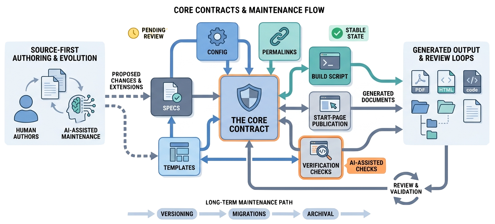

> Spec-driven journals can evolve safely when maintainers preserve the small build contract, keep source and generated output separate, add journals deliberately, and verify changes with scoped builds and rendered pages.

[Spec-Driven Journals](https://github.com/zeljkoobrenovic/spec-driven-journals) is intentionally small, but it is not frozen.

New journals can be added. Templates can change. The renderer can support new block types. The start page can publish new entries. Helper scripts can evolve.

The maintenance challenge is to extend the system without turning it into a hidden framework that authors and AI agents cannot reason about.

For Spec-Driven Journals, maintenance should keep two public entry points coherent:

| Entry point | Link |
| --- | --- |
| Official project repository | [github.com/zeljkoobrenovic/spec-driven-journals](https://github.com/zeljkoobrenovic/spec-driven-journals) |
| Generated journal site | [zeljkoobrenovic.github.io/spec-driven-journals](https://zeljkoobrenovic.github.io/spec-driven-journals/) |

## Preserve The Core Contract

The most important contracts are:

| Contract | Why it matters |
| --- | --- |
| `_journals/<journal>/config.yaml` defines journal order. | Authors can inspect the table of contents in one file. |
| Posts use front matter plus markdown body. | Metadata and prose stay together. |
| Non-trivial posts have sibling specs. | Intent stays visible across sessions. |
| Generated pages live under `docs/`. | Publication output is separate from source. |
| Cross-links use double-bracket permalink syntax. | Links survive title changes. |
| Blocks use `{type, content}`. | New renderers can plug in without changing the payload shape. |
| The core build uses the Python standard library. | A new machine can build without dependency setup. |


*Illustration placeholder: `journal-maintenance-contracts-map.png` should show the stable contracts around config, permalinks, specs, templates, build script, start-page publication, and verification checks.*

These contracts are what make Spec-Driven Journals learnable.

## Choose The Smallest Change

Most maintenance work should start with the smallest source change that solves the problem.

| Need | Usually change | Avoid starting with |
| --- | --- | --- |
| Add a new collection of articles. | A new journal folder, `config.yaml`, posts, and specs. | Template or build changes. |
| Add one article. | One post folder, one spec, and the journal config. | A new content format. |
| Add a repeated visual language. | A documented custom block type after several real examples. | Raw HTML copied into many posts. |
| Publish a generated journal on the start page. | `_start/_config/apps.json` and the start-page build. | Changing the journal generator. |
| Fix a rendered problem. | Source markdown, asset paths, templates, or build logic. | Manual edits under `docs/`. |

## Add A Journal

To add a journal:

1. Create `_journals/<journal>/config.yaml`.
2. Create `_journals/<journal>/posts/`.
3. Add at least one post folder with `index.md`.
4. Add `spec.md` for non-trivial posts.
5. Add post paths under `sections:` in `config.yaml`.
6. Build the journal.
7. Add the generated journal to the start page if it should be discoverable.

The journal build and start page build are separate. A new journal can generate correctly under `docs/<journal>/` and still not appear on the start page until `_start/_config/apps.json` is updated and `_start/generate-docs.py` is run.

That separation is useful. It lets maintainers draft a journal before promoting it to the start page.

## Add A Post

To add a post:

1. Create `_journals/<journal>/posts/<slug>/index.md`.
2. Create `_journals/<journal>/posts/<slug>/spec.md` if the work is substantive.
3. Add front matter with a stable `permalink`.
4. Add the post path to `config.yaml`.
5. Build the journal.
6. Inspect the generated post and spec pages.

For per-post folders, use the same slug for folder and permalink unless there is a clear reason not to. The system does not require that, but readers and maintainers benefit from the alignment.

## Add Or Change A Template

Template changes affect many pages.

Before changing `_templates/index.html`, `_templates/post.html`, or `_templates/site.css`, ask:

- Is this a journal-specific need or a global rendering need?
- Does the change affect existing posts?
- Does it preserve the JSON payload contract?
- Does it preserve raw HTML behavior where existing posts rely on it?
- Does it need a build-side change too?

Template changes should be verified by rebuilding at least the affected journal. Broad template changes should eventually be verified with a full build.

## Add A Custom Block Type

Custom blocks are the main extension point for richer content.

The pattern is:

1. Add a fence tuple in `_wiring/build.py`.
2. Optionally add a parser that transforms the raw block into JSON.
3. Add a renderer function in `_templates/post.html`.
4. Keep the block payload in the `{type, content}` envelope.
5. Document the authoring syntax.

Do not add a custom block just because markdown feels slightly inconvenient. Add one when it gives authors a reusable content language that improves several posts.

## Maintain Stable URLs

`permalink:` values are stable URLs.

Titles can change. Section names can change. Folder names can sometimes change before publication. But changing a permalink after publication breaks links and cross-record references.

This matters more as journals grow. The more a record is cited, the more expensive a permalink change becomes.

## Maintain Agent Instructions

`AGENTS.md`, `CLAUDE.md`, and Spec-Driven Journals READMEs are part of the operating system for AI-mediated authoring.

When build behavior changes, update the agent-facing instructions. Otherwise future agents will follow stale rules and produce reasonable-looking wrong work.

Good maintenance keeps three things aligned:

- actual implementation
- human-facing documentation
- agent-facing instructions

When those drift, Spec-Driven Journals becomes harder to work in.

## Verification Habits

There is no formal test suite yet. The practical checks are:

```bash
python3 -m py_compile _wiring/build.py _start/generate-docs.py
python3 _wiring/build.py
python3 _start/generate-docs.py
```

During scoped work, build the affected journal:

```bash
python3 -c "import _wiring.build as b; index_tpl=(b.TEMPLATES_DIR/'index.html').read_text(encoding='utf-8'); post_tpl=(b.TEMPLATES_DIR/'post.html').read_text(encoding='utf-8'); b.DOCS_DIR.mkdir(exist_ok=True); b.build_journal(b.JOURNALS_DIR/'spec-driven-journals', index_tpl, post_tpl, b.build_crosslink_index())"
```

Then inspect:

- generated index page
- changed post pages
- generated spec pages
- copied assets
- unresolved double-bracket links
- obvious rendering problems in tables, images, and custom blocks

## When To Keep It Small

The system should stay small unless a real need appears.

Avoid adding:

- dependencies that only save a few lines
- framework abstractions that hide simple file operations
- content formats that only one post uses
- generated metadata that no reader or maintainer uses
- styling systems that make the templates harder to inspect

Spec-Driven Journals' strength is that a reader can understand it. Preserve that.

## The Closing Principle

Spec-driven journals work when Spec-Driven Journals remains a clear collaboration surface.

Humans bring intent and judgment. AI agents help edit and verify. Source files preserve the durable artifact. Generated pages make it readable. The build connects those layers with as little machinery as possible.

That is the system worth maintaining.
