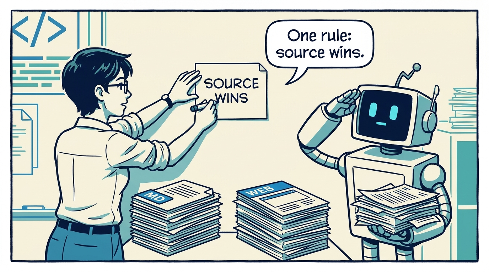
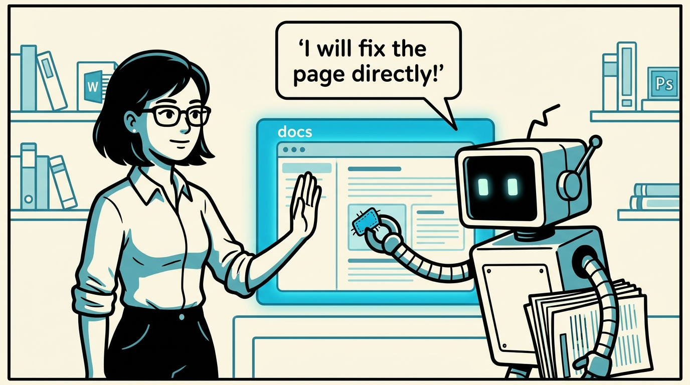
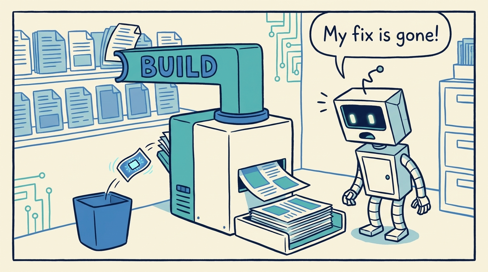
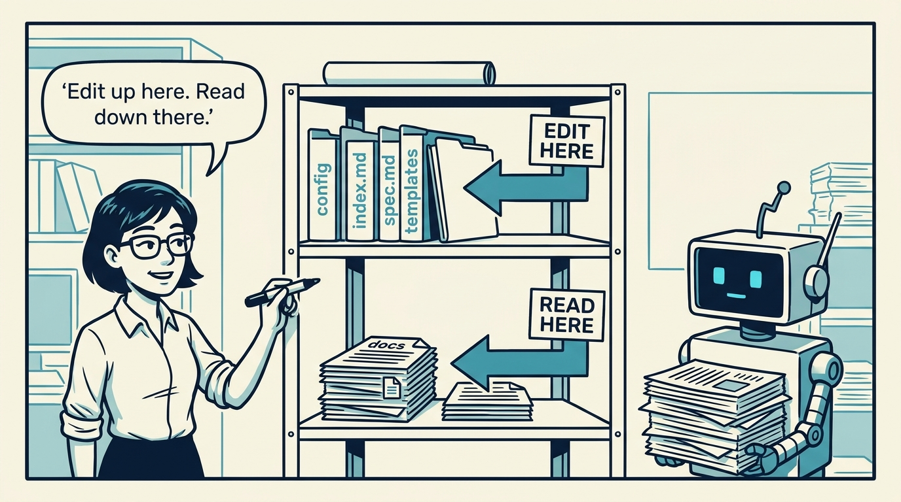
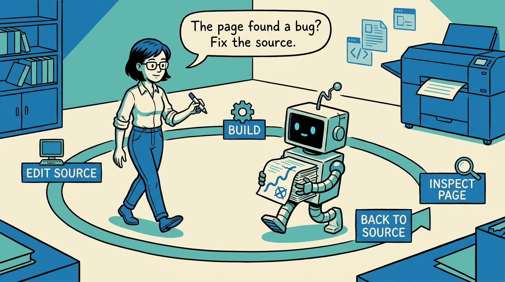
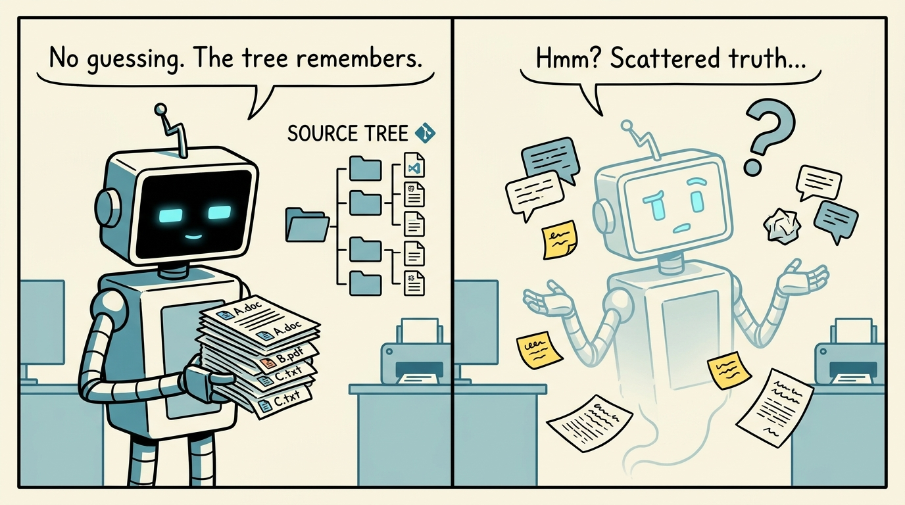
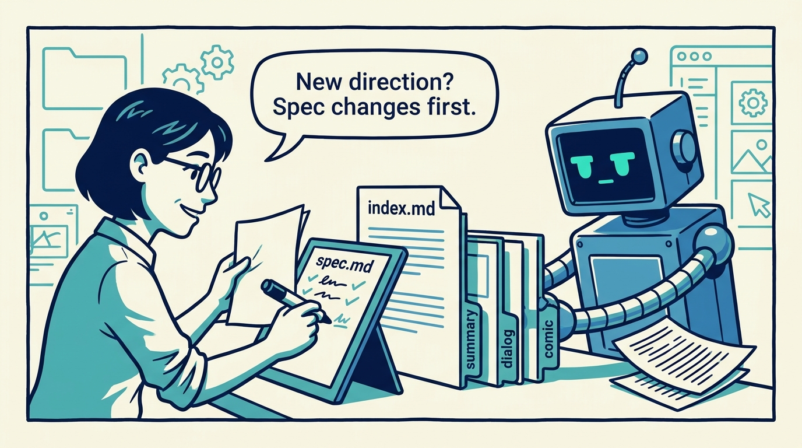
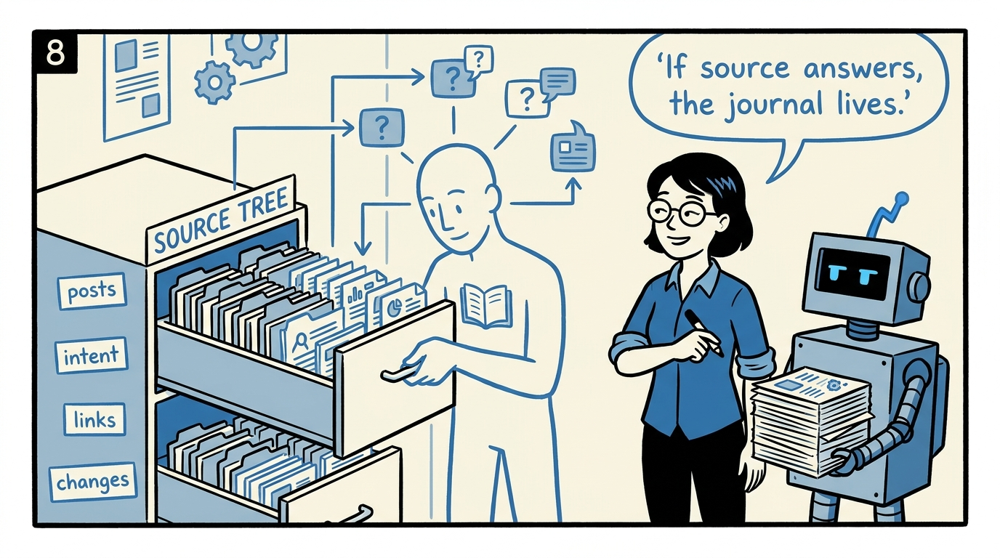

<!-- comic-style
{
  "cast": "MAYA: a pragmatic engineer-author, short dark hair, glasses, rolled-up sleeves, calm and slightly amused, often holding a marker or a printed page. REX: an over-eager boxy robot AI assistant, one bent antenna, glowing rectangular eyes, perpetually carrying or printing too many documents.",
  "style": "Clean two-tone explainer comic, thick ink outlines, flat colors with blue/teal accents on a light cream background, generous white space, hand-lettered speech bubbles with SHORT readable text (max 8 words per bubble), simple geometric office/library/print-shop settings mixing documents with software symbols, no photorealism, no dense text, no title text."
}
-->

Why you edit the markdown and never the generated page — in eight panels.

**Panel 1:** *The most important rule in Spec-Driven Journals is simple: source wins.*

**Panel 2:** *The generated page is right there. Fixing it there is the trap.*

**Panel 3:** *During a build, docs is removed and recreated. Manual changes there do not survive.*

**Panel 4:** *The canonical layer is for editing; the generated layer is for reading and review.*

**Panel 5:** *Change source, build, inspect, return to source. The rendered page is feedback, not a canvas.*

**Panel 6:** *Agents inspect source before acting. Scattered truth means guessing, and guessing breeds confident wrong output.*

**Panel 7:** *When a post changes direction, the spec changes first - that is how intent stays visible across sessions.*

**Panel 8:** *The practical test: if the answers live in source, the journal keeps improving. If they live in memory, it decays.*
