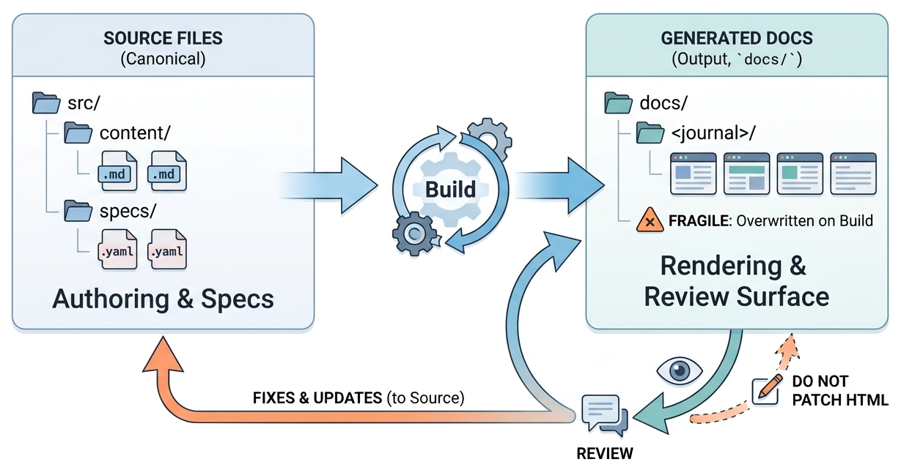

> A spec-driven journal is useful because it separates canonical source from generated output: authors change markdown, specs, config, and assets, while generated HTML remains the review and publication surface.

The most important rule in [Spec-Driven Journals](https://github.com/zeljkoobrenovic/spec-driven-journals) is simple: **source wins**.

The generated site matters. It is what readers see, search, and share. But the generated site is not where durable changes belong. Durable changes belong in source files under `_journals/`, `_templates/`, `_wiring/`, and `_start/`.

That rule connects this journal to two existing records: [[markdown-records]] and [[markdown-records-as-canonical]]. Those records explain the broader principle. This article explains how the principle works inside Spec-Driven Journals.

The canonical source is the [official Spec-Driven Journals repository](https://github.com/zeljkoobrenovic/spec-driven-journals). The public reading surface is the [generated Spec-Driven Journals site](https://zeljkoobrenovic.github.io/spec-driven-journals/).

## The Canonical Layer

The canonical layer contains files that humans and AI agents should edit:

| Source file | Why it matters |
| --- | --- |
| `_journals/<journal>/config.yaml` | Declares the journal title, description, sections, and ordered post list. |
| `_journals/<journal>/posts/<slug>/index.md` | The published article source. |
| `_journals/<journal>/posts/<slug>/spec.md` | The working contract for non-trivial article work. |
| `_journals/<journal>/posts/<slug>/assets/` | Per-post images and other media. |
| `_templates/index.html` and `_templates/post.html` | Shared rendering templates. |
| `_templates/site.css` | Shared visual styling. |
| `_wiring/build.py` | The build pipeline that turns journal source into generated pages. |
| `_start/_config/apps.json` | The start-page catalog of published journals. |

These files are reviewable in git. They can be diffed, cited, linted, generated from, and read by an AI coding agent before it changes anything.

## The Generated Layer

The generated layer lives under `docs/`.

It is still important:

- it shows whether the article reads well after rendering
- it exposes broken cross-links and missing assets
- it gives reviewers a browser-friendly surface
- it is what static hosting can publish
- it lets non-authors read the system without opening markdown files

But generated HTML is output. During a build, `docs/<journal>/` is removed and recreated for each journal being built. Any manual change made there is fragile because the next build can overwrite it.

*Illustration placeholder: `source-first-journal-workflow.png` should show canonical source files on the left, generated docs on the right, and a review loop that returns fixes to source rather than patching generated HTML.*

## Why This Helps Authors

Source-first authoring gives writers a stable workflow:

1. Change the post, spec, config, template, or script.
2. Build the journal.
3. Inspect generated output.
4. If the rendered page exposes a problem, return to source.
5. Commit source and generated output together when the change is meant to publish.

The generated site becomes a feedback loop, not a second editing surface.

That distinction prevents a common documentation failure: the source says one thing, the published page says another, and no one knows which one to trust.

## Why This Helps AI Agents

AI agents need stable context.

If the source of truth is a set of markdown files and small scripts, an agent can inspect the current system before acting. It can read the config, find the post, check the spec, understand the build, make scoped edits, run a scoped build, and summarize the result.

If the source of truth is scattered across generated pages, chat history, local browser edits, and unpublished documents, the agent has to guess. Guessing is where confident but wrong output starts.

Spec-Driven Journals reduces that risk by making the source tree the memory.

## The Role of Specs

Specs are part of the source of truth, but they are not the same as posts.

| Artifact | Role |
| --- | --- |
| `spec.md` | States the intent and contract for a post. |
| `index.md` | Carries the published argument. |
| generated `.spec.html` | Lets reviewers inspect the contract in the browser. |
| generated post HTML | Lets readers inspect the article in the browser. |

When a post changes direction, the spec should change first. If the post has moved beyond the spec, the spec is drifted and should be reconciled.

That is not process for its own sake. It is how Spec-Driven Journals keeps intent visible across AI-mediated sessions.

## What Source-First Does Not Mean

Source-first does not mean every thought must be written in markdown before discussion. Conversations, sketches, meetings, and AI sessions can all help shape the work.

It also does not mean generated pages are unimportant. A post that builds but reads poorly in the browser is not done.

The point is narrower and stronger: when the durable artifact is accepted, its canonical form belongs in source.

## The Practical Test

A journal is behaving like source of truth when a future author can answer these questions from Spec-Driven Journals source alone:

- Which posts exist, and in what order?
- What is the permalink for each post?
- What was the intent of the post?
- Which source files generate the page?
- Which template renders it?
- Which assets does it depend on?
- Which related records does it link to?
- What changed in the last meaningful authoring session?

If those answers live in source, the journal can keep improving. If they live only in memory, the journal decays.
