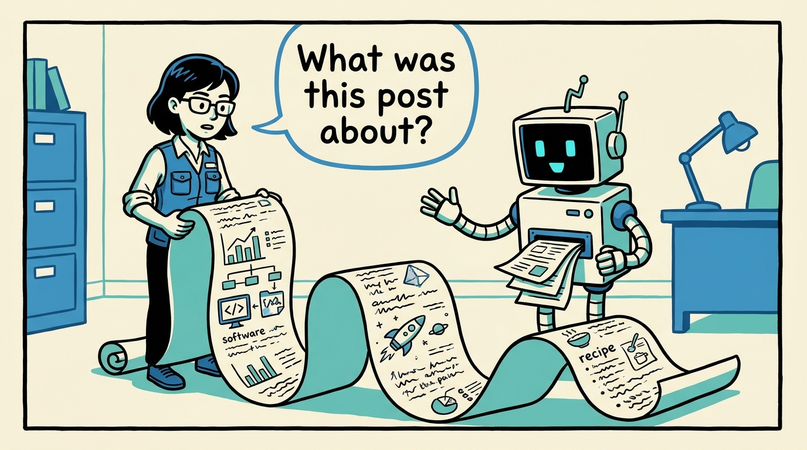
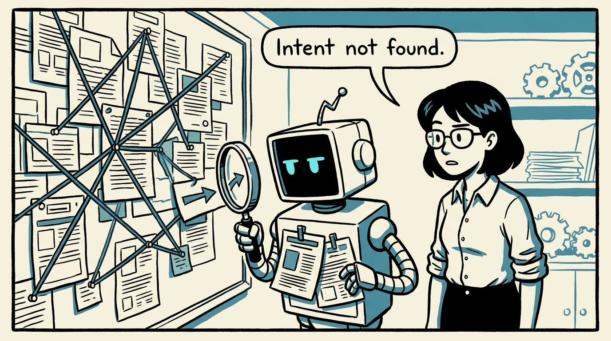
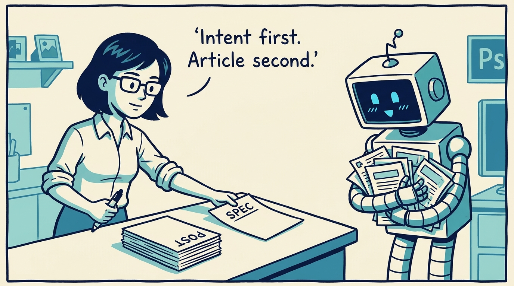
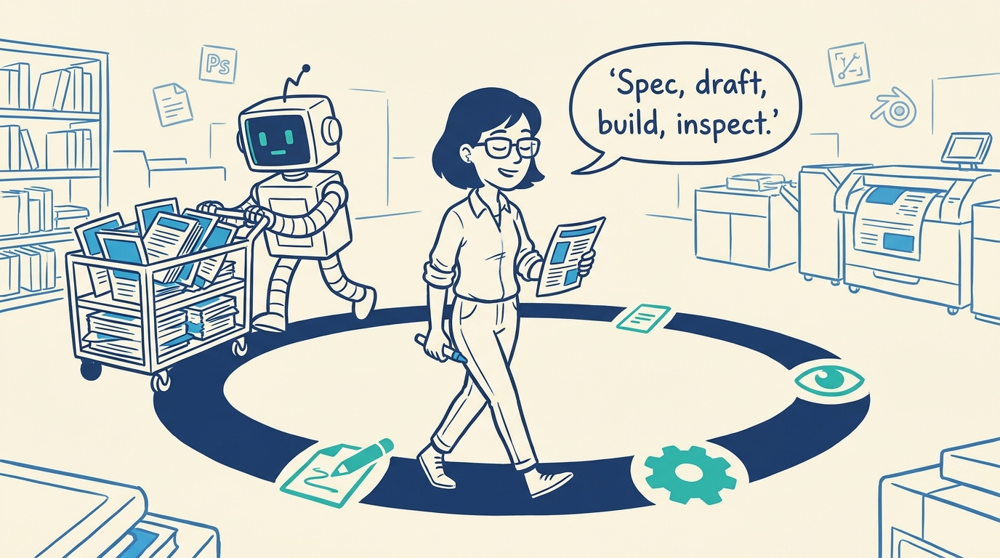
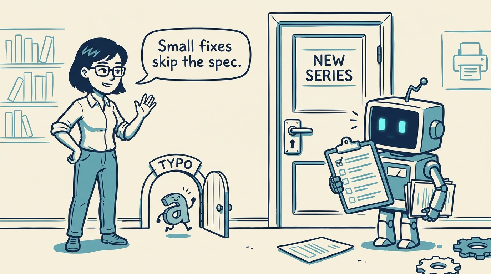
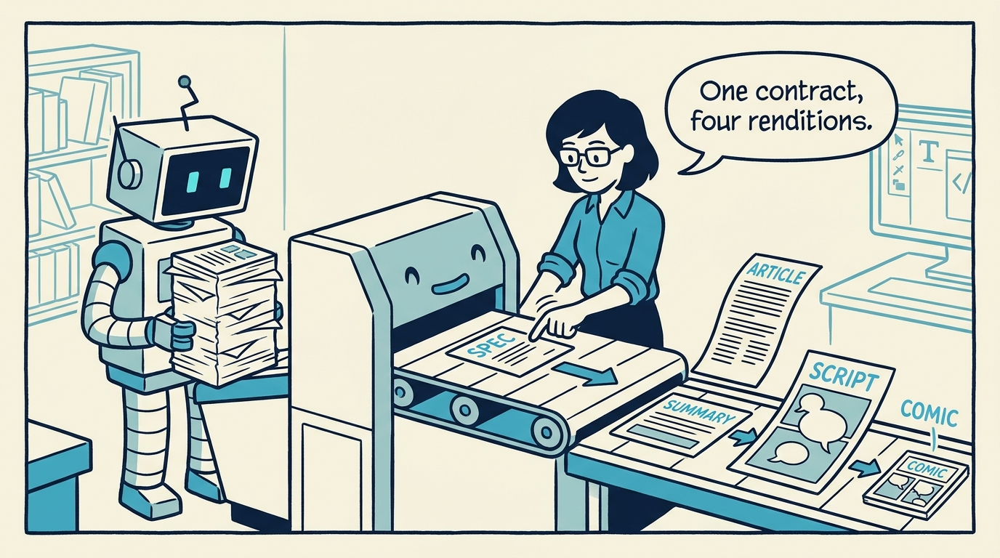
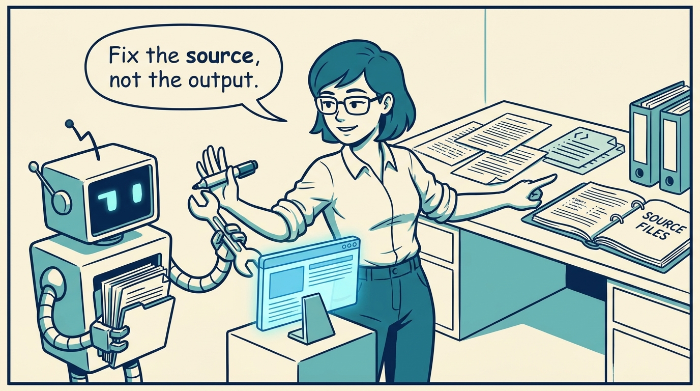
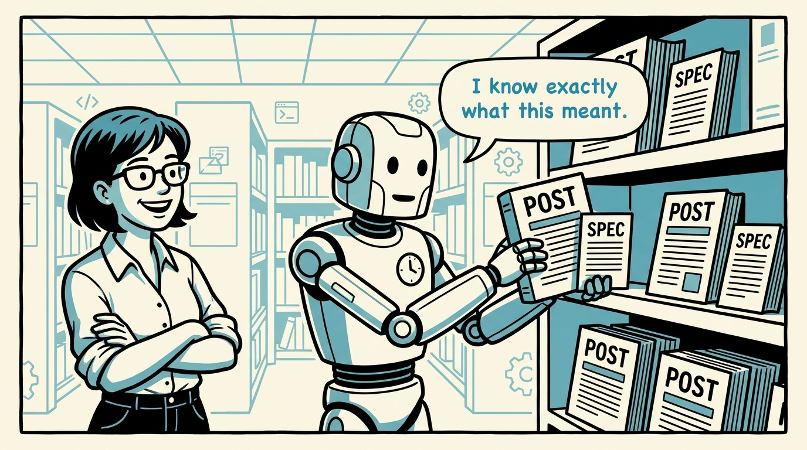

<!-- comic-style
{
  "cast": "MAYA: a pragmatic engineer-author, short dark hair, glasses, rolled-up sleeves, calm and slightly amused, often holding a marker or a printed page. REX: an over-eager boxy robot AI assistant, one bent antenna, glowing rectangular eyes, perpetually carrying or printing too many documents.",
  "style": "Clean two-tone explainer comic, thick ink outlines, flat colors with blue/teal accents on a light cream background, generous white space, hand-lettered speech bubbles with SHORT readable text (max 8 words per bubble), simple geometric office/library/print-shop settings mixing documents with software symbols, no photorealism, no dense text, no title text."
}
-->

How a small sibling spec keeps every post, build, and fix pointed at the same intent — in eight panels.

**Panel 1:** *The failure mode of substantial writing is not typos. It is drift.*

**Panel 2:** *Three sessions later, nobody can say what the piece was supposed to do.*

**Panel 3:** *State the intent in a sibling spec, then draft the post from that contract.*

**Panel 4:** *Spec, draft, build, inspect, fix at source — the order is the discipline.*

**Panel 5:** *A post needs a spec when the intent is not self-evident from the title.*

**Panel 6:** *The spec's Modalities section declares which docs the post warrants beyond the article.*

**Panel 7:** *If the page reads poorly, go back to the source and rebuild.*

**Panel 8:** *Future sessions get cheaper: inspect the article, the spec, or both — no archaeology required.*
