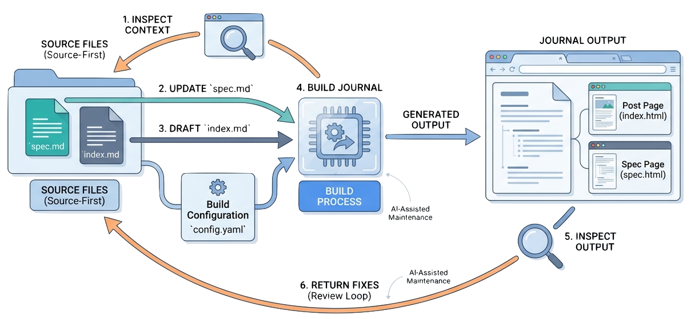

> Spec-driven authoring is the practical workflow inside Spec-Driven Journals: state the intent in a sibling spec, draft the post from that contract, build the journal, inspect the generated page, and return fixes to source.

Spec-driven authoring is not a large process. It is a small discipline that keeps substantial writing from drifting.

The durable rationale lives in [[spec-driven-authoring]]. This article turns that rationale into a day-to-day workflow for [Spec-Driven Journals](https://github.com/zeljkoobrenovic/spec-driven-journals).

The previous article, [[cross-links-assets-and-blocks]], covered what can go inside a post body. This one covers the order of work: how source, specs, posts, builds, and review fit into one repeatable loop.

## The Workflow

For a non-trivial article, work in this order:

1. Inspect the journal and related records.
2. Create or update `spec.md`.
3. Draft or revise `index.md`.
4. Add the post to `config.yaml` if it is new.
5. Add modality docs (`summary.md`, `dialog.md`, `comics.md`) if the spec calls for them.
6. Build the affected journal.
7. Inspect the generated post and spec pages.
8. Return fixes to source.
9. Summarize changed files, build result, and remaining gaps.

The important part is the order. The spec comes before the article when the article's intent is meaningful enough to drift.


*Illustration placeholder: `spec-driven-authoring-loop.png` should show the loop from inspect context, update `spec.md`, draft `index.md`, build the journal, inspect generated output, and return fixes to source.*

## What Counts As Non-Trivial

A post needs a spec when the intent is not self-evident from the title.

Examples:

| Change | Spec needed? | Reason |
| --- | --- | --- |
| New article series | Yes | The intent, audience, sequence, and sources need to be explicit. |
| New foundation record | Yes | The record shapes durable practice. |
| Major rewrite of an existing post | Yes | The old and new intent may diverge. |
| Small typo fix | No | The intent is already clear. |
| Broken image path fix | Usually no | The change is mechanical. |
| Status flip or metadata correction | Usually no | The post argument is not changing. |

This journal uses specs for every article because the articles are part of a new collection and each one has a distinct role.

## What The Spec Should Say

A useful spec is short and concrete.

It should answer:

- What does this article need to land?
- Who is the reader?
- What can a reviewer check?
- What is deliberately out of scope?
- What is still unresolved?
- Which sources shaped the draft?
- What changed while drafting?

The success criteria are especially important. They let the author, reviewer, and AI agent evaluate the post against a shared contract instead of against taste alone.

## Draft The Post From The Spec

Once the spec exists, the post should satisfy it.

That does not mean the post must mechanically follow the spec headings. It means the post should land the intent and success criteria. The article can have its own narrative structure.

The distinction matters:

| Spec | Post |
| --- | --- |
| Working contract. | Published artifact. |
| Written for authoring and review. | Written for readers. |
| Captures intent, sources, and changelog. | Carries the argument. |
| Can be terse. | Should be readable. |

If the post discovers a better direction, update the spec. If the spec no longer describes the post, the work has drifted.

## One Spec, Several Modalities

A spec can drive more than the article. The spec's **Modalities** section declares which additional docs the post warrants:

| Modality file | Tab | What it is |
| --- | --- | --- |
| `index.md` | Article | The detailed main article — required, default tab. |
| `summary.md` | Summary | A management summary (300–500 words) keyed to the spec's success criteria and non-goals. |
| `dialog.md` | Conversation | A two-host conversation that walks the success criteria as dialogue beats. |
| `comics.md` | Comic | An explainer comic of generated panels, one beat per panel. |

The article is always written first; the other modalities derive from the spec plus the finished article. Each modality has a dedicated authoring skill (in `.claude/skills/`: `detailed-article`, `management-summary`, `podcast-dialog`, `explainer-comics`), and all of them treat the spec as a read-only contract — if a modality reveals drift, the spec gets reconciled, not bypassed.

## Build The Journal

For a normal full publication pass, Spec-Driven Journals documents:

```bash
python3 _wiring/build.py
python3 _start/generate-docs.py
```

During a scoped edit, it is often better to build only the affected journal so unrelated dirty output is not touched. The generator exposes `build_journal()` for that pattern:

```bash
python3 -c "import _wiring.build as b; index_tpl=(b.TEMPLATES_DIR/'index.html').read_text(encoding='utf-8'); post_tpl=(b.TEMPLATES_DIR/'post.html').read_text(encoding='utf-8'); b.DOCS_DIR.mkdir(exist_ok=True); b.build_journal(b.JOURNALS_DIR/'spec-driven-journals', index_tpl, post_tpl, b.build_crosslink_index())"
```

The full build remains the publication-level check. Scoped builds are useful while collaborating in a dirty worktree.

After publication, the public reading surface is the [generated Spec-Driven Journals site](https://zeljkoobrenovic.github.io/spec-driven-journals/). Source changes should still be reviewed in the [official Spec-Driven Journals repository](https://github.com/zeljkoobrenovic/spec-driven-journals).

## Inspect The Generated Output

After building, check the generated files:

- `docs/<journal>/index.html`
- `docs/<journal>/<permalink>.html`
- `docs/<journal>/<permalink>.spec.html` when a spec exists
- modality tabs on the post page when `summary.md`, `dialog.md`, or `comics.md` exist
- copied assets under `docs/<journal>/assets/`

Also check for visible unresolved cross-links:

```bash
rg -n "\\[\\[" docs/<journal>
```

If the page reads poorly, do not patch generated HTML. Go back to `index.md`, `spec.md`, config, templates, or assets.

## Review Against The Spec

A good review asks:

- Does the post satisfy the spec intent?
- Does it serve the stated audience?
- Are the success criteria visibly met?
- Did the post drift into non-goals?
- Are sources represented honestly?
- Does the generated page render tables, images, links, and custom blocks correctly?
- Does the spec changelog reflect meaningful changes?

That review is more useful than proofreading alone.

## The Payoff

Spec-driven authoring makes future sessions cheaper.

A future reader can inspect the article. A future maintainer can inspect the spec. A future AI agent can inspect both, then make a scoped change without reconstructing intent from conversation history.

That is the practical reason to keep the spec next to the post.
