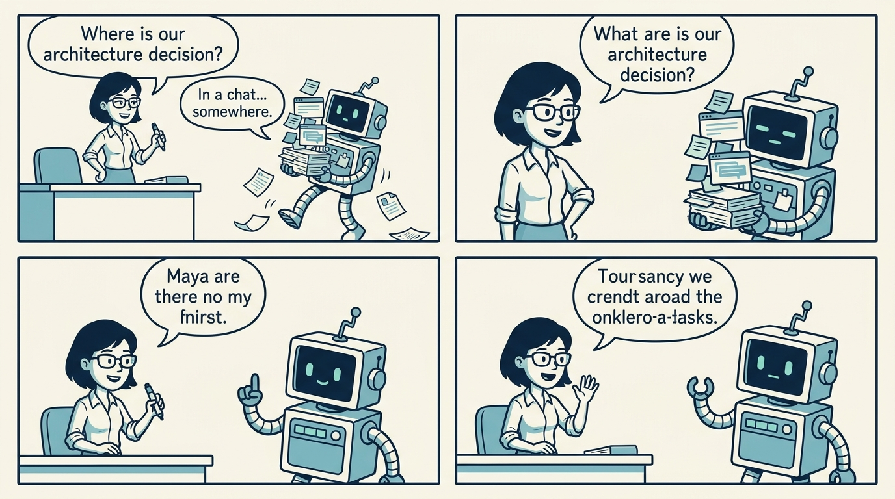
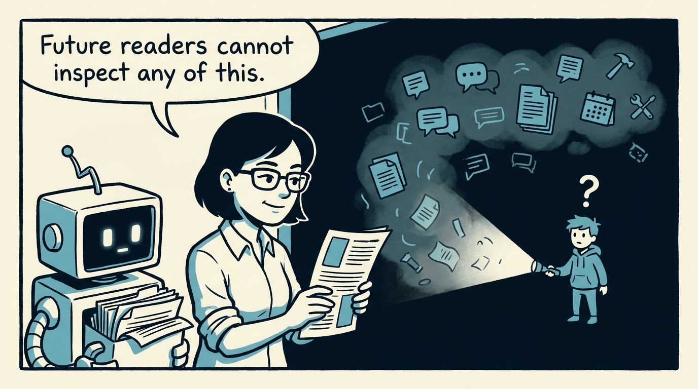
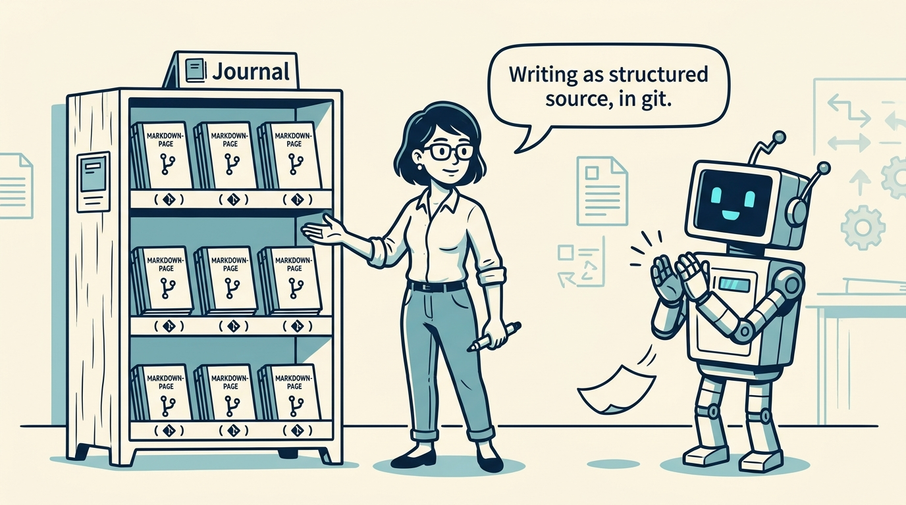
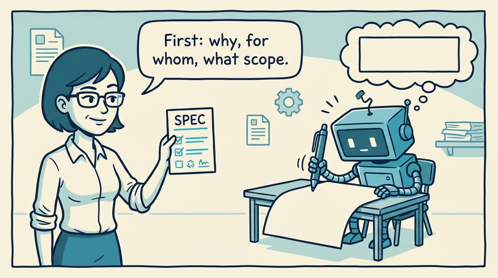
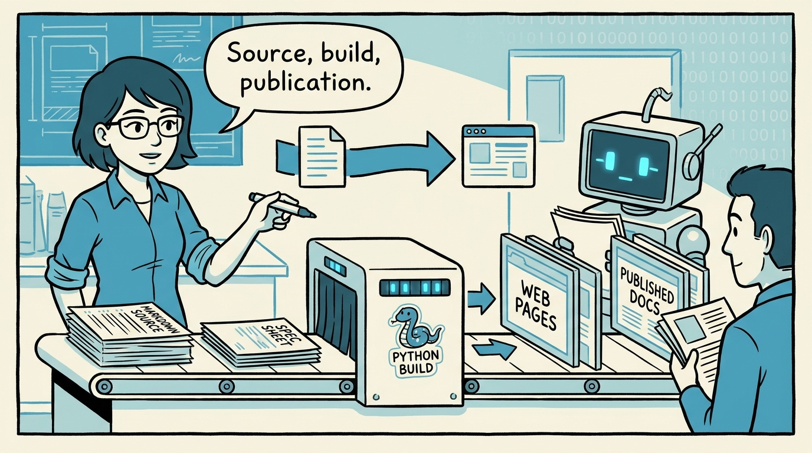
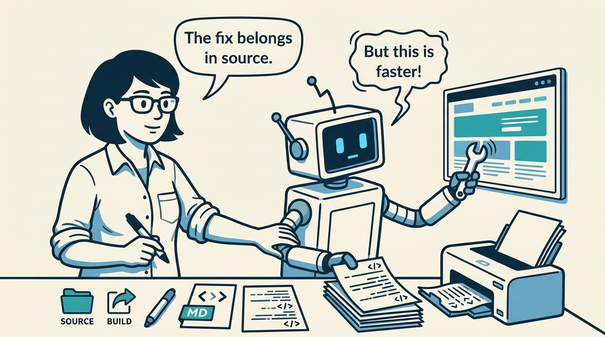
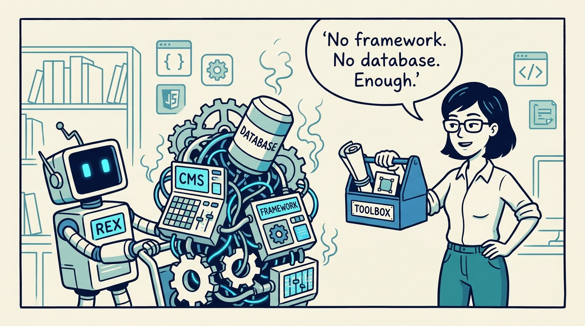
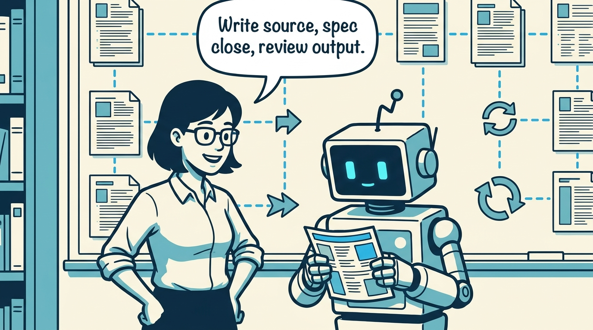

<!-- comic-style
{
  "cast": "MAYA: a pragmatic engineer-author, short dark hair, glasses, rolled-up sleeves, calm and slightly amused, often holding a marker or a printed page. REX: an over-eager boxy robot AI assistant, one bent antenna, glowing rectangular eyes, perpetually carrying or printing too many documents.",
  "style": "Clean two-tone explainer comic, thick ink outlines, flat colors with blue/teal accents on a light cream background, generous white space, hand-lettered speech bubbles with SHORT readable text (max 8 words per bubble), simple geometric office/library/print-shop settings mixing documents with software symbols, no photorealism, no dense text, no title text."
}
-->

Durable writing deserves a home that humans and AI agents can both inspect — in eight panels.

**Panel 1:** *Meetings and chats are fine for creation — and terrible for memory.*

**Panel 2:** *Scattered across tools, records cannot be inspected, linked, or built on.*

**Panel 3:** *The core idea: treat durable writing as structured source with a stable home.*

**Panel 4:** *The spec is the working contract — short on purpose, written before the article.*

**Panel 5:** *Three layers: source is canonical, the build is small, the publication is output.*

**Panel 6:** *Generated pages are disposable — if output looks wrong, fix the source.*

**Panel 7:** *Lightweight by design: standard library, templates, and nothing to install.*

**Panel 8:** *The loop: source, spec, build, review — and fixes always flow back to source.*
