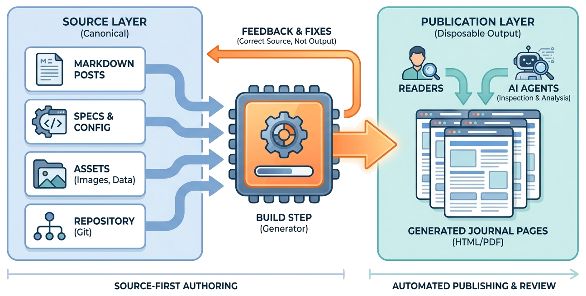

> Spec-driven journals treat durable writing as structured source: each article is authored from a lightweight spec, published as static documentation, and kept readable by humans and AI agents.

[Spec-Driven Journals](https://github.com/zeljkoobrenovic/spec-driven-journals) is a publishing system for durable technical writing.

It is not a wiki, not a content-management system, and not a general application framework. It is a small static-site generator wrapped around a writing discipline: put durable records in markdown, keep source in git, make the build deterministic, and let generated pages be the review and reading surface.

The project name, **Spec-Driven Journals**, describes two connected ideas:

| Idea | Meaning |
| --- | --- |
| **Journal** | A coherent collection of posts, published as its own static site under `docs/<journal>/`. |
| **Spec-driven** | Non-trivial posts have a sibling `spec.md` that states intent, audience, success criteria, non-goals, sources, and changelog before the article is drafted. |

The spec is the working contract. The post is the published artifact. The generated HTML is the reader-facing output.

One spec can drive more than one published doc. Besides the main article (`index.md`), a post folder can carry sibling **modality** files — `summary.md` (management summary), `dialog.md` (two-host conversation), and `comics.md` (explainer comic) — all rendered as tabs on the same post page. A tab appears when the file exists; the article stays the default tab and the post URL never changes.

## Official Project And Publication

Use these two links as the stable entry points for Spec-Driven Journals:

| Entry point | Link |
| --- | --- |
| Official project repository | [github.com/zeljkoobrenovic/spec-driven-journals](https://github.com/zeljkoobrenovic/spec-driven-journals) |
| Generated journal site | [zeljkoobrenovic.github.io/spec-driven-journals](https://zeljkoobrenovic.github.io/spec-driven-journals/) |

## Why This Exists

Organizations produce many durable artifacts: principles, strategy notes, architecture decisions, foundation records, operating models, standards, discussion documents, and implementation guides.

Those artifacts often start in meetings, chats, documents, or AI conversations. That is fine for creation, but weak for memory. If the durable artifact remains scattered across tools, future readers and AI agents cannot reliably inspect it, link it, or build on it.

Spec-driven journals give the work a stable home:

- source files live under `_journals/`
- each journal has a `config.yaml`
- each post has front matter and markdown body
- substantial posts have a `spec.md`
- one spec can drive several modality docs (article, summary, dialog, comic) shown as tabs
- generated output lives under `docs/`
- cross-record links use stable permalinks

The goal is not to make writing more bureaucratic. The goal is to make durable writing easier to inspect, review, publish, and improve.

## The Simple Mental Model

Spec-Driven Journals has three layers:

| Layer | Role |
| --- | --- |
| Source | Markdown posts, specs, configs, assets, and templates. |
| Build | A small Python script that parses source and writes static HTML. |
| Publication | Generated pages under `docs/`, served locally or through static hosting. |

The source layer is canonical. The publication layer is disposable output.

That distinction is central. If a generated page looks wrong, the fix belongs in source. Editing generated HTML directly may make one page look better, but it breaks the model that future authors and AI agents depend on.

*Illustration placeholder: `spec-driven-journals-layer-model.png` should show markdown posts, specs, config, and assets feeding a small build step, which emits generated journal pages for readers and AI agents to inspect.*

## Why Specs Matter

The spec is short on purpose. It does not replace the post. It answers the questions that usually cause drift:

- Why does this article exist?
- Who is it for?
- What should a reader understand after reading it?
- What is deliberately out of scope?
- Which sources shaped the article?
- What changed during drafting?

For human authors, the spec is a way to keep the article honest. For AI agents, it is a contract: before generating prose, the agent has to know what the post is supposed to do.

That is why this journal also has specs. The articles are about Spec-Driven Journals, and the project philosophy says non-trivial articles should be spec-driven.

## What Makes Spec-Driven Journals Lightweight

The implementation is intentionally small:

- no application framework
- no dependency install for the core build
- no server-side rendering pipeline
- no database
- no schema package
- no CMS workflow

The main build uses Python's standard library, HTML templates, CSS, and client-side JavaScript. That is enough for the current goal: publish durable writing in a way that is versioned, searchable, linkable, and easy for AI agents to inspect.

Small does not mean casual. It means the system has fewer moving parts to explain, fewer dependencies to patch, and fewer hidden behaviors for authors to memorize.

## What This Series Covers

This collection is meant to be read in layers. Start with the philosophy, then learn the source shape, then use the authoring workflow, and only then look at the implementation details.

| Read next | What it answers |
| --- | --- |
| [[journals-as-source-of-truth]] | Where should durable changes be made, and why does source win? |
| [[anatomy-of-a-journal]] | What files make up a journal, a post, a spec, and an asset set? |
| [[cross-links-assets-and-blocks]] | How do links, images, diagrams, and custom blocks work in post bodies? |
| [[spec-driven-authoring-workflow]] | How should a substantive post move from spec to generated review? |
| [[ai-mediated-journal-operations]] | How should humans and AI agents collaborate in Spec-Driven Journals? |
| [[build-pipeline-and-rendering-model]] | What does the generator do with source files? |
| [[extending-and-maintaining-the-system]] | How should maintainers add journals, posts, templates, and block types without making the system heavy? |

The durable idea is simple: write the source, keep the spec close, generate the site, review the output, and return fixes to source.
