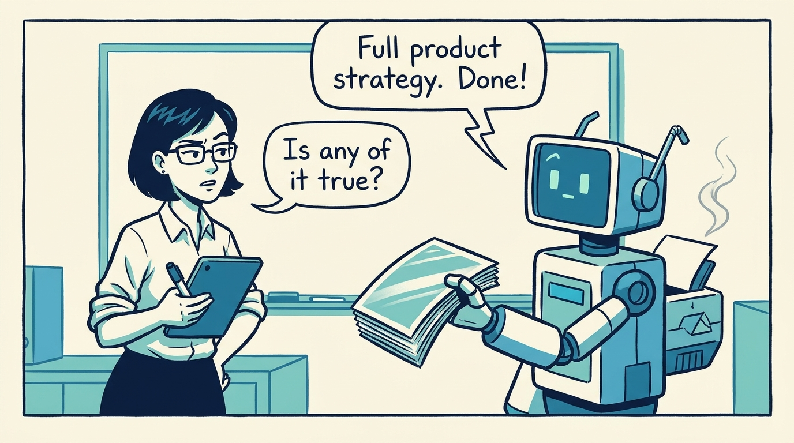
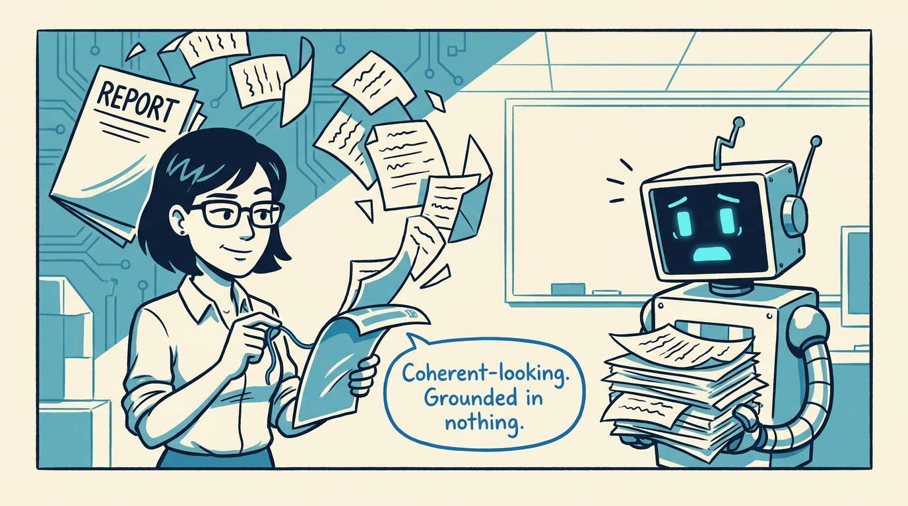
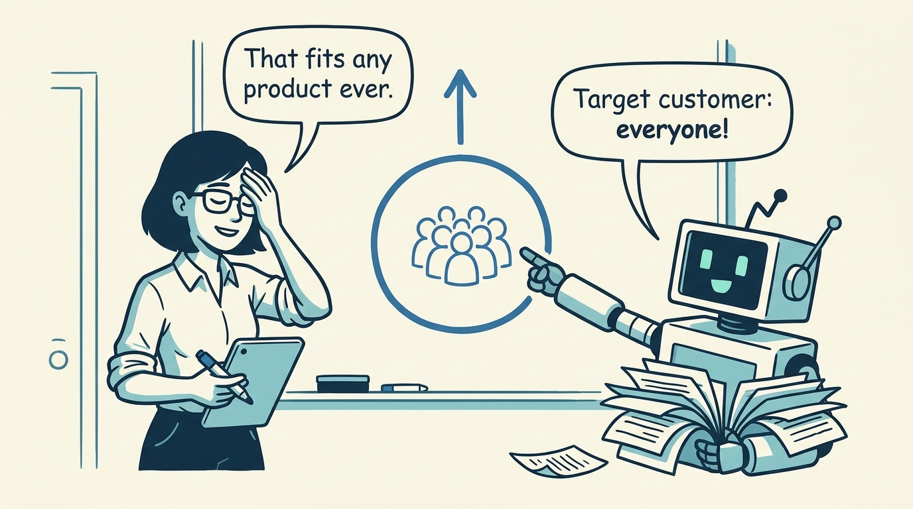
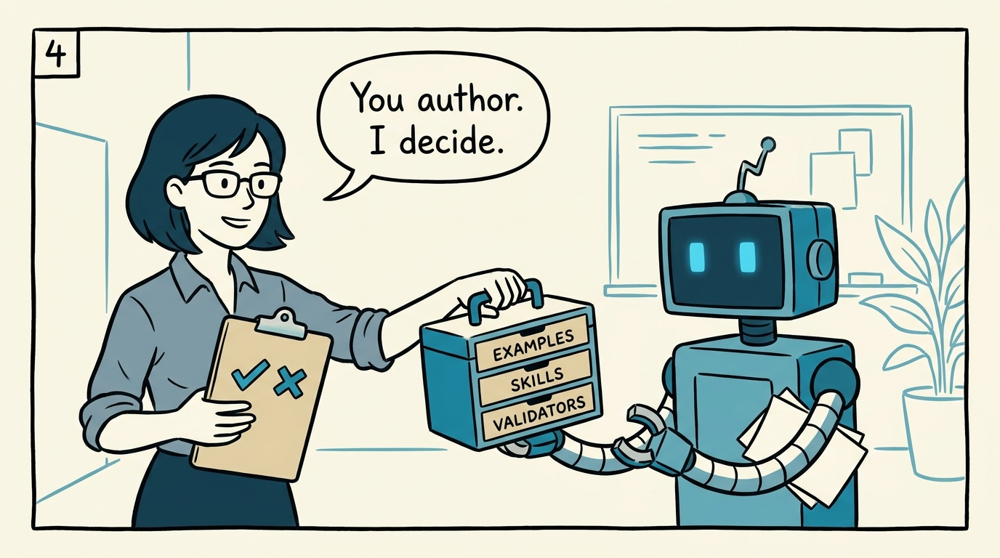
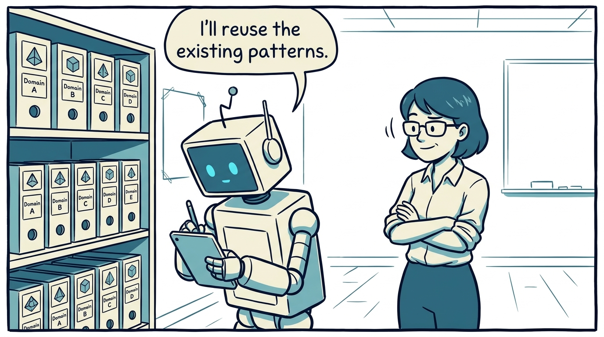
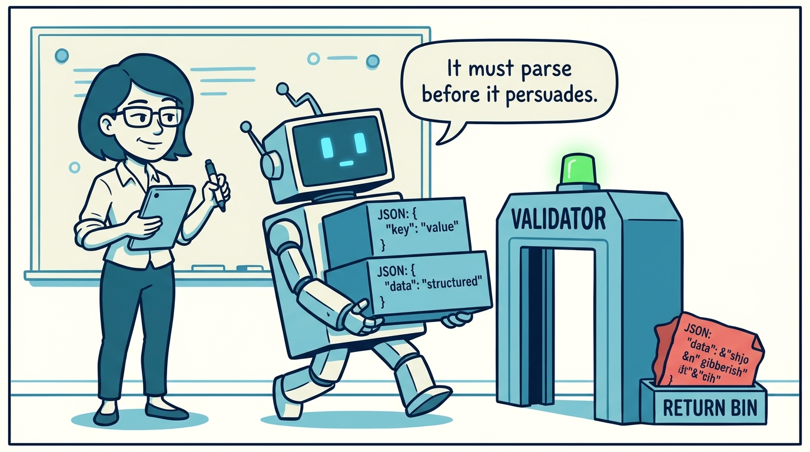
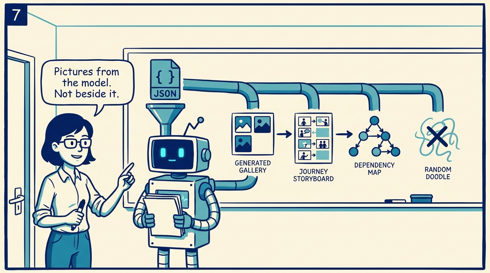
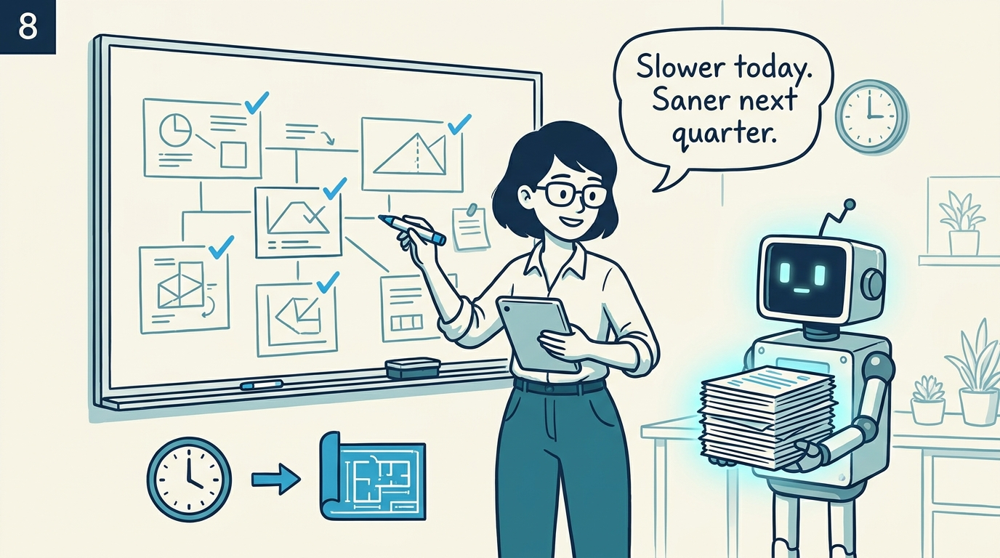

<!-- comic-style
{
  "cast": "MAYA: a pragmatic product architect, short dark hair, glasses, rolled-up sleeves, calm and slightly amused, often holding a marker or tablet. REX: an over-eager boxy robot AI assistant, one bent antenna, glowing rectangular eyes, perpetually holding or printing too many documents.",
  "style": "Clean two-tone explainer comic, thick ink outlines, flat colors with blue/teal accents on a light cream background, generous white space, hand-lettered speech bubbles with SHORT readable text (max 8 words per bubble), simple geometric office/whiteboard settings, no photorealism, no dense text, no title text."
}
-->

What AI agents are actually for in product architecture — in eight panels.

**Panel 1:** *AI agents produce plausible product prose at speed — which is both the useful part and the dangerous part.*

**Panel 2:** *Unconstrained, an agent builds a confident model that no evidence supports and no next session can maintain.*

**Panel 3:** *The failure modes are recognizable: generic customers, invented metrics, capabilities that are just renamed systems.*

**Panel 4:** *The decision: treat agents as structured authors inside the repository — humans keep intent, judgment, and review.*

**Panel 5:** *Examples are authoring infrastructure: the agent starts from the current system, not from a blank prompt.*

**Panel 6:** *Validation changes what the agent optimizes for: the output must parse and stay consistent before anyone reviews it.*

**Panel 7:** *Source-first visuals — icons, journey panels, JTBD comics, dependency maps — render the model; they never replace it.*

**Panel 8:** *The trade: a slower structured workflow today instead of repairing a disconnected product model later — the agent is the fast hand, the human stays editor-in-chief.*
