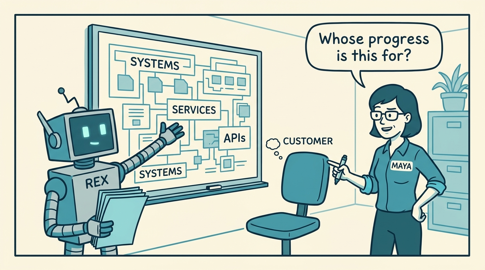
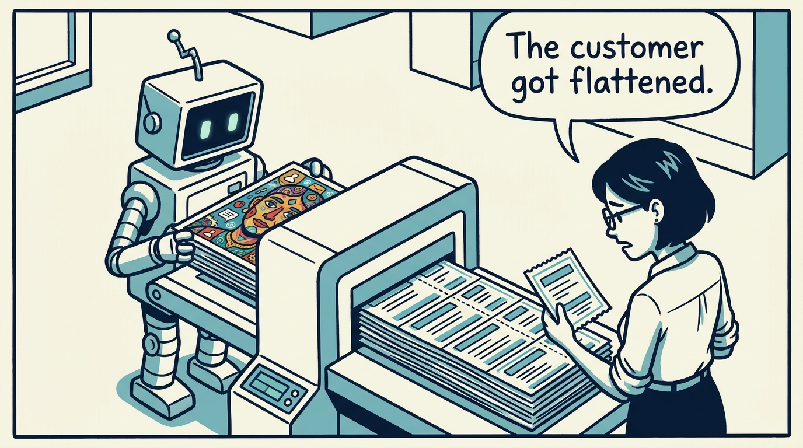
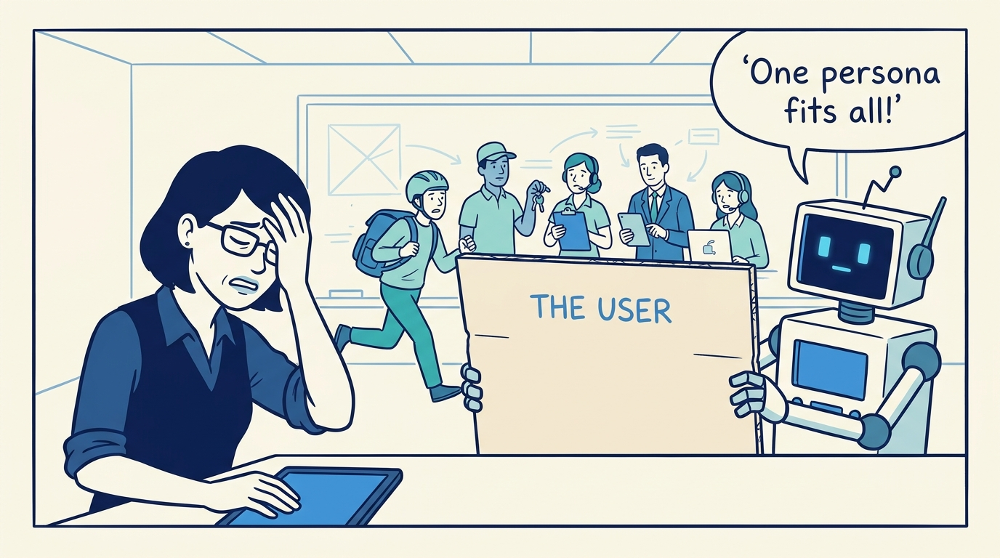
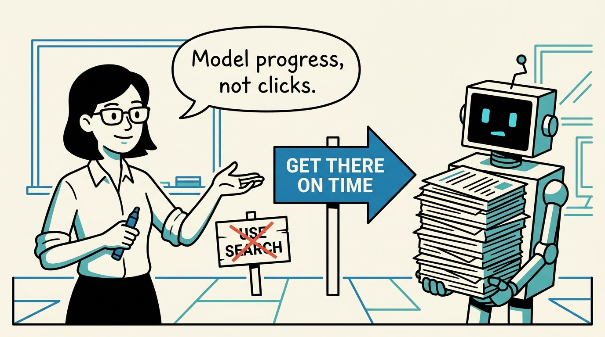
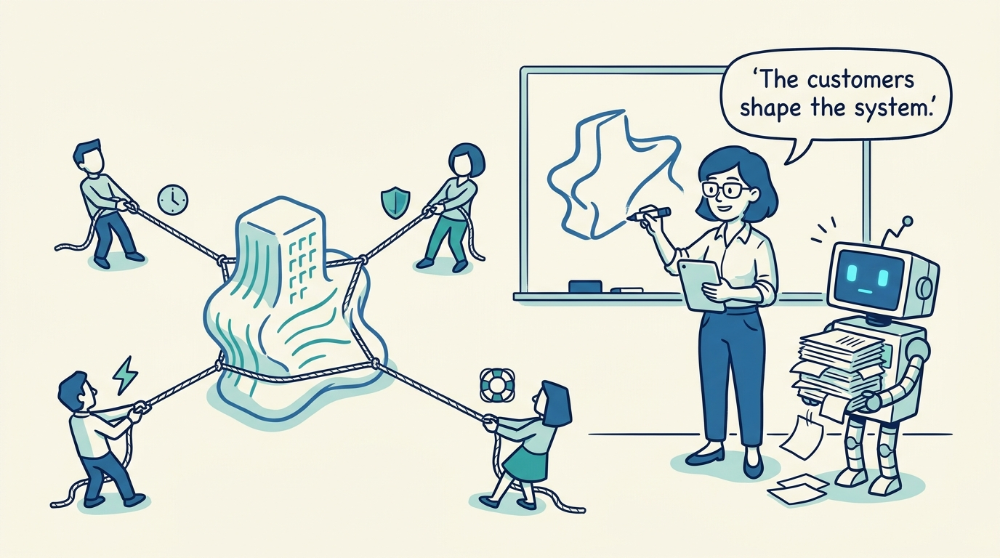
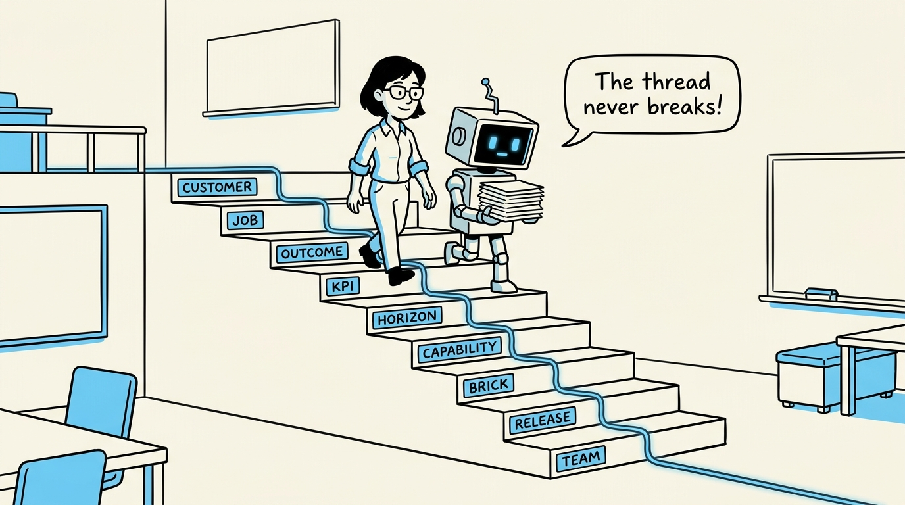
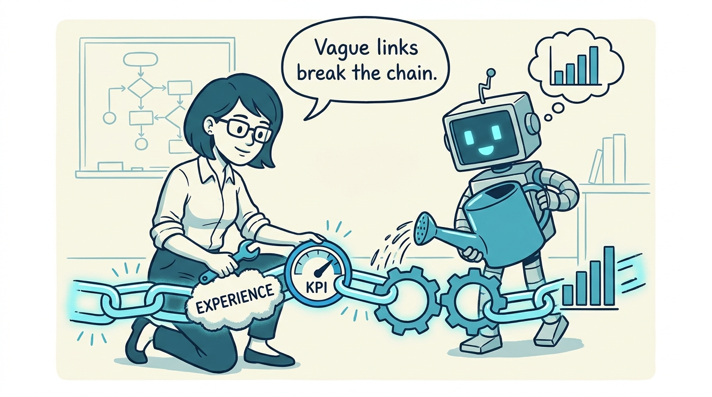
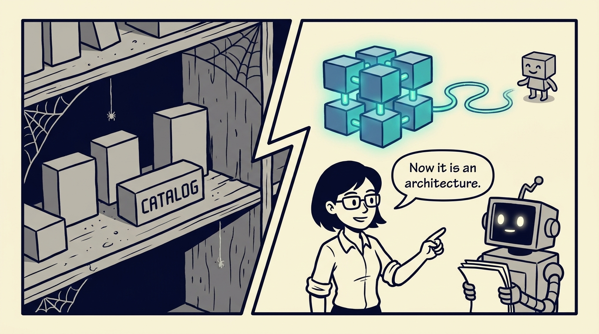

<!-- comic-style
{
  "cast": "MAYA: a pragmatic product architect, short dark hair, glasses, rolled-up sleeves, calm and slightly amused, often holding a marker or tablet. REX: an over-eager boxy robot AI assistant, one bent antenna, glowing rectangular eyes, perpetually holding or printing too many documents.",
  "style": "Clean two-tone explainer comic, thick ink outlines, flat colors with blue/teal accents on a light cream background, generous white space, hand-lettered speech bubbles with SHORT readable text (max 8 words per bubble), simple geometric office/whiteboard settings, no photorealism, no dense text, no title text."
}
-->

How customer value becomes architecture without getting lost on the way — in eight panels.

**Panel 1:** *The first architectural question is not 'which systems?' — it is 'whose progress are we supporting?'*

**Panel 2:** *By the time teams discuss systems, the customer model is often flattened into feature requests.*

**Panel 3:** *Anti-pattern: one generic persona — every downstream artifact ends up sounding the same.*

**Panel 4:** *A job describes the progress a customer is making — not the feature they click.*

**Panel 5:** *The decision: customer groups come first — their different needs are how the architecture finds its shape.*

**Panel 6:** *Customer value stays visible down the chain: group, job, outcome, KPI, horizon, capability, brick, release, team.*

**Panel 7:** *The cost: the chain is a maintained artifact — vague KPIs and slogan horizons quietly rot it.*

**Panel 8:** *Without the chain, bricks are a technical catalog. With it, they are a product architecture.*
