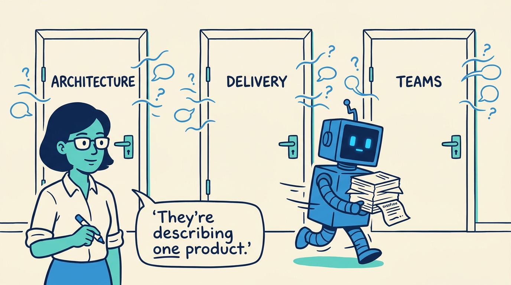
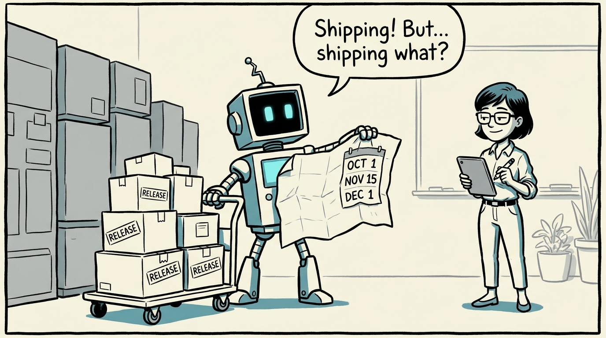
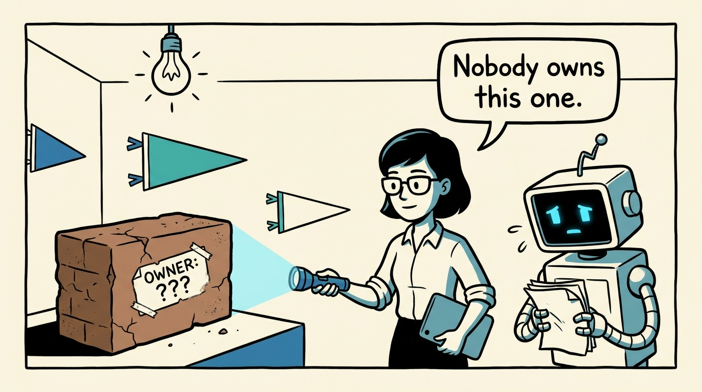
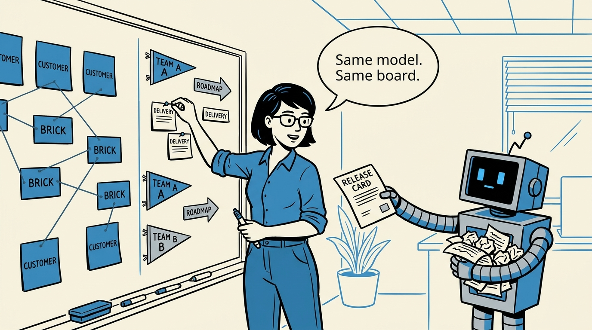
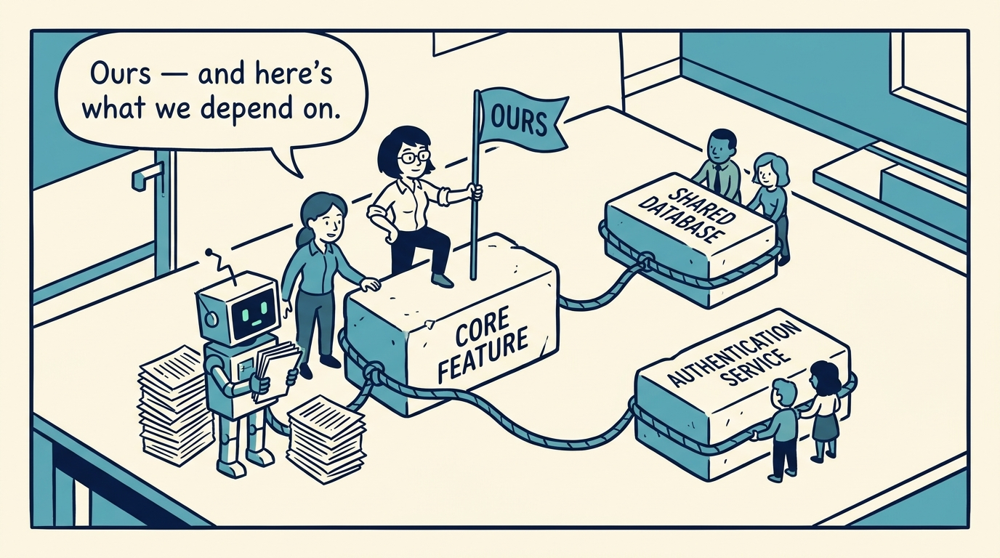
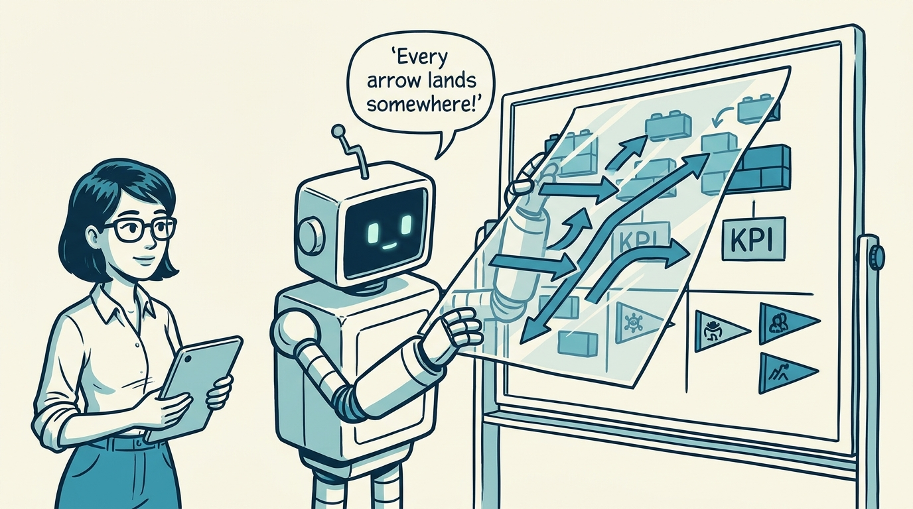
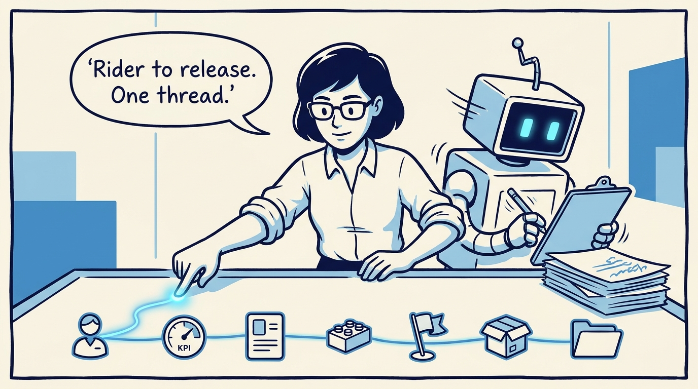
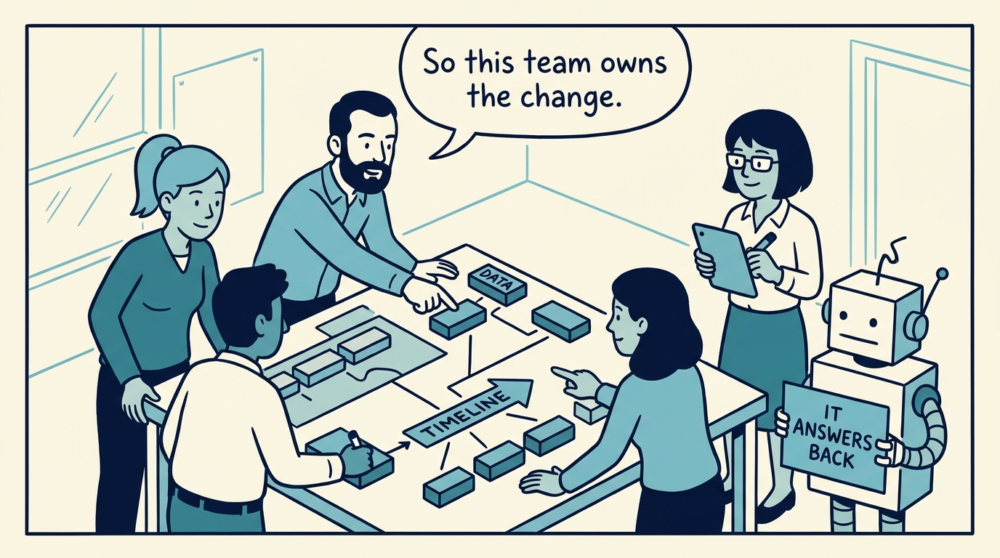

<!-- comic-style
{
  "cast": "MAYA: a pragmatic product architect, short dark hair, glasses, rolled-up sleeves, calm and slightly amused, often holding a marker or tablet. REX: an over-eager boxy robot AI assistant, one bent antenna, glowing rectangular eyes, perpetually holding or printing too many documents.",
  "style": "Clean two-tone explainer comic, thick ink outlines, flat colors with blue/teal accents on a light cream background, generous white space, hand-lettered speech bubbles with SHORT readable text (max 8 words per bubble), simple geometric office/whiteboard settings, no photorealism, no dense text, no title text."
}
-->

Why delivery, teams, and roadmaps belong inside the architecture — in eight panels.

**Panel 1:** *Architecture is called structure, delivery is called process, teams are called organization — but they describe one system.*

**Panel 2:** *A delivery plan that ignores architecture cannot explain what is being changed — and vice versa.*

**Panel 3:** *The anti-pattern: hidden ownership — a brick nobody owns is changed by everyone and maintained by no one.*

**Panel 4:** *The decision: delivery, ownership, objectives, releases, and roadmap overlays live in the same domain model as customers and bricks.*

**Panel 5:** *Teams own bricks, not just tasks — and the dependency view exposes the coordination work between them.*

**Panel 6:** *A strong roadmap item points back to customers, KPIs, capabilities, bricks, and teams — an overlay, not a separate plan.*

**Panel 7:** *The payoff is the trace: from riders under time pressure to dispatch bricks, the matching team, the release, and the evidence.*

**Panel 8:** *The operating test: a model is real architecture when it helps decide what to prioritize, who owns it, and what's at risk.*
