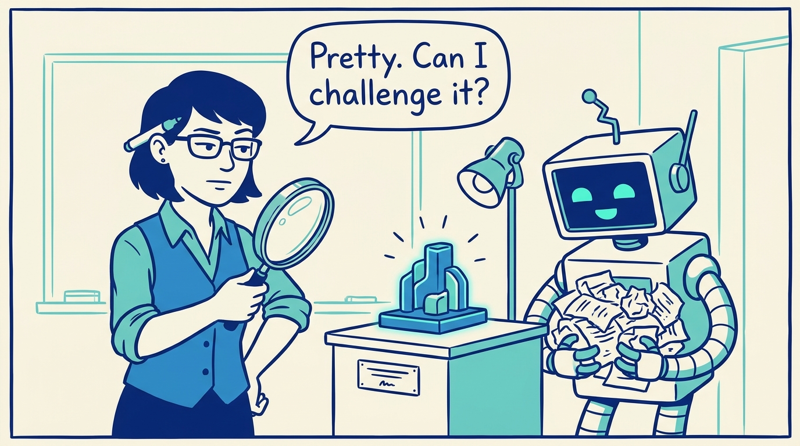
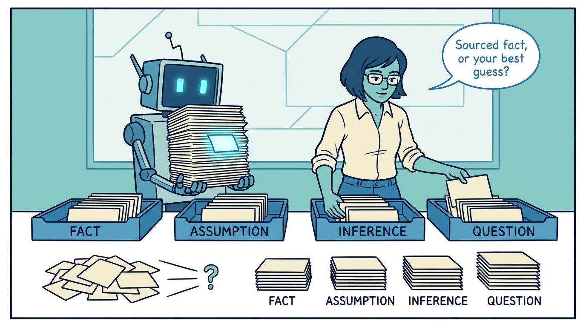
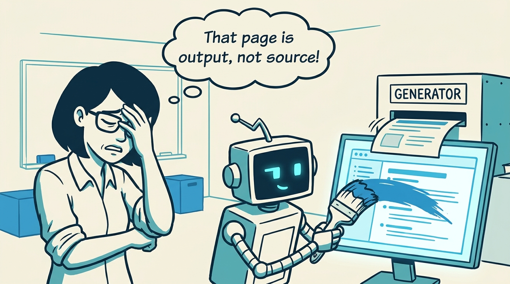
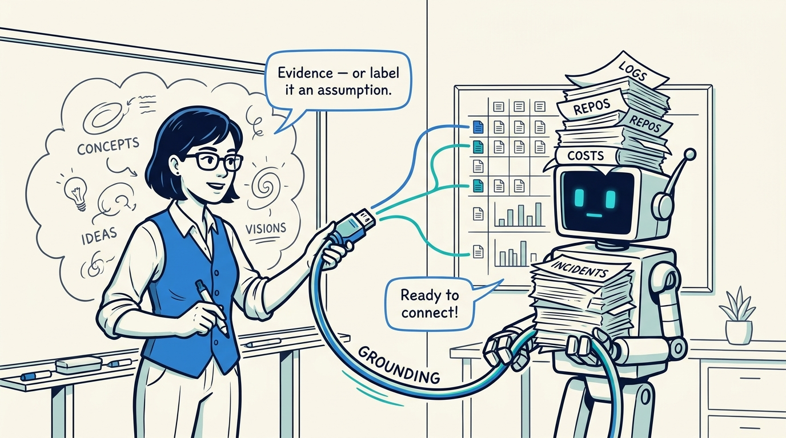
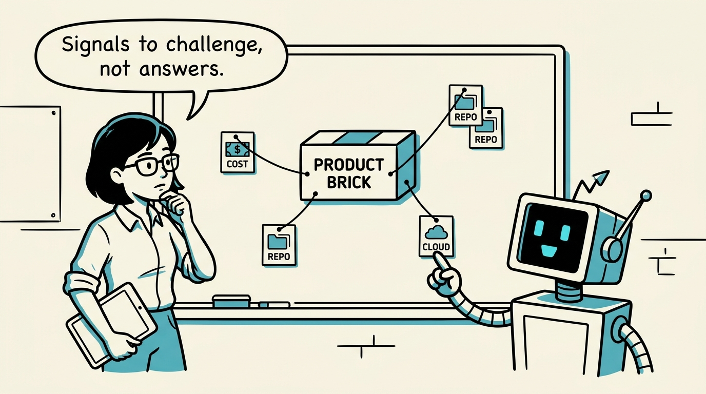
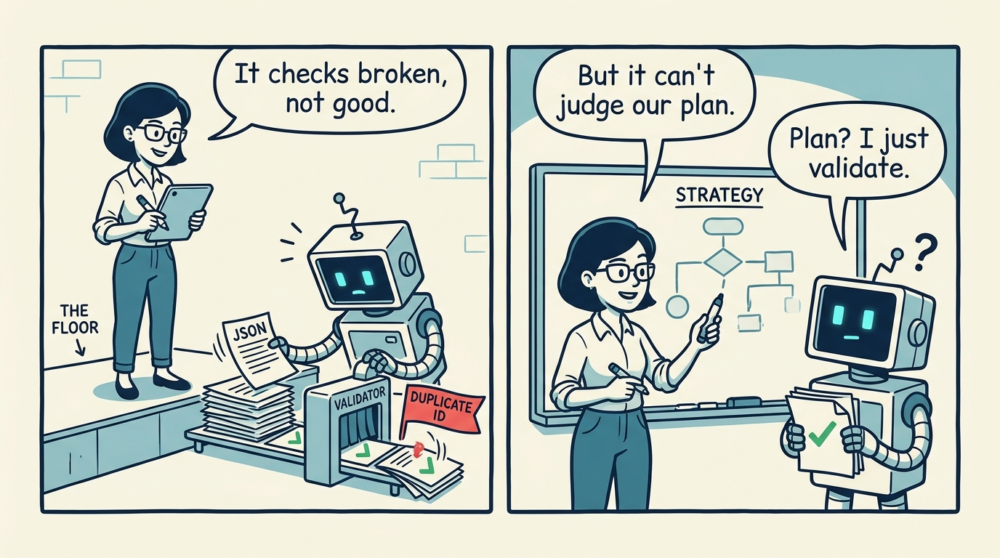
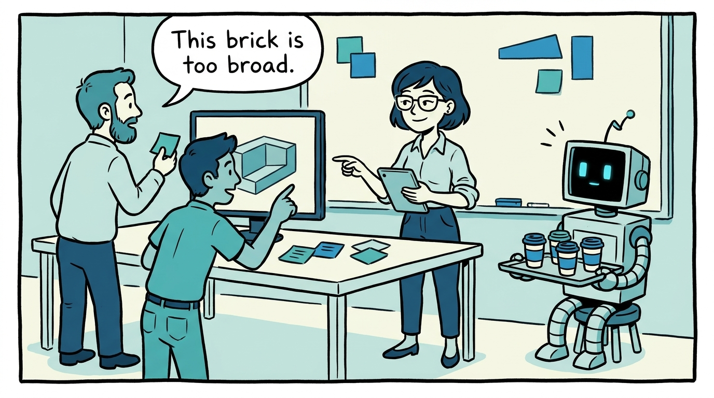
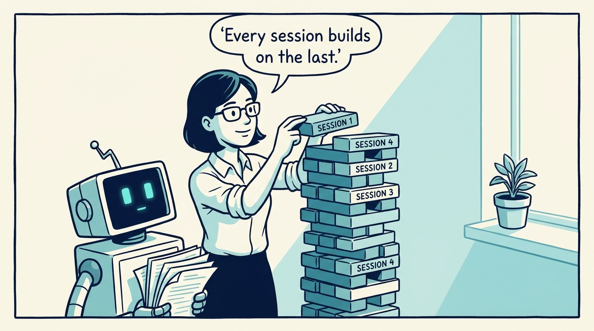

<!-- comic-style
{
  "cast": "MAYA: a pragmatic product architect, short dark hair, glasses, rolled-up sleeves, calm and slightly amused, often holding a marker or tablet. REX: an over-eager boxy robot AI assistant, one bent antenna, glowing rectangular eyes, perpetually holding or printing too many documents.",
  "style": "Clean two-tone explainer comic, thick ink outlines, flat colors with blue/teal accents on a light cream background, generous white space, hand-lettered speech bubbles with SHORT readable text (max 8 words per bubble), simple geometric office/whiteboard settings, no photorealism, no dense text, no title text."
}
-->

How an AI-authored product model earns trust — in eight panels.

**Panel 1:** *An AI agent can produce a polished model fast — but polish is not trust. The first job of the model is to be reviewable.*

**Panel 2:** *Product architecture mixes public facts, internal knowledge, and judgment. Review is only possible when the model says which is which.*

**Panel 3:** *The anti-pattern: fixing the rendered page. It makes one page look better and breaks the model every future session depends on.*

**Panel 4:** *The core move: grounding joins dreaming and exploring. Every important concept connects to evidence or is marked as an assumption.*

**Panel 5:** *A grounded brick points to repositories, services, and cost signals. The cards don't decide the architecture — they make it challengeable.*

**Panel 6:** *Validators prove the source parses, IDs are unique, and references hold. Mechanical validation is the floor — not strategic judgment.*

**Panel 7:** *The cost: discipline doesn't replace review. Domain boundaries, KPIs, ownership, and roadmap realism still need human judgment.*

**Panel 8:** *The durable payoff: not a prettier site, but a living model — structured memory that humans and AI agents keep improving together.*
