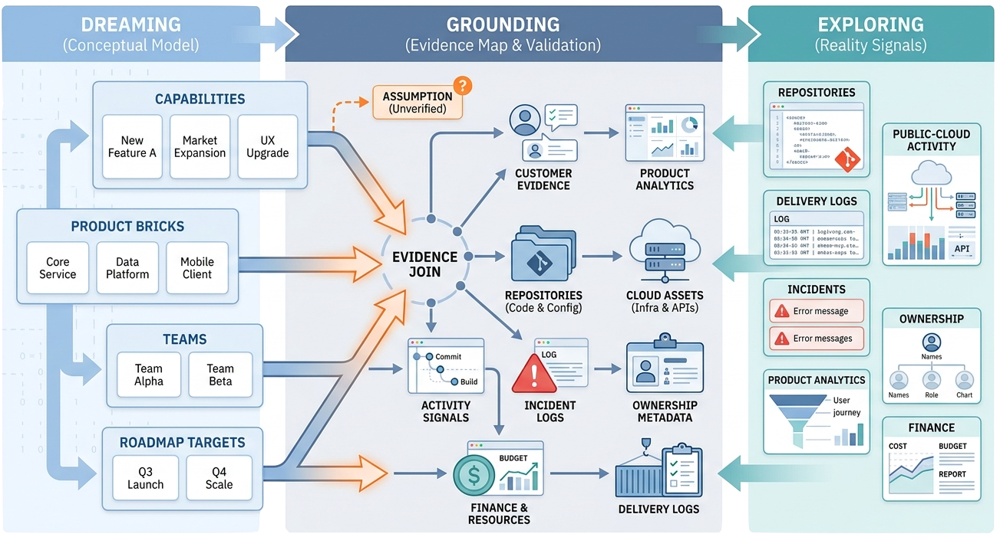
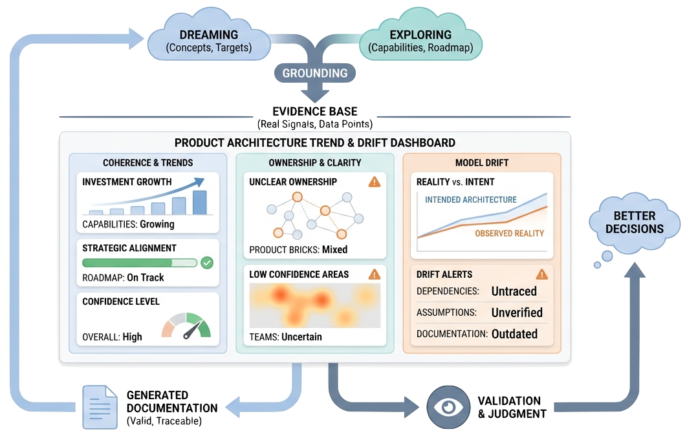

> AI-authored product architecture becomes reviewable when grounding connects intended product concepts to explored reality, evidence is explicit, source files validate, and generated documentation is treated as output.

The first job of a product architecture model is not to be impressive. It is to be reviewable.

AI agents can produce a polished product-domain model quickly. But polish is not trust.

This closing article returns to the frame introduced in [[what-is-spec-driven-product-architecture]]: dreaming, exploring, and grounding. Dreaming defines the intended product architecture. Exploring reads reality through source code, cloud activity, delivery logs, finance, incidents, ownership, analytics, and other signals. Grounding connects the two so the model can be challenged.

Trust then comes from evidence discipline, deterministic checks, visible assumptions, and generated documentation that lets humans inspect the model without losing the source-of-truth structure.

## Evidence Separates Facts From Assumptions

Evidence is especially important when modeling real companies, products, or markets.

The model should separate:

- sourced facts
- explicit assumptions
- informed inferences
- open questions

That separation matters because product architecture often mixes public facts, internal knowledge, and architectural judgment. An AI agent may infer a plausible product brick or capability from observed product behavior, but it should not present that inference as a sourced fact.

The same rule applies to metrics. If a company reports a platform-wide revenue number, the model should not rewrite it as a domain-specific revenue number. If a market report uses a particular scope or year, the model should preserve that scope. If no public metric exists, the model can use an assumption only when the assumption is visible.

Evidence discipline is not about slowing the work down. It is about making later review possible.

## Grounding Connects Dreaming And Exploring

The opening article introduced three activities. This closing article focuses on what makes the third activity operational.

**Dreaming** defines the intended product architecture: product vision, customer value, capabilities, product bricks, delivery model, team design, target states, and roadmap.

**Exploring** investigates reality. This is where the approach connects to [Grounded Architecture](https://grounded-architecture.io/): build lightweight tools and maps over real data so architecture work can see what is actually happening. Useful signals can come from source code, repositories, public-cloud activity, delivery logs, incidents, ownership metadata, product analytics, and finance.

**Grounding** is the evidence join between those two modes. Each important concept in the product-domain model should either connect to evidence or be marked as an assumption. A capability can connect to customer evidence or product analytics. A product brick can connect to repositories, services, cloud assets, APIs, data assets, or operational workflows. A team ownership claim can connect to activity, incident, financial, or accountability signals.

*Grounding becomes tangible when a product brick can point to implementation evidence. Repository cards do not decide the architecture, but they give reviewers concrete signals to challenge or support the model.*

This makes the model realistic in three ways:

- It reveals concepts that are aspirational but not yet supported by reality.
- It keeps the model up to date as systems, teams, costs, and activity patterns change.
- It exposes trends: where investment is growing, where architecture is drifting, where ownership is unclear, and where the product architecture is becoming more or less coherent.

Grounding does not remove judgment. It gives judgment a better substrate.

*Grounding asks every important concept to connect to evidence, or to be marked as an assumption: capabilities, product bricks, teams, and roadmap targets should all be traceable to real signals where possible.*

*The same evidence base can show trends and drift: where investment is growing, where ownership is unclear, where confidence is low, and where reality is moving away from the intended product architecture.*

## Validation Catches Mechanical Drift

Validation cannot tell whether the product strategy is good. It can tell whether the source model is broken.

The source project includes validation scripts for product-domain models. A scoped validator can check JSON parsing, duplicate IDs, brick ownership, team dependencies, and team staffing consistency. Strict ID checks can be added when appropriate.

That changes the authoring standard.

An AI agent should not only produce text that sounds plausible. It should leave behind source that can be parsed and checked. This is why the repository emphasizes structured JSON authoring, stable lowercase IDs, schema recognition, and reference consistency.

Mechanical validation is not strategic validation. It is the floor.

## Publishing Makes Review Shared

The project generates a static documentation site from source JSON and HTML templates.

That generated site is useful because it turns the model into pages that product leaders, architects, engineers, and stakeholders can scan. It shows whether the source tells a coherent story, and whether the grounding claims are visible enough to review.

But the generated site is output, not source.

The review loop should look like this:

1. Author or edit source files.
2. Validate source files.
3. Generate documentation.
4. Review rendered pages.
5. Return to source when the rendered story exposes gaps.

Directly editing generated docs breaks that loop. It may make one page look better, but it does not improve the model that future agents and generators depend on.

## What Validation Cannot Replace

Even with good evidence and validators, product architecture still needs human judgment.

A validator will not know whether:

- the selected product domain is the right boundary
- customer groups are strategically meaningful
- jobs to be done reflect real customer progress
- KPIs are the right measures
- product capabilities are too broad or too narrow
- a product brick is a good ownership boundary
- a team topology is politically or operationally realistic
- the roadmap sequence fits business constraints

Those questions require review by people who understand the product, business, and organization.

The purpose of the structured model is to make that review easier, not unnecessary.

## A Good First Modeling Session

A first session for a new product domain should be deliberately structured:

1. Choose a clear domain and lowercase slug.
2. Gather source links and internal context.
3. Ask the agent to inspect repository guidance, mature comparable domains, generators, templates, and relevant skills.
4. Have the agent propose the domain scope before creating files.
5. Create source files under [`_config/product-domains/<domain-id>/`](https://github.com/zeljkoobrenovic/spec-driven-product-architecture/tree/main/_config/product-domains).
6. Populate customers, jobs, KPIs, strategy horizons, delivery, capabilities, bricks, teams, objectives, roadmap, evidence, and business context to a useful first depth.
7. Validate JSON and run scoped domain checks.
8. Generate documentation only when the source is coherent enough to review.
9. Review generated pages and return fixes to source.
10. Record assumptions and gaps for the next session.

The first version does not need to be perfect. It should be structurally coherent enough that the next session can improve it.

## How To Judge A Draft Domain

A draft domain is useful when it supports informed disagreement.

Reviewers should be able to say:

- "This customer group is missing."
- "This KPI is not measurable."
- "This capability is an implementation component, not an outcome."
- "This brick is too broad for one team to own."
- "This release depends on a team that is not modeled."
- "This competitor metric is not comparable."
- "This assumption should be sourced or marked as an inference."

Those are good review comments. They mean the model is concrete enough to challenge.

## The Durable Payoff

The payoff of spec-driven product architecture is not a prettier documentation site. It is a living product-domain model that humans and AI agents can keep improving.

When the model is source-first, grounded, evidence-aware, validated, and published, every session can build on the previous one. The repository becomes more than a collection of generated pages. It becomes a structured memory for product architecture work.

That is the real promise of [[what-is-spec-driven-product-architecture]]: not automatic strategy, but a better substrate for product, architecture, delivery, and AI-mediated authoring to work together.
