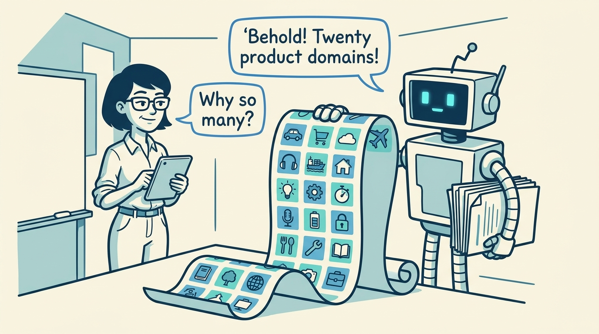
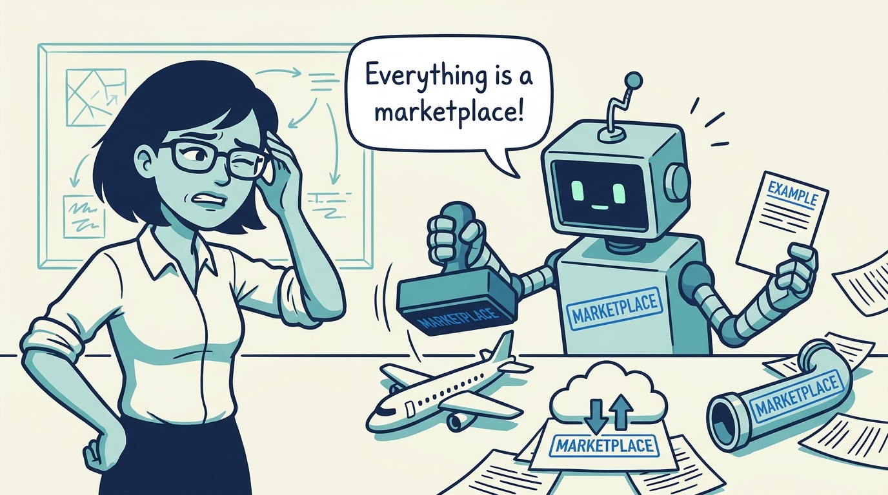
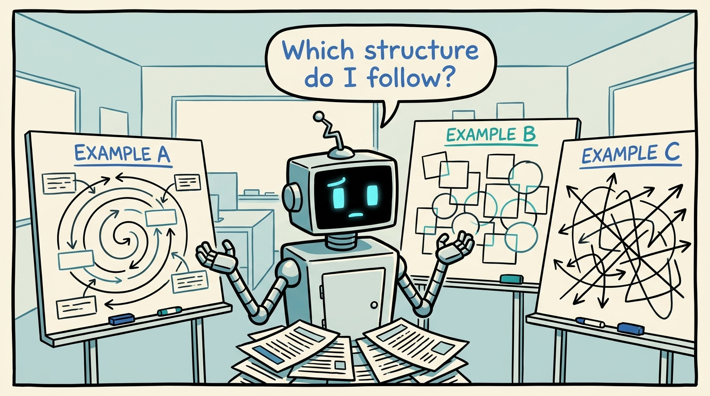
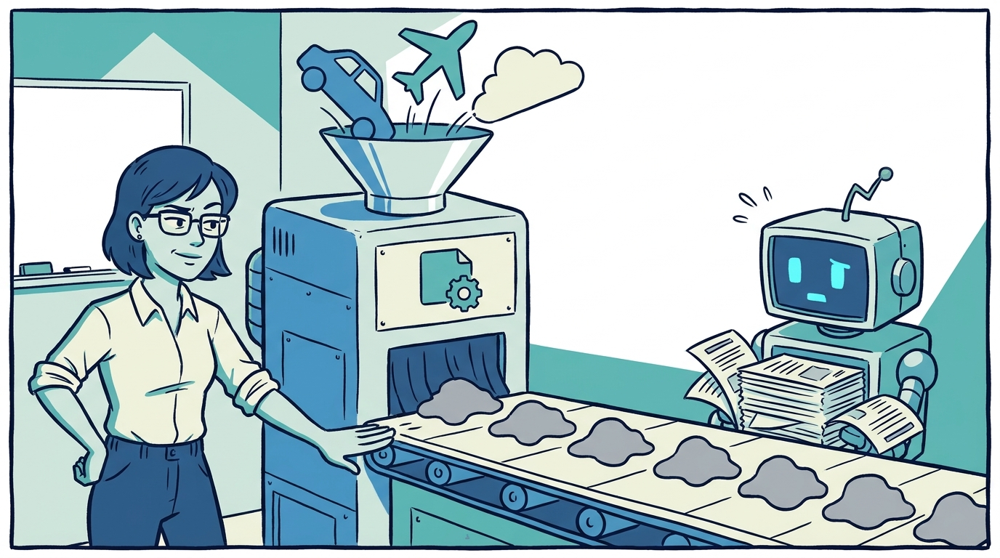
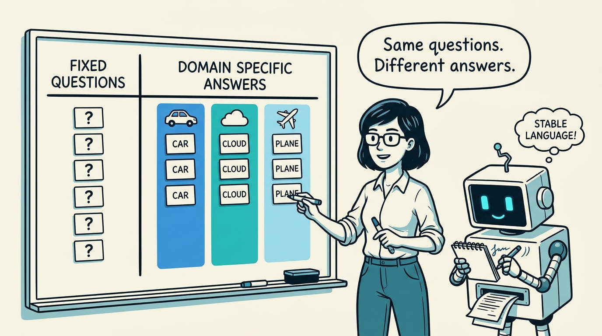
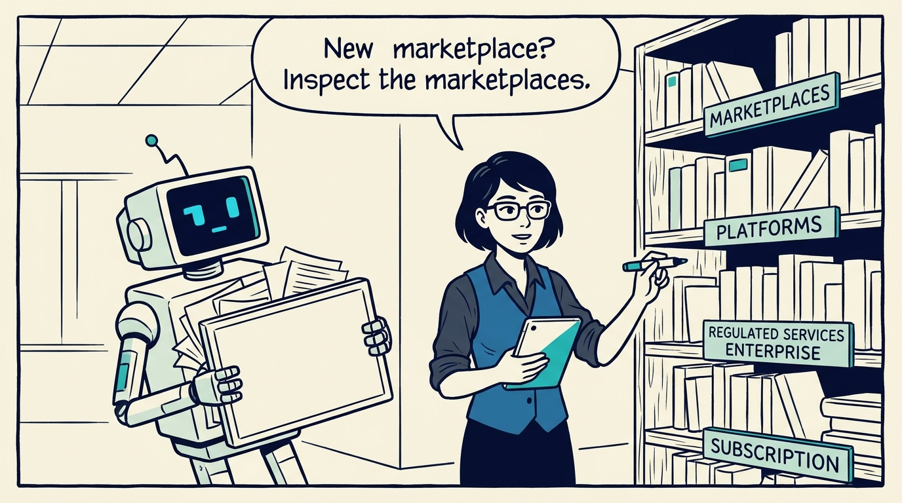
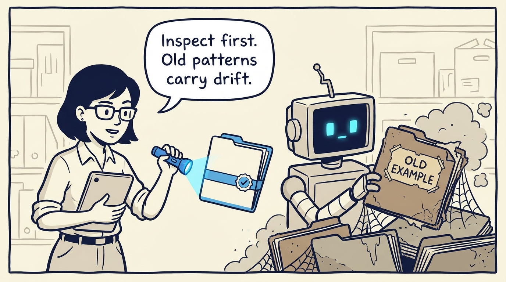
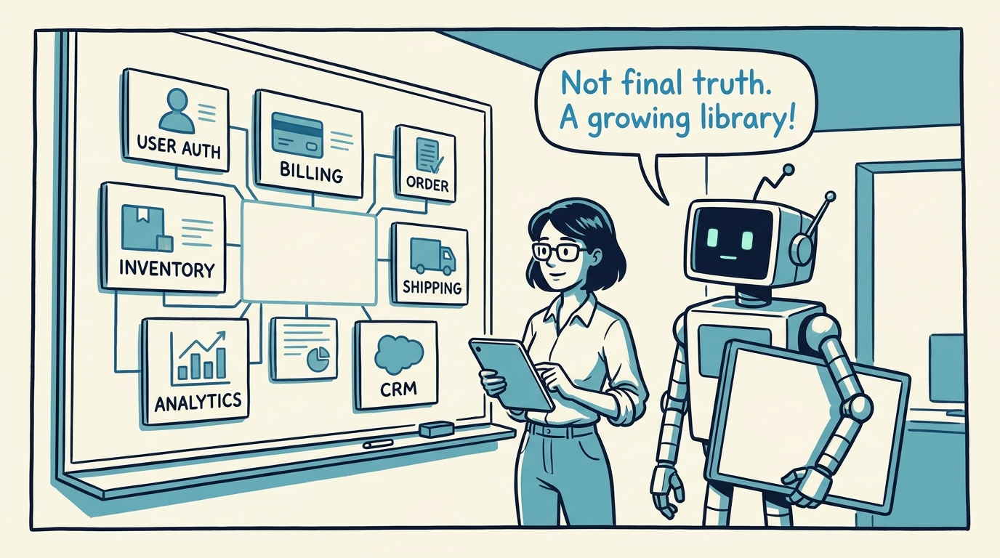

<!-- comic-style
{
  "cast": "MAYA: a pragmatic product architect, short dark hair, glasses, rolled-up sleeves, calm and slightly amused, often holding a marker or tablet. REX: an over-eager boxy robot AI assistant, one bent antenna, glowing rectangular eyes, perpetually holding or printing too many documents.",
  "style": "Clean two-tone explainer comic, thick ink outlines, flat colors with blue/teal accents on a light cream background, generous white space, hand-lettered speech bubbles with SHORT readable text (max 8 words per bubble), simple geometric office/whiteboard settings, no photorealism, no dense text, no title text."
}
-->

Why one method models twenty different products — in eight panels.

**Panel 1:** *Ride sharing, retail, cloud, airlines, streaming, freight... the variety is not decoration.*

**Panel 2:** *One kind of example teaches a narrow pattern — and the agent over-applies it everywhere.*

**Panel 3:** *The opposite failure: if every example has its own structure, nothing transfers.*

**Panel 4:** *The anti-pattern: forcing every domain through one template until the product story turns to mush.*

**Panel 5:** *The decision: the reusable model asks the same questions; each domain must answer them differently.*

**Panel 6:** *How it plays out: archetypes tell a new domain which mature examples to learn structure from.*

**Panel 7:** *The cost: a living example set drifts — copying an old pattern blindly preserves the drift.*

**Panel 8:** *The examples are not final truth — they are a growing pattern library for the next domain.*
