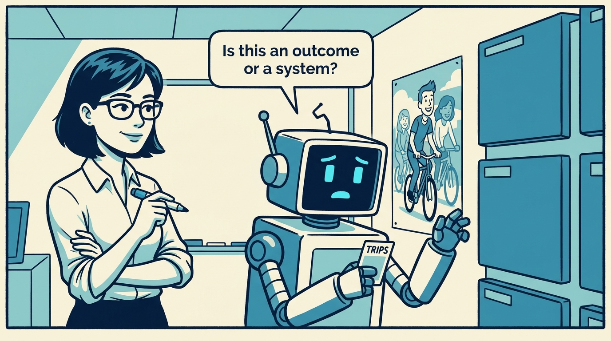
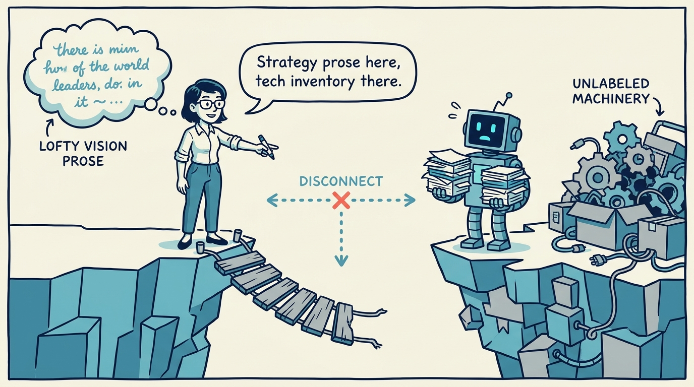
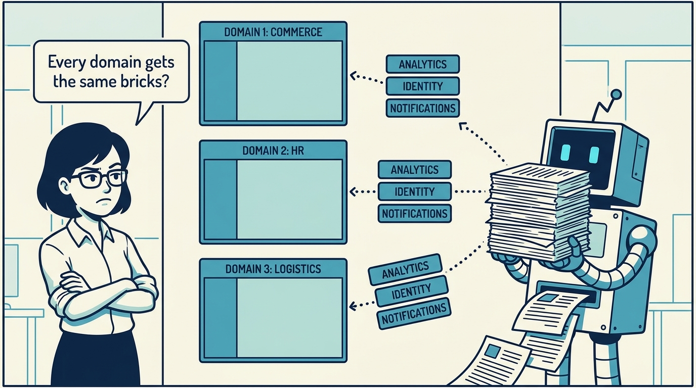
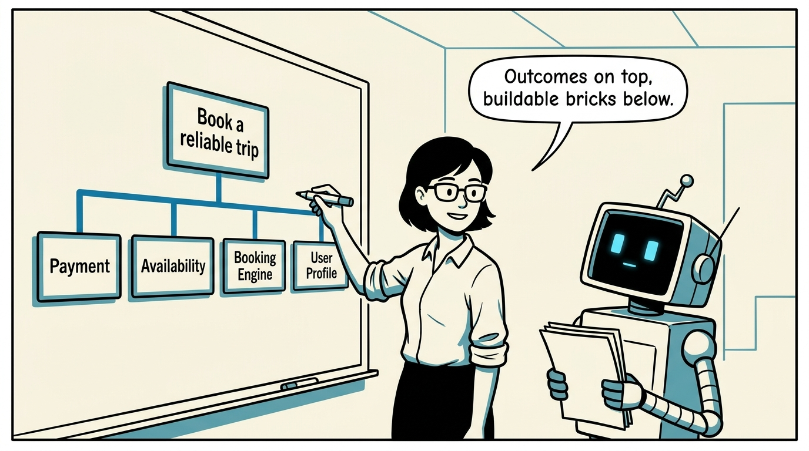
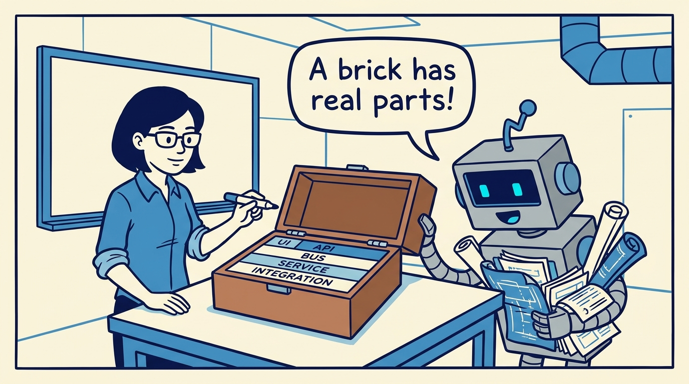
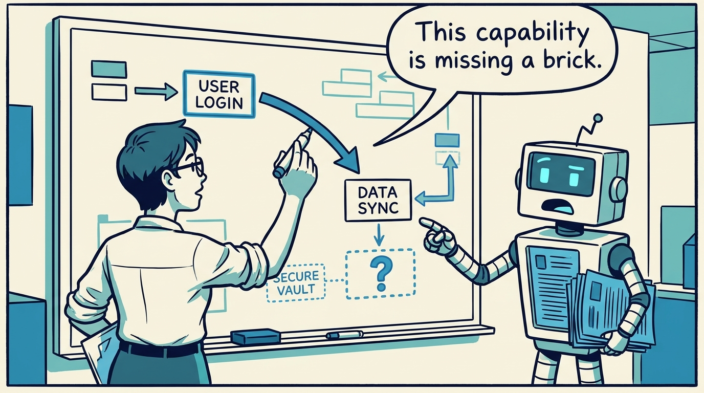
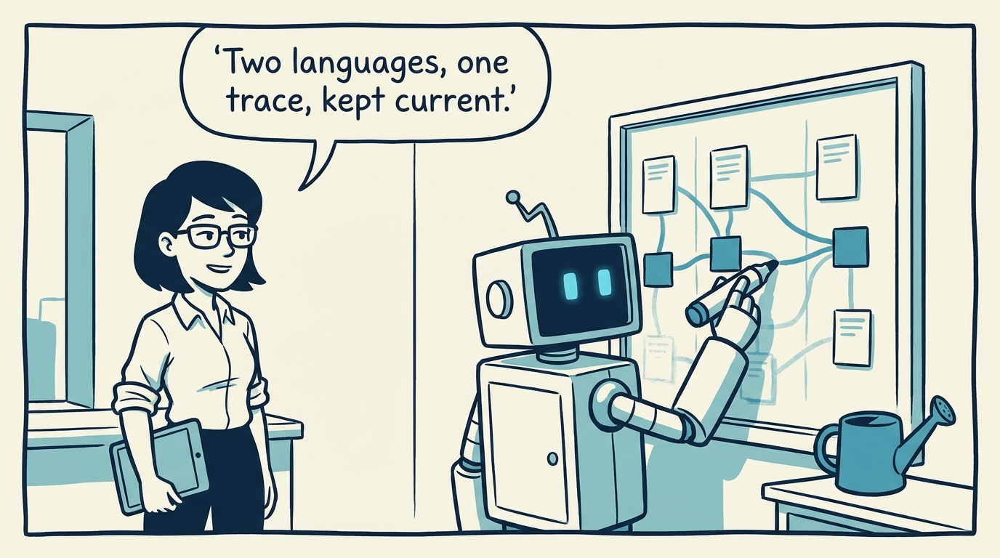
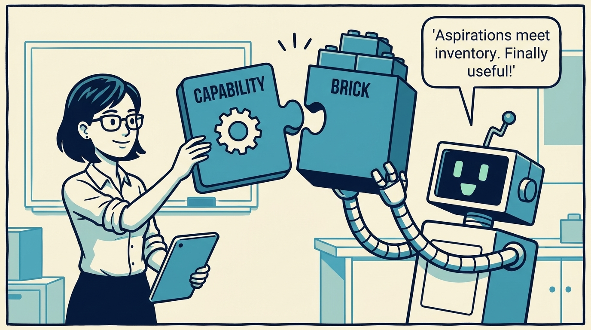

<!-- comic-style
{
  "cast": "MAYA: a pragmatic product architect, short dark hair, glasses, rolled-up sleeves, calm and slightly amused, often holding a marker or tablet. REX: an over-eager boxy robot AI assistant, one bent antenna, glowing rectangular eyes, perpetually holding or printing too many documents.",
  "style": "Clean two-tone explainer comic, thick ink outlines, flat colors with blue/teal accents on a light cream background, generous white space, hand-lettered speech bubbles with SHORT readable text (max 8 words per bubble), simple geometric office/whiteboard settings, no photorealism, no dense text, no title text."
}
-->

How outcomes become buildable — capabilities, bricks, and the honest arrows between them, in eight panels.

**Panel 1:** *Every product model faces the same question: is this what the product does, or how it does it?*

**Panel 2:** *Stay at the outcome level and you get strategy prose; jump to systems and you get a technical inventory.*

**Panel 3:** *The documented drift patterns: feature lists, technology catalogs, and the same generic platform filler for every domain.*

**Panel 4:** *The decision: capabilities keep the language of outcomes; bricks name the buildable, ownable units beneath them.*

**Panel 5:** *Modules in layers — UI, interfaces, bus, services, integrations — give a brick enough shape, not a full solution design.*

**Panel 6:** *Dependencies are where the model gets honest: a missing or unowned brick means the capability is under-specified.*

**Panel 7:** *The cost: keeping outcome language and implementation language connected is continuous work, not a one-time drawing.*

**Panel 8:** *Capabilities without bricks are aspirations; bricks without capabilities are inventory. The useful model has both.*
