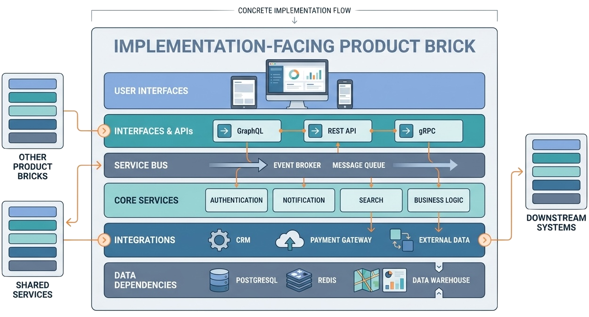
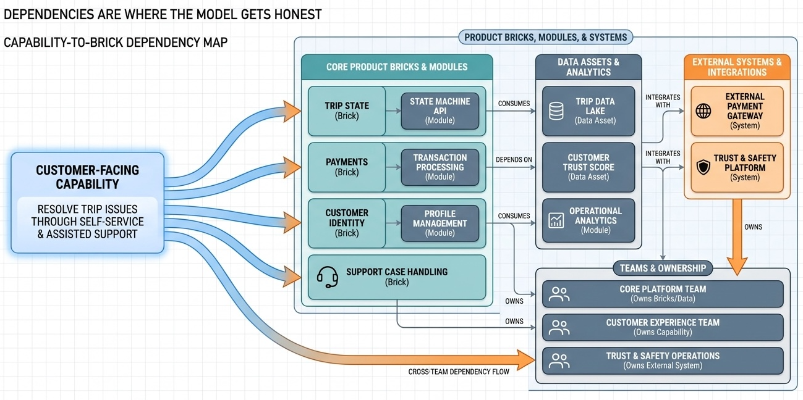

> Capabilities describe the outcomes a product must deliver. Product bricks describe the implementation-facing units that make those outcomes buildable, ownable, and traceable.

The most important bridge in Spec-Driven Product Architecture is the bridge between product outcomes and implementation reality.

If the model stays at the outcome level, it becomes product strategy prose. If it jumps straight to systems and services, it becomes a technical inventory. Product capabilities and product bricks keep both sides visible.

## Capabilities Are Outcomes

A product capability describes something valuable the product can do for customers or the business.

Good capability names sound like outcomes:

- Book and complete a reliable trip.
- Launch and tune marketplace changes with controlled experiments.
- Feed analytics and machine learning with fresh governed data.
- Help developers ship through approved golden paths.
- Govern enterprise architecture decisions with shared evidence.

Capabilities are not modules. They are not teams. They are not epics. They describe durable product abilities that often require several bricks, external systems, data assets, and operational workflows.

This matters because capabilities preserve the language of value. They let product leaders, architects, and AI agents discuss what the product must be able to do before diving into how the system does it.

## Product Bricks Are Implementation-Facing Units

A product brick is a buildable, ownable part of the product architecture.

It is more concrete than a capability and more product-aware than a low-level component. A brick may include user interface modules, APIs, services, message consumers, integrations, data dependencies, and dependencies on other bricks.

The brick should be:

- **Buildable** - a team can implement and evolve it.
- **Ownable** - it has a clear primary owner.
- **Traceable** - it supports capabilities, outcomes, delivery plans, and evidence.
- **Coherent** - its modules belong together for a product or platform reason.
- **Durable** - the ID can survive wording changes and roadmap cycles.

For AI agents, product bricks are the key to application awareness. They force the model to say which implementation structures must exist for the strategy to be real.

## The Three-Level Structure

The repository guidance expects product bricks to use a meaningful three-level structure:

1. Root group.
2. Subgroup.
3. Brick.

The root group might be a durable product or platform area. The subgroup organizes related workflows, systems, or capabilities. The brick is the actual implementation-facing unit.

This avoids two bad extremes:

- A flat list of 60 unrelated bricks.
- A shallow set of vague buckets such as "platform," "data," and "experience."

The three-level structure gives the generated documentation a navigable architecture while keeping the source model clear enough for AI agents to maintain.

## Modules Make Bricks Concrete

Bricks become concrete through modules. A module might be a web component, mobile component, BFF, API, backoffice interface, message consumer, stateless service, stateful service, service, or integration.

The current product-brick model groups modules into layers such as:

| Layer | Typical role |
| --- | --- |
| `ui` | User-facing web, mobile, or operator surfaces. |
| `interfaces` | APIs, BFFs, and explicit service boundaries. |
| `bus` | Message queues, consumers, daemons, and asynchronous flows. |
| `stateless-service` | Orchestration services without durable owned state. |
| `service` | Stateful or domain services. |
| `integration` | External system integrations. |

This is not meant to turn every domain model into a full solution design. It gives enough architectural shape to make dependencies, ownership, and delivery implications visible.

*A product brick becomes useful when it is concrete enough to show user interfaces, APIs, services, integrations, data dependencies, and the places where other bricks touch it.*

## Dependencies Are Where The Model Gets Honest

Product architecture becomes useful when it shows dependencies.

A brick can depend on another brick. A module can call or consume another module. A brick can own or use data assets. A capability can depend on several bricks and external systems.

These connections reveal whether the strategy is plausible.

For example, a capability such as "resolve trip issues through self-service and assisted support" might depend on trip state, payments, customer identity, support case handling, trust operations, and analytics. If those bricks are missing or owned by disconnected teams, the capability is not just "hard." It is architecturally under-specified.

The model makes that visible before delivery surprises arrive.

*Capabilities become reviewable when the model shows which bricks, modules, APIs, data assets, external systems, and teams make the outcome possible.*

### Running Example: Reliable Trip Completion

In the ride-sharing example, "book and complete a reliable trip" is a capability, not a brick. It is an outcome the product must deliver. The implementation-facing model has to show what makes that outcome real:

| Product question | Ride-sharing answer |
| --- | --- |
| Which capability is at stake? | Book and complete a reliable trip. |
| Which bricks support it? | Trip request and intent capture, matching and dispatch, pricing and offer management, driver availability, payments and settlement, support and recovery. |
| Which modules make it concrete? | Rider and driver app surfaces, pricing API, dispatch service, event consumers, trip-state store, payment authorization, support-case tooling. |
| Which dependencies matter? | Driver supply, map and routing providers, payment providers, fraud and safety workflows, marketplace analytics. |
| Which ownership questions appear? | Who owns dispatch reliability, who coordinates pricing changes, who handles recovery when the trip flow breaks? |
| Which evidence should be visible? | ETA accuracy, cancellation patterns, incident history, support contacts, repository ownership, cloud activity, and cost signals. |

## Capabilities And Bricks Need Each Other

Capabilities without bricks are aspirations. Bricks without capabilities are inventory.

The useful model has both:

| Question | Model element |
| --- | --- |
| What customer or business outcome must the product deliver? | Product capability |
| Which implementation-facing units make that outcome possible? | Product bricks |
| Which modules, APIs, services, integrations, and data assets sit inside a brick? | Brick modules and dependencies |
| Which team owns the brick? | Team model |
| Which roadmap item changes the capability or brick? | Releases, targets, objectives, initiatives |

This is the application-aware heart of spec-driven product architecture.

## What AI Agents Should Avoid

When agents author product bricks, they often drift into one of three patterns:

- **Feature lists** - each brick is a user-visible feature, with no implementation boundary.
- **Technology catalogs** - each brick is a system name, with no customer value.
- **Generic platform filler** - every domain gets the same "analytics," "identity," and "notifications" entries, regardless of domain needs.

The antidote is traceability. A brick should be justified by customer value, capability needs, delivery workflows, or operating constraints. A capability should point to the bricks that make it possible. A team should be able to own or coordinate the bricks it is assigned.

[[delivery-teams-and-roadmaps]] takes the next step: once product bricks and capabilities exist, the model needs delivery, ownership, and sequencing.
