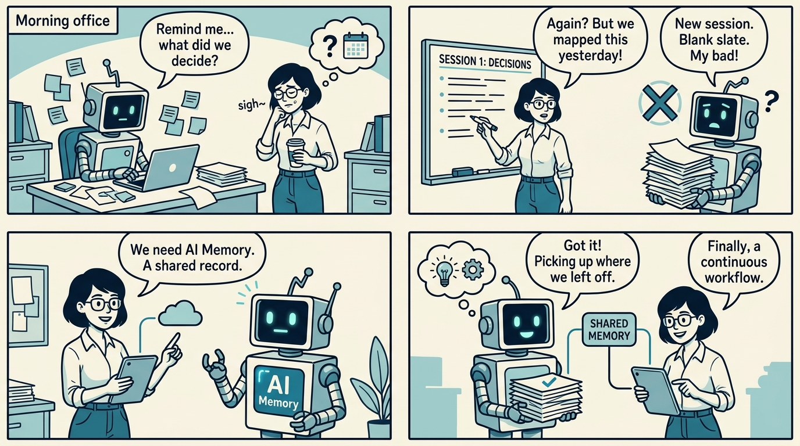
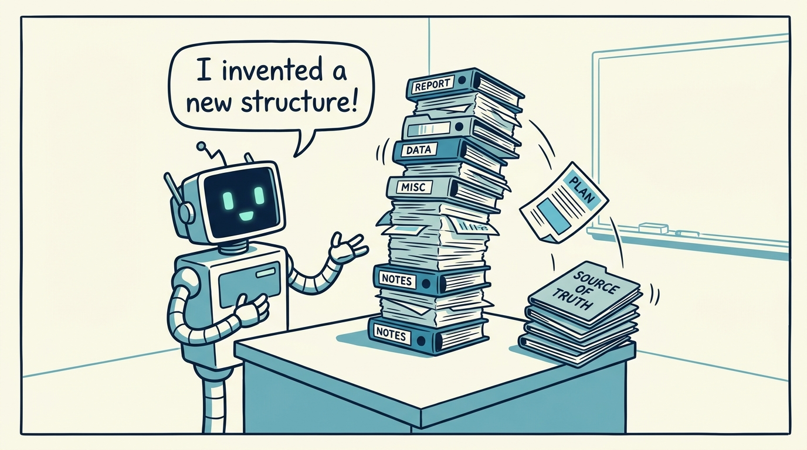
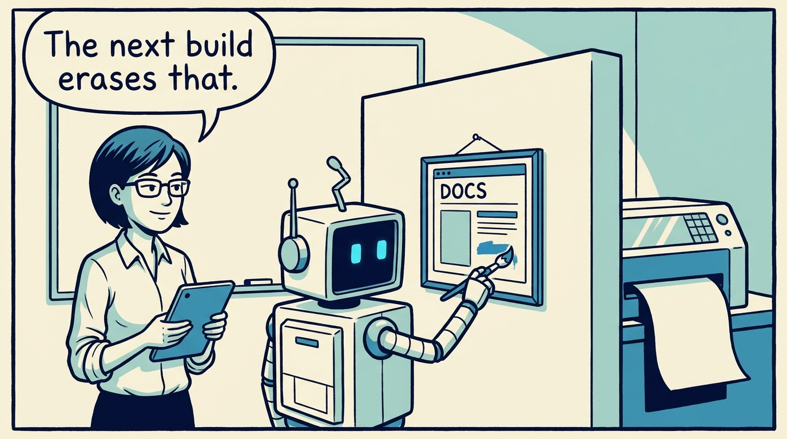
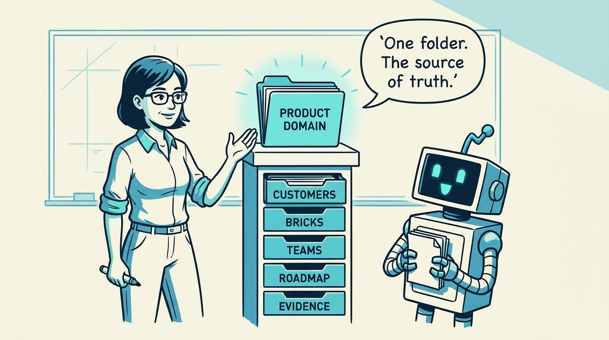
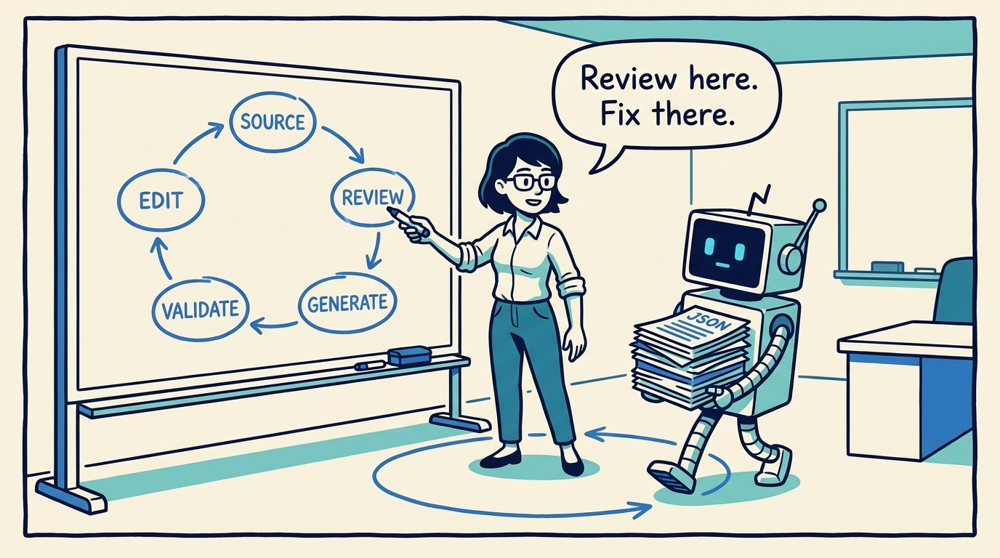
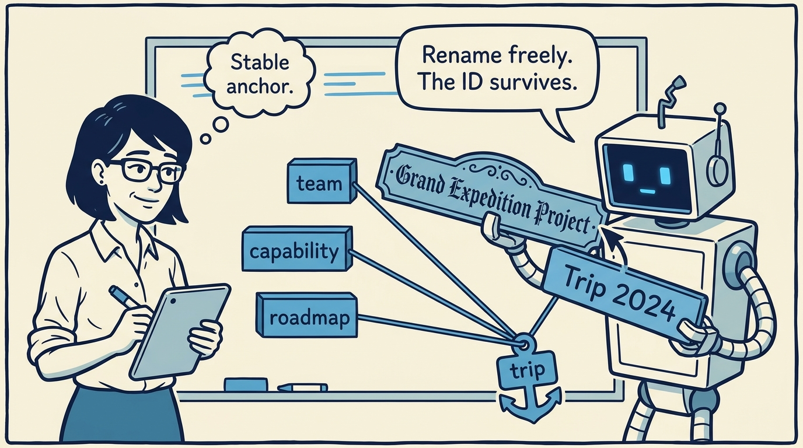
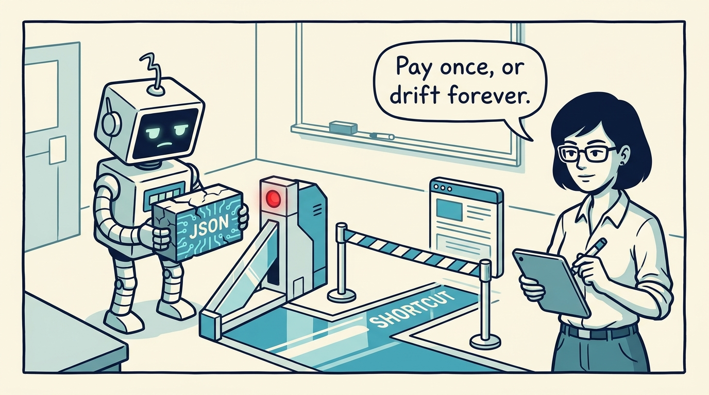
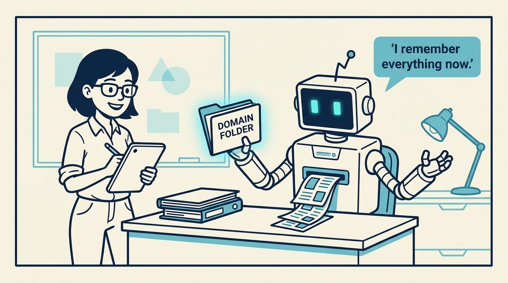

<!-- comic-style
{
  "cast": "MAYA: a pragmatic product architect, short dark hair, glasses, rolled-up sleeves, calm and slightly amused, often holding a marker or tablet. REX: an over-eager boxy robot AI assistant, one bent antenna, glowing rectangular eyes, perpetually holding or printing too many documents.",
  "style": "Clean two-tone explainer comic, thick ink outlines, flat colors with blue/teal accents on a light cream background, generous white space, hand-lettered speech bubbles with SHORT readable text (max 8 words per bubble), simple geometric office/whiteboard settings, no photorealism, no dense text, no title text."
}
-->

Why one folder — not the pretty pages — holds the product architecture, in eight panels.

**Panel 1:** *Without a place to return to, every prompt is a new negotiation about context.*

**Panel 2:** *The agent invents structure, or optimizes one artifact while quietly breaking another.*

**Panel 3:** *Generated pages are overwritten on the next run — edits there cannot preserve the model.*

**Panel 4:** *The decision: one domain folder holds the whole model — structured, inspectable, cross-linked.*

**Panel 5:** *The workflow: edit the source, validate, generate, review — and return to source when review finds a gap.*

**Panel 6:** *Stable IDs are part of the spec: names can improve, references survive the rewording.*

**Panel 7:** *The cost: structured JSON and validation discipline — slower per edit, but the model stays real.*

**Panel 8:** *The payoff: the prompt starts the work; the domain folder preserves it across every session.*
