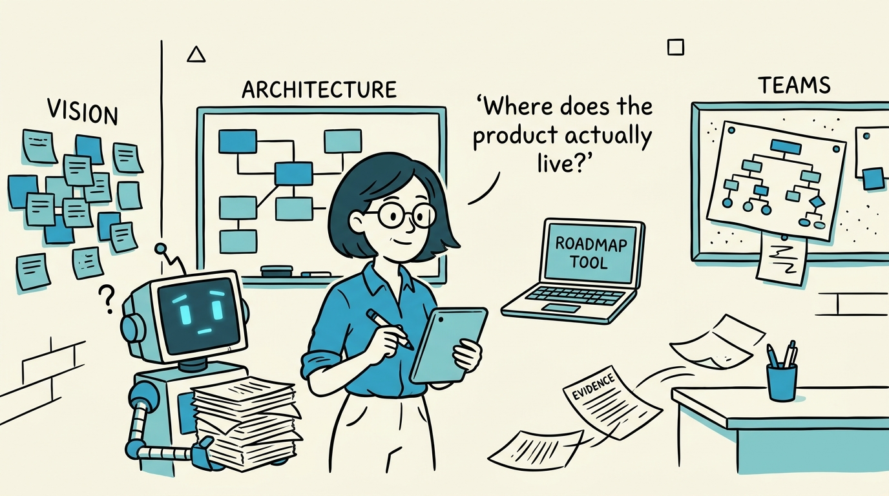
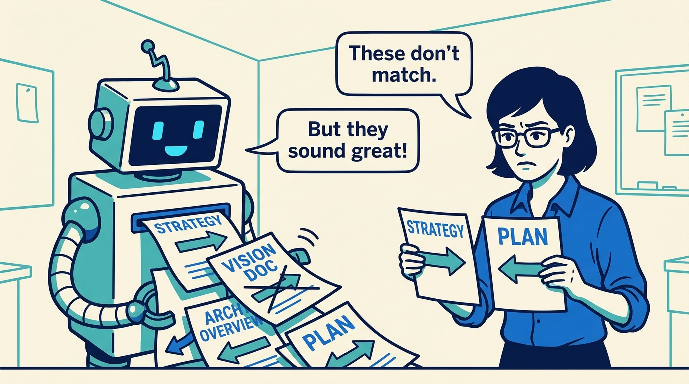
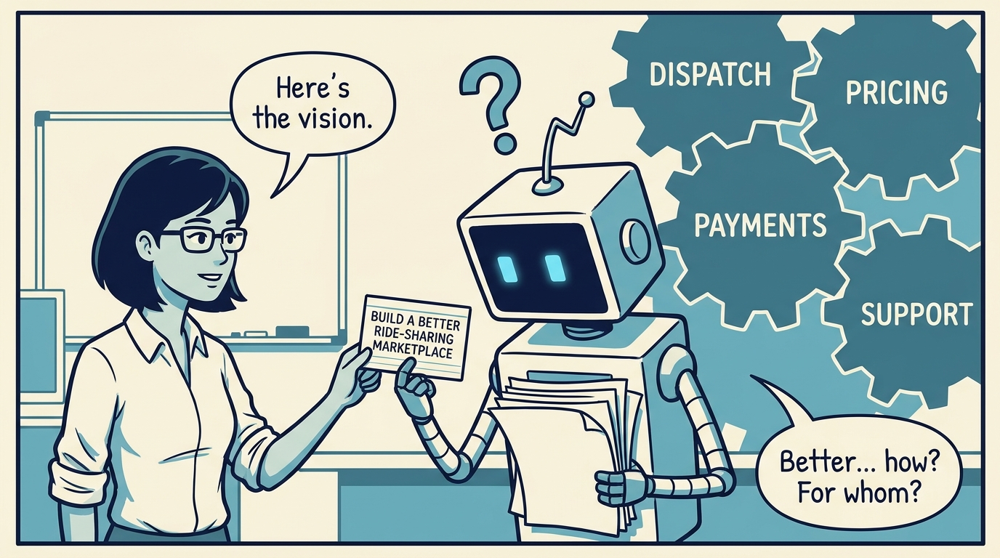
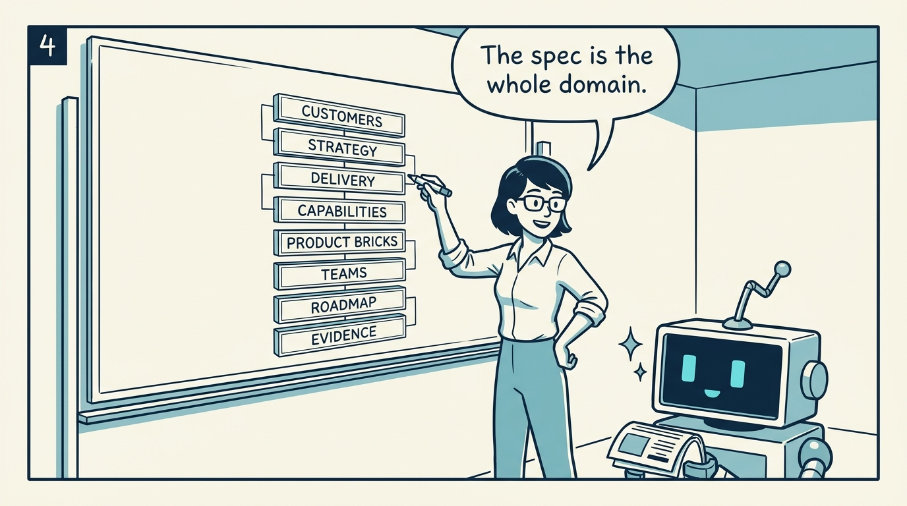
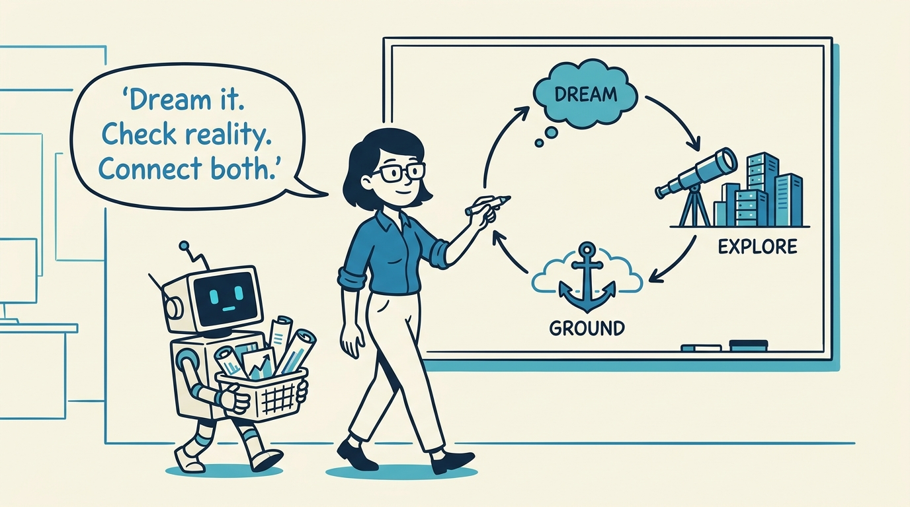
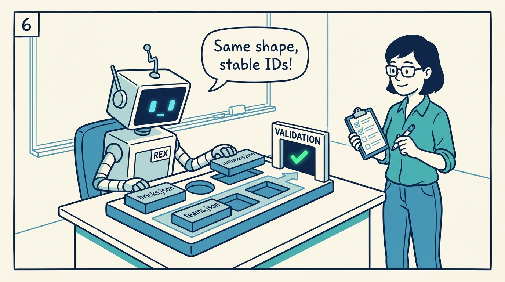
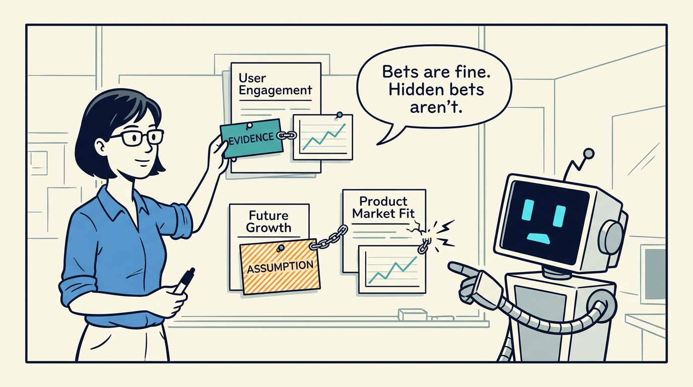
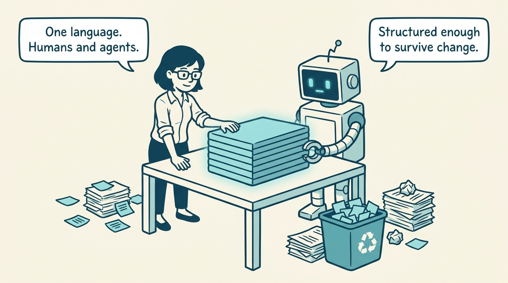

<!-- comic-style
{
  "cast": "MAYA: a pragmatic product architect, short dark hair, glasses, rolled-up sleeves, calm and slightly amused, often holding a marker or tablet. REX: an over-eager boxy robot AI assistant, one bent antenna, glowing rectangular eyes, perpetually holding or printing too many documents.",
  "style": "Clean two-tone explainer comic, thick ink outlines, flat colors with blue/teal accents on a light cream background, generous white space, hand-lettered speech bubbles with SHORT readable text (max 8 words per bubble), simple geometric office/whiteboard settings, no photorealism, no dense text, no title text."
}
-->

How a product stays coherent before any code exists — in eight panels.

**Panel 1:** *Products lose coherence long before code appears: vision, architecture, roadmap, teams, and evidence all live in different places.*

**Panel 2:** *AI agents amplify the fragmentation: plausible text everywhere, hard to compare, validate, or connect to delivery.*

**Panel 3:** *Vision is necessary but not operational: one sentence cannot tell an agent how jobs, pricing, payments, and support connect.*

**Panel 4:** *The core move: the spec becomes a structured model of the product domain — eight connected layers, not a feature brief.*

**Panel 5:** *Three modes keep the model honest: dream the intended product, explore real data, ground every concept in evidence.*

**Panel 6:** *With structure, examples, and validation, the agent edits source models inside a domain language — not strategy prose.*

**Panel 7:** *Early architecture always contains bets — grounding keeps them visible and shows when reality drifts from the dream.*

**Panel 8:** *The goal: a shared product-architecture language — specific enough to be useful, structured enough to survive repeated change.*
