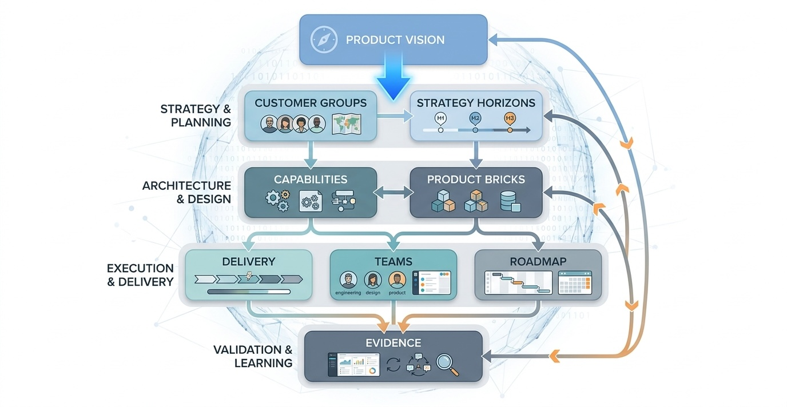
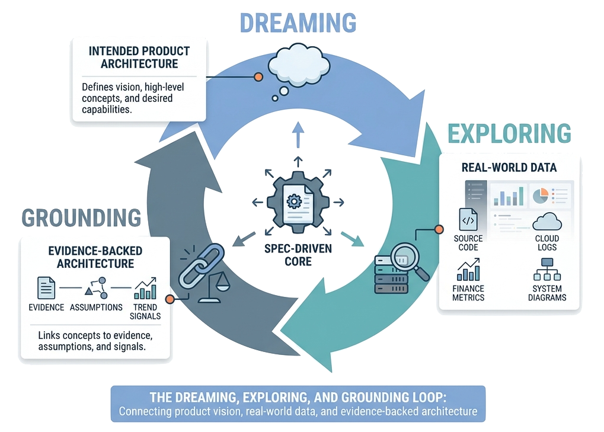

> Spec-driven product architecture treats the product domain model as a source-of-truth artifact: structured enough for AI agents to author and validate, and rich enough to connect product vision to implementation reality.

Spec-driven development usually starts close to software delivery. A team writes a specification, an AI agent or developer turns it into code, and tests or reviews check whether the implementation matches the spec.

That is useful, but it is too narrow for product architecture.

Most products fail to stay coherent before code appears. Customer groups are described in one place, product vision in another, architecture in diagrams, roadmap in planning tools, teams in org charts, and evidence in scattered documents. AI agents can help write all of those artifacts, but without a shared structure they also amplify the fragmentation. They produce plausible text that is hard to compare, hard to validate, and hard to connect back to delivery reality.

Spec-driven product architecture moves the specification boundary upward. The spec is not only a feature brief or a technical design. It is a structured model of a product domain.

## The Core Idea

In this series, **Spec-Driven Product Architecture** is the method; the public [repository](https://github.com/zeljkoobrenovic/spec-driven-product-architecture) is the working implementation. The method says product architecture should live in structured source models that humans and AI agents can inspect, validate, and publish.

A product architecture model should not stop at a vision statement. It should connect the idea of the product to the structures that make it buildable, operable, and reviewable:

| Layer | What it specifies |
| --- | --- |
| Customers | Customer groups, personas, jobs to be done, pains, needs, and outcomes. |
| Strategy | Value propositions, KPI pyramids, north-star metrics, and product horizons. |
| Delivery | Channels, APIs, events, releases, MVP scope, and operating workflows. |
| Product capabilities | Outcome-based capabilities that customers and the business care about. |
| Product bricks | Implementation-facing building blocks: systems, services, interfaces, modules, data, and dependencies. |
| Teams | Ownership, responsibilities, coordination points, and team topology. |
| Roadmap | Targets, initiatives, discoveries, releases, and sequencing. |
| Evidence and grounding | Source links, assumptions, documents, data signals, and architecture references that ground the model. |

The model is written as structured JSON under `_config/`, rendered into static documentation, and maintained by AI agents and humans together.

Readers can also explore many generated product-domain examples in the published [Spec-Driven Product Architecture overview](https://zeljkoobrenovic.github.io/spec-driven-product-architecture/start-packages/overview/index.html).

*The product-domain model works as a connected layer stack: product vision flows into customer groups, strategy horizons, delivery, capabilities, product bricks, teams, roadmap, and evidence.*

## Dreaming, Exploring, And Grounding

A realistic product architecture needs three complementary modes: **dreaming**, **exploring**, and **grounding**.

| Mode | What it does | Typical artifacts |
| --- | --- | --- |
| Dreaming | Defines the intended product: vision, concept, customer value, capabilities, product architecture, future state, and roadmap. | Product-domain specs, strategy horizons, capability maps, product-brick models, target states. |
| Exploring | Looks at what is actually happening in reality by building and using tools over real data. This connects to [Grounded Architecture](https://grounded-architecture.io/), especially its emphasis on data-led architecture practice and Lightweight Architectural Analytics. | Source-code maps, public-cloud activity, repository activity, deployment and incident data, finance data, ownership maps, technology landscape views. |
| Grounding | Explicitly connects dreaming and exploring so each important product-architecture concept has evidence, or a visible assumption, in the available data. | Evidence links, data references, confidence notes, trend signals, drift indicators, unresolved evidence gaps. |

*A pragmatic product architecture moves between dreaming the intended product, exploring real source/code/cloud/log/finance data, and grounding concepts in evidence, assumptions, and trend signals.*

Dreaming is necessary because product architecture needs imagination. It defines where the product should go, which customer outcomes matter, and which capabilities and product bricks should exist.

Exploring is necessary because organizations already have a reality. Source code, cloud usage, logs, delivery activity, finance, incident history, and ownership signals show what systems exist, how they behave, where money is spent, and where teams are actually investing attention. Grounded Architecture describes this kind of data-led practice as a way to keep architecture connected to the organization and its technology landscape.

Grounding is the explicit join between the two. It asks whether the concepts in the product-domain model can be connected to evidence:

- Does this product brick map to real repositories, services, cloud assets, APIs, or operational workflows?
- Does this capability have evidence in customer journeys, support data, product analytics, or delivery plans?
- Does this team ownership claim match repository ownership, activity logs, incident responsibility, or financial accountability?
- Does this roadmap target respond to observed trends, or only to an aspirational story?
- Which concepts are still assumptions because the current data does not prove or disprove them?

The goal is not to reject every concept that lacks evidence. Early product architecture always contains bets. The goal is to make those bets visible, keep the model up to date, and detect when reality starts moving away from the dream.

## Why Product Vision Is Not Enough

Product vision is necessary, but it is not operational by itself.

"Build a better ride-sharing marketplace" does not tell an agent how rider jobs connect to dispatch, pricing, risk, payments, support, driver earnings, fleet operations, or marketplace analytics. "Modernize internal developer experience" does not tell an agent which developer journeys matter, which golden paths exist, which platform capabilities are required, who owns them, or how the roadmap should reduce cognitive load.

A vision becomes useful when the model can answer practical questions:

- Which customer groups are materially different?
- Which jobs to be done create the most important product outcomes?
- Which KPIs express whether those outcomes are improving?
- Which capabilities make the outcomes possible?
- Which product bricks support those capabilities?
- Which teams own those bricks?
- Which roadmap items change those bricks, capabilities, and customer outcomes?
- Which facts are sourced and which are explicit assumptions?

Those questions are the point of the spec.

## Why AI Changes The Bar

AI agents can draft product architecture faster than a human can write it manually. That speed is useful only when the repository gives the agent a clear shape to follow.

Without structure, an agent tends to produce general product strategy prose. With structure, examples, and validation, the same agent can produce a model that another agent can inspect, extend, compare, and render.

In this project, the agent is not asked to "write a strategy." It is asked to create or refine source files such as:

- `customers/customers.json`
- `product-deployments/products.json`
- `product-deployments/deployment.json`
- `delivery/releases.json`
- `product-bricks/product-bricks.json`
- `product-bricks/product-capability.json`
- `objectives/current/...`
- `teams/teams.json`
- `business/competition.json`
- `start/config.json`

That is a different operating model. The agent has to work inside a domain language, preserve stable IDs, reuse existing schema patterns, keep references consistent, and validate the model before generated documentation is trusted.

## What Makes It Application-Aware

Many product strategy artifacts are intentionally abstract. They describe customers, needs, opportunities, and value propositions. That abstraction is useful, but it leaves a gap between "what the product should do" and "what has to exist in the application and organization."

Spec-Driven Product Architecture closes that gap with product bricks and delivery models.

A product brick is not just a feature and not just a system. It is an implementation-facing unit that can be built, owned, evolved, and connected to product value. A brick can include user-facing components, APIs, message consumers, services, integrations, data dependencies, and dependencies on other bricks. Product capabilities then describe the outcome-based combinations of bricks that produce customer or business value.

This is what makes the model application-aware. It does not pretend product architecture is only market positioning. It keeps enough implementation structure to support real delivery conversations.

## What This Series Covers

The rest of this series expands the model in layers:

- [[product-domain-as-source-of-truth]] explains why the product domain folder is the source of truth.
- [[customer-value-to-architecture]] shows how customer groups, jobs, KPIs, and strategy horizons create the top of the model.
- [[product-bricks-and-capabilities]] explains the bridge from outcomes to implementation-facing architecture.
- [[delivery-teams-and-roadmaps]] connects delivery, ownership, and planning.
- [[ai-agents-as-product-architecture-authors]] describes how AI agents should work inside the model.
- [[modeling-diverse-domains]] explains why examples from many domains are part of the method.
- [[evidence-validation-and-publishing]] returns to the grounding frame and explains validation and generated static documentation.

Several articles use Ride Sharing Marketplace as a lightweight running example. The example is concrete enough to show the model end to end, but it is not meant to make the method specific to marketplaces.

The goal is not to create a heavier planning process. The goal is to give humans and AI agents a shared product-architecture language that is specific enough to be useful and structured enough to survive repeated changes.
