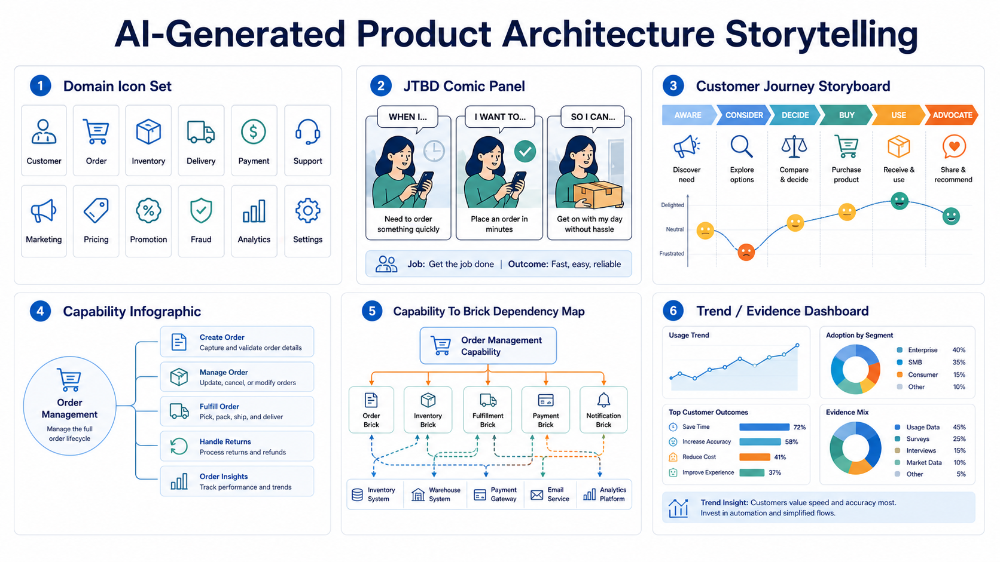
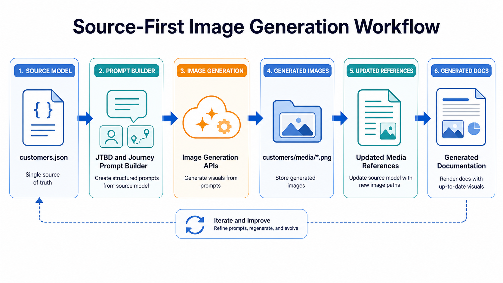

> AI agents become useful product-architecture authors when they are given structure, examples, local skills, validation gates, source-first media generation, and a repository they can inspect and validate.

AI agents are good at producing plausible product and architecture prose. That is both useful and dangerous.

The useful part is speed. An agent can inspect examples, draft source files, fill in repetitive structures, connect artifacts, and generate documentation much faster than a human starting from a blank page.

The dangerous part is also speed. If the repository does not constrain the work, the agent can produce a confident model that looks coherent but is not grounded in evidence, does not match the existing schema, and cannot be maintained by the next session.

Spec-Driven Product Architecture treats AI agents as structured authors, not independent strategy owners.

## The Human-Agent Division Of Labor

Humans provide intent, judgment, source selection, and review. Agents provide structured drafting, repository navigation, cross-artifact consistency checks, and mechanical validation.

| Human responsibility | Agent responsibility |
| --- | --- |
| Choose the product domain and purpose. | Inspect existing domains and infer current patterns. |
| Provide source links, business context, and constraints. | Separate sourced facts, assumptions, and inferences. |
| Review whether the model is strategically plausible. | Create or edit source files in the expected structure. |
| Decide tradeoffs and resolve ambiguity. | Keep IDs stable and references consistent. |
| Accept, reject, or revise the generated model. | Run validators and generate documentation when requested. |

This division keeps accountability where it belongs. The agent helps produce the model; it does not own the product strategy.

## Why Local Skills Matter

The source project includes a repo-local skill library under `_skills/product-domains/`.

Those skills are not marketing copy. They are operational guidance for agent work. They define how to approach domain framing, market research, customer segmentation, jobs to be done, KPI architecture, product strategy, product-brick architecture, delivery model design, team topology, roadmap design, schema recognition, structured JSON authoring, and static documentation modeling.

The skills help the agent avoid a common failure: treating every product architecture task as the same generic writing exercise.

For example:

- A market-research task needs evidence discipline.
- A product-brick task needs implementation-facing boundaries.
- A team-topology task needs ownership and coordination logic.
- A structured JSON task needs schema compatibility and reference stability.

Different phases need different guidance. The skill library gives the agent a way to load only the relevant guidance for the current task.

## Examples Are Part Of The Method

The project has many product domains. That matters because AI agents learn the repository's shape by inspecting examples.

When asked to create a new domain, the agent should not invent a folder structure from memory. It should inspect mature comparable domains, generator expectations, templates, and validation scripts. Then it should reuse the current repository patterns.

This is how the repository turns examples into authoring infrastructure.

The examples show:

- how customer groups are expressed
- how jobs to be done are structured
- how KPI pyramids are written
- how strategy horizons are shaped
- how product bricks use groups, modules, dependencies, and metadata
- how capabilities depend on bricks
- how teams own work
- how generated documentation expects the source to look

The agent still needs judgment. But it starts from the current system instead of a blank prompt.

## AI Makes The Documentation Engaging

AI is not only useful for drafting source JSON. It is also useful for turning structured product architecture into engaging documents, stories, and visuals.

Product strategy and implementation architecture are easier to review when the documentation shows the story clearly:

- icons that make domains, customers, capabilities, and product bricks easier to scan
- comic-like or storyboard visualizations of customer journeys and jobs to be done
- step-by-step panels that explain how a customer moves from trigger to discovery, evaluation, trial, engagement, and retention
- executive-style infographics that connect a job, its outcome, supporting capabilities, and relevant KPIs
- dependency visuals that show how capabilities depend on product bricks, modules, APIs, data assets, teams, and external systems
- trend and evidence visuals that show whether the architecture is becoming more coherent or drifting away from the intended model


*Generated illustration: `ai-generated-product-architecture-storytelling-gallery.png`. A collage showing icons, journey panels, JTBD comics, capability infographics, dependency maps, and trend visuals generated from the product-domain model.*

The important rule is that these visuals should be generated from the source model, not invented beside it. In the source repository, the image-generation scripts under [`_config/scripts/image-generation`](https://github.com/zeljkoobrenovic/spec-driven-product-architecture/tree/main/_config/scripts/image-generation) are a concrete example. They scan product-domain customer models, read `jobsToBeDone` and `customerJourneyStories`, build image prompts from the actual customer, JTBD, journey, outcome, capability, and KPI language, write images into `customers/media/`, and update `customers.json` media references when needed.


*Generated illustration: `source-first-image-generation-workflow.png`. A workflow diagram showing `customers.json`, JTBD and journey data, prompt generation scripts, image APIs, generated `customers/media/*.png`, and patched JSON media references.*

That keeps storytelling connected to the specification. A comic-like journey panel is not a decorative illustration; it is a visual rendering of a modeled customer job. An icon is not only branding; it helps readers navigate a domain model. A dependency visual is not just a diagram; it exposes whether the implementation-facing product bricks and capabilities are understandable enough to reason about.

This is where LLMs and image models complement the structured repository. The model gives AI the content and constraints. AI turns that content into documents, visual narratives, and maps that humans can actually use in strategy conversations.

## A Good Agent Workflow

A useful AI-mediated session follows a source-first sequence:

1. Read the repository guidance.
2. Inspect existing domains and generator expectations.
3. Load only the relevant local skills.
4. Clarify the intended domain and sources.
5. Draft or revise source files under `_config/product-domains/<domain-id>/`.
6. Keep IDs lowercase and stable.
7. Keep references synchronized across customers, capabilities, bricks, teams, objectives, and delivery.
8. Validate JSON and run the scoped domain validator.
9. Generate docs only when requested or when static output is part of the task.
10. Summarize assumptions, changed files, validation, and remaining gaps.

This workflow is slower than asking for a polished article. It is much faster than repairing a disconnected product model later.

## Validation Changes The Conversation

Validation is not a bureaucratic step. It changes what agents optimize for.

If the only output is prose, the agent optimizes for fluency. If the output must be valid JSON, reference-consistent, schema-aligned, and renderable, the agent has to work with the actual model.

The source project includes validation scripts such as:

```text
python3 _skills/product-domains/scripts/validate-domain-model.py <domain-id>
```

Validation cannot prove the product strategy is right. It can prove that the source model is parseable and catch classes of inconsistency that otherwise waste review time.

Strategic review remains human work.

## What To Avoid

AI-mediated product architecture fails when the agent is allowed to drift into unsupported certainty.

Watch for:

- invented business metrics
- generic customers that could fit any domain
- product bricks with no owning team
- capabilities that are just renamed systems
- roadmaps disconnected from customers or KPIs
- generated docs edited directly instead of source files
- schema changes introduced because the agent did not inspect examples
- assumptions presented as sourced facts

The fix is not to stop using agents. The fix is to give them a stronger source model, clearer examples, and validation gates.

## The Role Of The Reviewer

The human reviewer should not only proofread text. They should inspect the model's coherence:

- Is the domain scoped correctly?
- Are the customers materially distinct?
- Do jobs describe progress?
- Are KPIs specific enough?
- Do capabilities represent outcomes?
- Are product bricks buildable and ownable?
- Do teams and roadmap items connect to the model?
- Are assumptions visible?

That review turns AI output into product architecture.

[[modeling-diverse-domains]] explains why the project deliberately contains many different domains. The variety is not incidental; it is how the method learns what is stable across product contexts and what must remain domain-specific.
