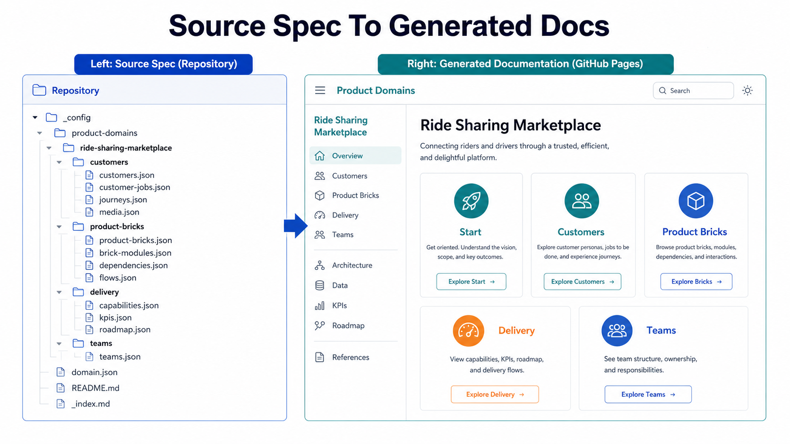

> Diverse product-domain examples are not decoration. They teach AI agents which modeling structures are reusable and which product details must remain specific to the domain.

Spec-Driven Product Architecture includes many product domains: ride sharing, online retail, public cloud services, internal developer platforms, enterprise CRM, premium airlines, local delivery, audio streaming, freight logistics, travel accommodations, industrial water intelligence, and more. Readers can browse the generated examples in the published [product-domain overview](https://zeljkoobrenovic.github.io/spec-driven-product-architecture/start-packages/overview/index.html).

That variety is not just for demonstration. It is part of the method.

AI agents improve when they can inspect examples. But examples are useful only when they show both consistency and variation. If every example is the same type of product, the agent learns a narrow pattern and over-applies it. If every example uses a different structure, the agent has no stable model to follow.

The project needs both: reusable structure and domain-specific content.

## What Should Stay The Same

Across domains, the modeling language should stay stable.

Most domains should be expressible through:

- customer groups
- personas or stakeholder roles
- jobs to be done
- journeys
- KPI pyramids
- product strategy horizons
- product deployments
- delivery channels, APIs, events, and releases
- product capabilities
- product bricks
- data assets
- objectives, initiatives, discoveries, and targets
- teams and ownership
- evidence, documents, and business context

This consistency is what lets AI agents transfer learning from one domain to another. A new domain can borrow the structure of mature domains without copying their business content.

## What Must Stay Different

The domain story must not be standardized into mush.

A ride-sharing marketplace has live supply-demand balancing, dispatch, pricing, safety, driver earnings, and city operations. A public cloud services domain has infrastructure products, developer APIs, governance, reliability, security, marketplace services, and usage-based economics. A premium long-haul airline has retailing, loyalty, operations, recovery, partner connectivity, cargo, and regulated service delivery.

Those domains should not have the same capabilities with different names.

The reusable model asks the same categories of questions. The domain-specific model answers them differently.

| Reusable question | Domain-specific answer |
| --- | --- |
| Who are the materially different customers? | Riders and drivers; developers and platform teams; travelers and airline operations; sellers and shoppers. |
| What progress are they trying to make? | Complete a trip, deploy safely, recover a disrupted journey, convert an order. |
| Which KPIs prove improvement? | ETA accuracy, deployment lead time, recovery time, fulfillment accuracy. |
| Which capabilities are needed? | Dispatch, golden paths, disruption recovery, checkout, partner onboarding. |
| Which product bricks make them real? | Domain-specific systems, modules, services, integrations, and data assets. |
| Which teams should own the work? | Stream teams, platform teams, trust teams, data teams, operations teams, compliance teams. |

This is why examples should be varied. They protect the method from becoming a template that fills itself.

## Domain Archetypes Help

The existing set of domains suggests several archetypes:

- **Marketplaces** - ride sharing, local delivery, travel accommodations, hosted stays, online retail, real estate, general listings.
- **Platforms** - internal developer platform, public cloud services, cloud data and AI platform, technical design collaboration.
- **Regulated or operational services** - premium airline, payments and revenue infrastructure, internet number registry and routing trust, industrial water intelligence.
- **Enterprise systems** - enterprise CRM, enterprise architecture management, travel and expense management.
- **Consumer subscription or content products** - audio streaming, digital news, mental wellbeing community.

Archetypes help an agent choose structural references. A new marketplace should inspect marketplace domains. A new developer tooling domain should inspect platform domains. A regulated operational product should inspect domains where compliance, reliability, and evidence are strong.

The agent should still inspect generator expectations and current schemas. Archetypes guide comparison; they do not replace repository reading.

## Examples Teach Depth

One hidden benefit of examples is depth calibration.

Without examples, an agent may produce a shallow skeleton:

- three customer groups
- five generic capabilities
- ten vague product bricks
- a team list with no ownership
- a roadmap that reads like a project plan

Mature examples show a higher bar:

- customer groups with distinct jobs and fears
- jobs with steps and capability needs
- KPI trees with specific leaves
- product bricks with modules and dependencies
- capabilities composed from multiple bricks
- teams that plausibly own bricks
- evidence and assumptions made visible

This is how the repository makes "good enough" concrete.

## Examples Also Reveal Schema Drift

The source project is evolving. Some files have moved from older names to newer names. Some domains may be more current than others. Some generator expectations may differ from older guidance.

That is normal in a living repository, but it means agents must inspect before editing.

An agent should ask:

- Which comparable domains look most mature and current?
- Which file names do the generators actually expect?
- Which schema shape appears canonical now?
- Are there legacy fields that should not be copied?
- Which validation checks exist?

This is especially important when creating new domains. Copying an old pattern blindly can preserve drift.

## The Quality Test

Diverse examples are working when they improve future authoring.

A new AI session should be able to inspect the repository and infer:

- how deep a mature domain should be
- how to separate market facts from assumptions
- how to avoid generic product-brick filler
- how to wire capabilities to bricks
- how to connect teams to ownership
- how to keep generated documentation useful

That is the point of modeling diverse domains. The examples are not final truth. They are a growing pattern library for structured product-architecture work.

## Example Domains To Inspect

The most useful way to read an example is to compare the source specification with the generated documentation. The source folder shows what the AI agent and human reviewers authored. The generated pages show how that model becomes navigable product-architecture documentation.

*Generated illustration: `domain-spec-to-generated-docs-comparison.png`. A side-by-side source-spec and generated-docs comparison using Ride Sharing Marketplace as the example.*

| Domain | Source specification folder | Generated documentation |
| --- | --- | --- |
| Ride Sharing Marketplace | [spec folder](https://github.com/zeljkoobrenovic/spec-driven-product-architecture/tree/main/_config/product-domains/ride-sharing-marketplace) | [generated docs](https://zeljkoobrenovic.github.io/spec-driven-product-architecture/product-domains/ride-sharing-marketplace/start/index.html) |
| Online Retail Marketplace | [spec folder](https://github.com/zeljkoobrenovic/spec-driven-product-architecture/tree/main/_config/product-domains/online-retail-marketplace) | [generated docs](https://zeljkoobrenovic.github.io/spec-driven-product-architecture/product-domains/online-retail-marketplace/start/index.html) |
| Internal Developer Platform | [spec folder](https://github.com/zeljkoobrenovic/spec-driven-product-architecture/tree/main/_config/product-domains/internal-developer-platform) | [generated docs](https://zeljkoobrenovic.github.io/spec-driven-product-architecture/product-domains/internal-developer-platform/start/index.html) |
| Public Cloud Services | [spec folder](https://github.com/zeljkoobrenovic/spec-driven-product-architecture/tree/main/_config/product-domains/public-cloud-services) | [generated docs](https://zeljkoobrenovic.github.io/spec-driven-product-architecture/product-domains/public-cloud-services/start/index.html) |
| Cloud Data and AI Platform | [spec folder](https://github.com/zeljkoobrenovic/spec-driven-product-architecture/tree/main/_config/product-domains/cloud-data-and-ai-platform) | [generated docs](https://zeljkoobrenovic.github.io/spec-driven-product-architecture/product-domains/cloud-data-and-ai-platform/start/index.html) |
| Enterprise CRM and Revenue Operations | [spec folder](https://github.com/zeljkoobrenovic/spec-driven-product-architecture/tree/main/_config/product-domains/enterprise-crm-and-revenue-operations) | [generated docs](https://zeljkoobrenovic.github.io/spec-driven-product-architecture/product-domains/enterprise-crm-and-revenue-operations/start/index.html) |
| Premium Long-Haul Airline | [spec folder](https://github.com/zeljkoobrenovic/spec-driven-product-architecture/tree/main/_config/product-domains/premium-long-haul-airline) | [generated docs](https://zeljkoobrenovic.github.io/spec-driven-product-architecture/product-domains/premium-long-haul-airline/start/index.html) |
| Travel Accommodations Marketplace | [spec folder](https://github.com/zeljkoobrenovic/spec-driven-product-architecture/tree/main/_config/product-domains/travel-accommodations-marketplace) | [generated docs](https://zeljkoobrenovic.github.io/spec-driven-product-architecture/product-domains/travel-accommodations-marketplace/start/index.html) |

[[evidence-validation-and-publishing]] closes the series by explaining how evidence, validation, and static publishing keep that pattern library trustworthy enough to use.
