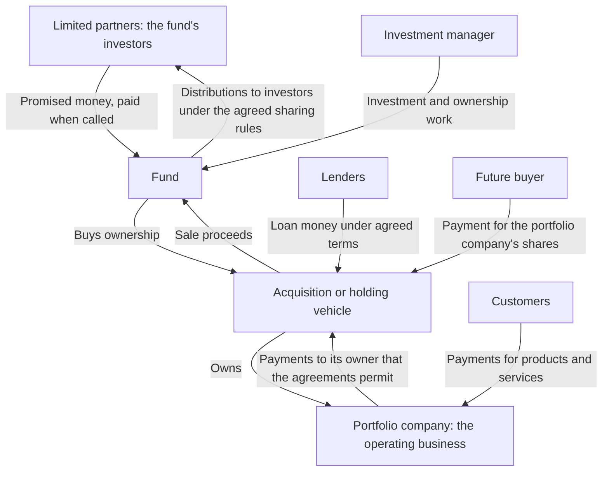

{id: announcement-is-not-a-budget}
# 3. Understand Funding and Control: An Investment Announcement Is Not a Budget

> **IN THIS SECTION, YOU WILL:** Learn to trace who owns the company, who supplies its money and who can approve spending it.

> **WHY INVESTORS CARE:** Investors and managers need to agree what money is actually available and who may approve spending, so that approvals apply to an agreed plan rather than to a headline.

> **WHY YOU SHOULD CARE:** A hiring plan built on the announced figure is built on money the company may never see.

> **KEY POINTS:**
>
> * Find out **who receives the investment money**. Buying a founder’s shares pays the founder; buying new shares can put money into the company.
> * **Separate the organizations involved**. The investment firm, its fund, the company used to hold the investment, and the business serving customers can have different money and obligations.
> * Distinguish **an estimate from a payment**. Saying an investment is worth more does not mean its owners have received cash, and a headline figure does not authorize a hire until the payer, the approver and the conditions are on the same page.

Your company announces a €100 million investment. It's natural to expect a larger hiring or product **budget**, an amount of spending that someone with authority has approved. But the headline figure may be a **valuation**, an estimate of what the whole company is worth (after investment), or the amount that changes hands in the transaction, and those two numbers can differ. Even the amount that changes hands need not reach the business.

A **share** is a unit of ownership in a company; its holder is a **shareholder**. Of the money paid for shares, payment for **newly issued shares** goes to the company that issues them: a **primary share issue**. Payment for **existing shares** goes to the shareholder selling them: a **secondary share sale**. Other parts of the amount may repay old loans or pay **transaction costs**, the legal and advisory fees of arranging the deal. Company cash can also grow in other ways, for example when a lender makes the company a loan as part of the same arrangement, or when an owner separately agrees to fund it.

In this chapter's examples, the money arrives at **closing**, the day the transaction is completed and the agreed payments are made, not at the announcement.

An announcement describes a transaction, an agreed exchange between the parties. To turn it into a hiring plan, establish how much cash reaches the business, when it arrives and who can authorize its use. These questions matter under every ownership arrangement; a transaction changes the conditions of the answer, because the amount that reaches the business depends on how the deal was structured and on the conditions attached to it.

In the chapter [Understand Expectations: Customers, Lenders and Investors](#customers-lenders-investors) we traced €100,000 through a prepayment (money paid before the service is delivered), a loan and a share issue — one payment at a time. This chapter zooms out from single payments to whole deals: arrangements that change who owns or controls the company. It compares three: a **minority funding round**, one occasion on which the company raises money by selling less than half its shares to investors; a **buyout**, the purchase of control of the company, here paid for by an **investment fund**, a pool of investors' money managed under agreed rules; and ownership by a larger operating company, a **corporate group**. It explains the fund structure behind the buyout, and ends with the one-page record that turns Alex's hiring assumption into an authorized plan.

{id: announcement-is-not-a-budget--map-the-arrangement-before-relying-on-the-money}
## Map the Arrangement Before Relying on the Money

Consider three alternative, fictional Larkspur announcements. In each, Alex wants to hire more **onboarding engineers**, who set new customers up on the product and move their data across. The number in the announcement cannot approve those hires.

| Announcement | Where money goes under these assumptions | What Alex needs to establish |
| --- | --- | --- |
| Investors buy €8 million (€8m) of newly issued shares, less than half the company | The company receives €8m at closing, before transaction costs | Which operating plan is approved, what approvals apply and how long that plan can be funded |
| A fund buys the founder’s shares for €40m | The selling founder receives the purchase money | Whether separate company funding exists and which payments any borrowing behind the purchase requires |
| A corporate group buys Larkspur | Selling shareholders receive the agreed share price | Which group entity funds future work and how the local budget relates to the parent’s priorities |

If an existing investor joins another round, that doesn't mean every shareholder contributes again. If a corporate investor buys a minority stake, less than half the shares, that doesn't automatically make the company part of the parent’s operating hierarchy. Draw the actual arrangement.

Identify the shareholder, the entity supplying cash, the person authorized to commit it and any conditions before payment. Include the date by which a promised decision must arrive for the engineering plan to stay feasible. The end of this chapter shows that page completed for the first announcement.

The next sections explain a fund-backed arrangement in detail. **Venture investors**, who fund young businesses with uncertain prospects, and **growth investors**, who fund the expansion of established businesses, usually without buying control, can also use funds; corporate and individual owners may use different structures. Don't invent a fund, a holding company or a fixed sale deadline when the arrangement has none.

{id: announcement-is-not-a-budget--a-fund-backed-buyout-can-involve-four-separate-organizations}
## A Fund-Backed Buyout Can Involve Four Separate Organizations

A useful starting map separates four types of **entity**, meaning an organization or legal body. Actual transactions can have more layers, several investors and different arrangements. The map's purpose is to locate money and responsibilities, not to assume everyone shares one bank account.

| Entity | What it is | Main responsibilities or interests |
| --- | --- | --- |
| **Investment firm** (also called the manager or, as the organizer of the deal, the financial sponsor) | Employs the investment and operating professionals; may manage several funds. | Manage investments, meet obligations to fund investors and sustain its own business |
| **Fund** | The pool of investors’ money: its own investors, the money they have promised, the kinds of investment it may make and an agreed lifetime. | Invest, and pay the money that investments bring in (the **proceeds**) to its investors under its governing agreements |
| **Holding vehicle** | A company set up to hold the investment; it may also borrow. | Hold ownership and meet its own obligations |
| **Portfolio company** | The operating business: sells to customers, employs people and pays suppliers. | Serve customers, meet obligations and sustain the business |

The map below shows how money moves between them in a fund-backed buyout. Three labels need explaining first. The fund’s investors are called **limited partners (LPs)**; they promise money to the fund and pay it in when the fund asks, a request called a **capital call**. The fund buys ownership, called **equity**, in the holding vehicle. When an investment is sold, the fund pays the money out to its investors; each such payment is a **distribution**, made in an order the fund agreement sets. The map is conceptual, not a legal organization chart, and it illustrates one form of investor ownership, not every form. Read the arrows from the investors and lenders toward the business, then follow the sale proceeds back to the fund’s investors:

One clarification about the sale route concerns which shares change hands. In this diagram the future buyer purchases the **portfolio company's shares from the holding vehicle**, so the payment lands in the holding vehicle, which repays its lenders and passes what remains to the fund. In other transactions the buyer purchases the holding vehicle itself from the fund, and the payment goes to the fund directly with the borrowing still attached to what was bought. Either way, the buyer pays for existing shares; the payment comes from that buyer, not from the company's customers, and none of it is new money for the operating business unless the agreement says so. A real financing review also needs the intermediate companies, taxes, the lenders’ contractual protections (such as approval rights over particular actions) and any other investors.

Two consequences follow from the map.

**"The firm has capital" is not a statement about you.** Capital here means money available to invest. A firm may be raising a €2 billion (two thousand million) fund while the fund that owns your company has already placed all the money it may invest and is near the end of its agreed lifetime. Those are different pots. An investment from the new fund would need its own justification and approvals under the relevant agreements; it isn't an automatic source of support for the older fund’s company.

**Locate the borrowing as well as the cash.** Debt, money borrowed that must be repaid, can sit in a holding company, an operating company or several entities. The company’s **balance sheet**, a statement at one date of what it owns (its assets), what it owes and what is left for its owners (its equity), needs reading at the relevant level. Payments required elsewhere in the ownership structure may still depend on cash from the operating business. Ask finance to explain those connections.

So before accepting a budget for a cloud migration, moving the software to another computing provider, ask **which entity pays the invoice** and who can commit its money. Before relying on a promise of support, ask **by what mechanism the capital would actually arrive**. Before sharing customer data with anyone at the owner, ask who is receiving it and under what authority. Common ownership answers none of these.

**Figure 1:** *Map the legal entities and their obligations before assuming one organization can use another’s money. In this illustration the lender’s loan cash goes to the holding company, which owes the repayments.*

{id: announcement-is-not-a-budget--commitments-are-promises-not-payments}
## Commitments Are Promises, Not Payments

The money in the fund comes from the limited partners: pension funds, which invest to pay future pensions; insurers, which invest premiums to pay future claims; and endowments. An **endowment** is a pool of assets invested to support an institution, such as a university. These investors supply the fund’s capital; whether any of it reaches a company’s product and technology budget depends on the transaction.

Many funds are **partnerships**, a legal arrangement between partners governed by a **limited partnership agreement**. In that form, the **general partner**, or GP, holds the management responsibilities and powers under the fund arrangements. The investment firm often acts as the fund's manager under a separate agreement, and "GP" is used informally for the firm. Which body actually approves an investment is whatever those agreements say.

In a common arrangement, an LP doesn't pay its entire promised investment at once. It makes a **commitment**: a promise to supply money when asked, under agreed conditions. When the fund needs money for an investment, it issues a capital call, and the LP pays the amount requested.

Follow one fictional LP with a €10 million commitment:

| Year | Event | Cash to the LP |
| --- | --- | ---: |
| 1 | Commits €10m. No money moves. | — |
| 1 | First capital call: €2m requested, LP pays. | −€2m |
| 3 | The fund raises its estimates of what its companies are worth. | **€0** |
| 7 | A company is sold; the fund distributes the LP’s share of the proceeds. | +€3.5m |

The row that matters is year 3. **A valuation increase pays nobody.** It's an estimate, not a transfer, and the LP can't spend it. That distinction runs through the whole book: the moment a company is said to be worth more is not the moment anyone receives anything.

An agreement may let the fund reinvest proceeds or require an investor to return an earlier payment under stated conditions. Those details change cash timing. The basic distinction stands: a promise, a payment and a valuation estimate are three different events.

A fund's life includes fundraising, investing, supporting companies, selling investments or otherwise receiving proceeds, and eventually closing the fund. These phases overlap. The **investment period**, the years in which the fund may make new investments, and the fund's **term**, its overall planned lifetime, are different clocks; extensions of either and reinvestment provisions depend on the agreement. The **Institutional Limited Partners Association (ILPA)** represents investors in private funds, funds whose investors join under privately agreed terms rather than through a public market. Its principles are recommendations, not terms binding every fund. [S02: ILPA principles](https://ilpa.org/wp-content/uploads/2019/06/ILPA-Principles-3.0_2019.pdf)

For a company leader, the relevant question isn't simply how long a **private-equity** fund, one that buys ownership of companies outside the public stock market, usually holds a company. It's how much time and flexibility this ownership structure has, and **what happens if an intended exit, the planned sale of the investment, is delayed**.

**Figure 2:** *A promise, a request, a payment into the fund and a payment out of it are separate steps. Company cash grows only on the new-shares branch; the existing-shares branch pays the seller.*

{id: announcement-is-not-a-budget--fees-and-profit-sharing-shape-incentives}
## Fees and Profit Sharing Shape Incentives

The manager is paid through a **management fee**, a regular payment for managing the investments. The fee is usually calculated as a percentage of the money committed or invested, and it supports the manager's business. The manager may also receive **carried interest**, also called carry: a contractual share of investment profits, meaning the gain over what the fund paid after the deductions the agreement allows. The fund agreement sets the detailed rules for sharing investment proceeds between the investors and the manager, which practitioners call the distribution waterfall. Carry is different from a company's executive bonus and different again from **management equity**, the shares in that company that its executives own.

These terms shape which requests a company receives and when. A fund near the end of its term, or a manager whose profit share depends on a sale that turns estimated value into cash, has reasons to prefer some kinds of work over others.

The chapter [Compare Incentives and Stakes: Equity, Carry and Jobs](#different-bets) examines those incentives, and [Understand Investor Returns: Same Performance, Different Outcomes](#three-different-returns) the ways an investment's gain is measured. The optional reference [Fund Economics: Fees, Distributions and Performance Reports](#fund-economics) works through the sharing rules and the terms that fine-tune them, for readers who want the mechanics.

Fees, the way shared costs are split between the manager, its funds and their companies, and services bought from organizations connected to the manager also create conflicts. The US Securities and Exchange Commission (SEC), the federal regulator for investing, explicitly discusses in its guide the possibility that the manager's interests differ from those of its funds. [S01: SEC investor guide](https://www.investor.gov/introduction-investing/investing-basics/investment-products/private-investment-funds/private-equity) A company leader should therefore ask who funds an operating intervention and whether the provider has a financial interest in the recommendation. Useful support can still involve a conflict that needs to be understood.

{id: announcement-is-not-a-budget--owning-a-company-does-not-mean-running-it}
## Owning a Company Does Not Mean Running It

An owner’s influence over the company and an executive’s authority to act for it come from different roles and agreements.

An **investment committee** is the body authorized to approve investments for the fund under its arrangements. A company’s **board** oversees the business within its own authority, while executives manage day-to-day work. Buying a company, approving its annual plan and signing a customer contract are different decisions. Share ownership alone doesn't give every shareholder authority to sign contracts for the company. Loan agreements may also require the lender's approval for particular actions. When someone says "the investor wants X," the useful reply is: which body, exercising which right, and can they actually require it?

Some investment firms employ an investor's technology adviser who may contribute to both investment and company discussions; this book's example of such a role is the Technology Principal, Morgan. The role's authority must be established in each forum; neither a venture investor nor a corporate owner necessarily provides an equivalent role. The chapter [Clarify the Adviser’s Role: Are They Helping, Assessing or Deciding?](#investors-adviser) develops the role; the chapter [Clarify Authority: Decide Who Decides Before You Disagree](#decide-who-decides) works through the decision rights in detail.

{id: announcement-is-not-a-budget--alex-s-hire-the-completed-funding-and-authority-record}
## Alex's Hire: The Completed Funding-and-Authority Record

Return to the first announcement: investors buy €8m of newly issued shares in Larkspur, less than half the company. The round was announced on 20 September, the day the **subscription agreement**, the contract under which the investors buy the new shares, was signed; the money arrived at closing on 3 October. Between those dates the €8m was a contractual commitment, not cash. Alex's first proposal, sent on the day of the announcement, was five onboarding engineers, on the assumption that part of the €8m was an innovation budget. Here is the one-page record Sam and Alex completed on 11 October, with the source of each entry and the proposal that went to Ines, the chief executive officer (CEO). All figures are fictional, and this scenario is separate from the Larkspur cash figures used in later chapters.

| Field | Entry | Where the information came from |
| --- | --- | --- |
| Proposed commitment | Three onboarding engineers starting 1 November; about €300,000 a year recurring, roughly €100,000 per hire | Alex |
| Paying entity | Larkspur, the operating company, from its own bank account | Finance: the subscription agreement names Larkspur as the company issuing the shares and receiving the money |
| Cash state | Announced and subscription agreement signed 20 September; €8m received at closing on 3 October; €0.4m transaction costs paid; €7.6m net (after those costs) added to Larkspur's cash | Finance: bank statement and the closing statement, the transaction's record of the payments made and the costs deducted |
| Approver | The Larkspur board approves the annual operating plan under the **shareholders' agreement**, the contract between the shareholders and the company that sets their rights; it approved the year-one plan on 10 October. Within that plan, Ines as CEO authorizes hires; no further consent is needed | Board minutes, the written record of the board's decisions; shareholders' agreement read by legal |
| Conditions | Two **reserved matters** (decisions the shareholders' agreement says need a named party's consent) require the consent of the **investor director**, the board member the investors appointed under that agreement: spending above €250,000 outside the approved plan, and any increase in the number of new hires the plan allows, whatever it costs. The plan allows four new engineering hires in year one, so Alex's three fall within it | Legal: the shareholders' agreement and its list of reserved matters |
| Runway effect (how long the cash lasts) | Planned net spending, meaning cash paid out less cash received from customers, including the three hires, is about €300,000 a month, and the board keeps a €400,000 minimum cash reserve. Counting only the round's proceeds, €7.6m less the €400,000 reserve leaves €7.2m, which funds 24 months of planned spending before the reserve is reached | Finance: cash plan, the dated forecast of money entering and leaving the business |
| Decision date | Offers out by 15 October for a 1 November start | Alex |

**The decision.** Ines, as CEO, authorizes the three offers on 12 October within the approved plan. No investor consent is needed, because the hires sit inside the plan the board approved. Funding is the €7.6m net received at closing, not the €8m announced. The scarce capacity is recruiting time and the onboarding team's ability to absorb three people at once.

**Why not five.** Five engineers, Alex's first proposal, would mean five new engineering hires against the four the plan allows. That is a question of the hiring allowance, not of total headcount: the plan already assumes the engineers Larkspur employs today plus four. The fifth hire alone, at about €100,000, is below the €250,000 spending threshold, so the spending rule would not catch it. The hiring rule would, and the investor director's consent would have been needed before an offer went out.

**Why not wait.** Waiting for the "innovation budget" the announcement seemed to promise was rejected because no such budget exists in any agreement.

**What would reopen the decision.** Any one of three pieces of evidence:

- a revision of the board-approved plan;
- first-quarter onboarding volume, the amount of customer set-up work, below the plan's assumption;
- cash at a quarter end more than €300,000 below the approved cash plan's forecast for that date.

Ordinary spending under the plan does not reopen it; the plan already assumes that cash falls. What reopens it is a shortfall against the forecast.

Had the second announcement been the real one, the record would look different in its first three rows. The €40m paid the founder. Larkspur's own cash did not change. Any new hire would then have to be paid by Larkspur from its available cash and the cash it expects to generate from running the business. The only alternative is a separate funding commitment, which the record would have to name together with its own approver and conditions. The page is the same; the answers are what change.

{id: announcement-is-not-a-budget--from-money-and-authority-to-value}
## From Money and Authority to Value

Customer payments sustain the operating business. Investors, lenders and future buyers can also bring cash into the wider arrangement. Keeping those sources separate explains why an investor with plenty of money and a company short of cash can coexist.

You can now trace who supplies cash, who receives it and which body makes a decision, and you have seen the record that turns an announcement into an authorized hire. One question from the opening remains: what the €100 million meant. A headline may name the purchase price, new funding or a valuation, and the three can differ. The next chapter explains how to identify and interpret the valuation. That needs three basic financial ideas, sales, profit and cash, which we develop in the chapter [Understand Valuation: An Estimate, Not a Fact](#valuation-is-an-estimate).

{id: announcement-is-not-a-budget--questions-to-consider}
## Questions to Consider

1. *Can you complete the record above for your own arrangement: which entity pays, which figures are commitments, payments received or valuation estimates, who can commit the money and what conditions apply before payment?*
2. *When someone says “the investor has capital”, which pot are they describing: the fund that owns your company, a different fund or the firm’s own business?*
3. *Where does the borrowing sit in your structure, and how much of the operating company’s incoming cash is needed to pay its interest, the charge for borrowing, and its repayment instalments, the scheduled portions of the amount borrowed?*
4. *When you hear “the investor wants X”, do you know which body, exercising which right, is behind the request and whether it can actually require it?*

{id: announcement-is-not-a-budget--to-probe-further}
## To Probe Further

- **[Buyouts: A Primer](https://www.nber.org/papers/w29502)** — Tim Jenkinson, Hyeik Kim and Michael Weisbach, National Bureau of Economic Research working paper, 2021.  
  *The four-entity map in this chapter in fuller academic form, covering how buyout funds are organised and how general partners and company managers are paid.*
- **[Model Limited Partnership Agreement](https://ilpa.org/industry-guidance/templates-standards-model-documents/model-limited-partnership-agreement/)** — Institutional Limited Partners Association, 2019, revised 2020.  
  *Free model fund agreements so you can read the actual clauses behind commitments, capital calls and the distribution waterfall, as investors would prefer them.*
- **[The Economics of Private Equity Funds](https://academic.oup.com/rfs/article-abstract/23/6/2303/1569783)** — Andrew Metrick and Ayako Yasuda, Review of Financial Studies, 2010.  
  *Data on 238 funds showing that most of a manager's expected revenue comes from fees that don't depend on investment performance rather than from carry, the numbers behind the fee and profit-sharing mechanics summarized here and worked through in the fund-economics reference.*
- **[Eclipse of the Public Corporation](https://hbr.org/1989/09/eclipse-of-the-public-corporation)** — Michael C. Jensen, Harvard Business Review, 1989.  
  *The original case for the ownership structure this chapter maps, written by its most prominent advocate, so read it as advocacy rather than a test of the model. “Public corporation” in the title means a company whose shares trade on a stock market, not a state-owned one.*
- **[Patient Capital: The Challenges and Promises of Long-Term Investing](https://press.princeton.edu/books/paperback/9780691217086/patient-capital)** — Victoria Ivashina and Josh Lerner, Princeton University Press, 2019 (paperback 2021).  
  *The limited partners' side of the arrangement; patient capital means investment whose providers are willing to wait years for their return. It explains why a fund's life and exit timing create pressure on a company at all.*
