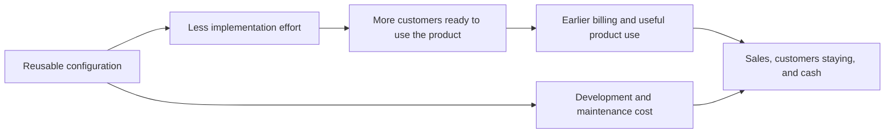

{id: roadmap-to-revenue}
# 12. The Chain From Roadmap to Revenue Breaks Easily

> **IN THIS SECTION, YOU WILL:** Learn to trace a product change from customer need through customer behavior to a business result, and let the measured result revise the next commitment.

> **WHY INVESTORS CARE:** Investors underwrite the financial result at the end of the chain, not the feature at the start. Released staff capacity can enter their model before it changes spending, but only with an explicit, dated conversion; without one, a business case that stops at freed hours gives them nothing to carry into a valuation or a repayment test.

> **WHY YOU SHOULD CARE:** A technology benefit enters a financial plan through a mechanism: more revenue, avoided expenditure, released capacity used elsewhere, or a change in risk. The mechanism needs evidence, and the link from freed effort to a financial result is the one to test hardest.

> **KEY POINTS:**
>
> * Start from a **customer need worth serving**. A faster workflow is only worth optimizing when customers are waiting for the result it produces and the investor’s expectation of it has been made explicit.
> * Distinguish **freed time from money saved**. If the same people are still paid, less effort creates capacity for other work without reducing spending, until a conversion plan turns it into a result.
> * Check the **whole chain against evidence**. Count committed and incurred cost, compare like groups, keep observed hours apart from annual projections, name the explanations you can’t rule out, and let the measured result change the next commitment.

A product team proposes making customer setup faster. That sounds useful, but what is the benefit? Customers might start using the product sooner. Staff might serve more customers. The company might collect payment earlier. Each possibility needs a different piece of evidence.

A **product roadmap** sets out intended product changes and priorities. A roadmap item describes work; its business case explains the useful result expected from it. This chapter follows one item from the proposed change to its measured effect, and ends with what the measurement changed.

A product leader normally has to show that a change is useful. An investor may expect this change to support a particular growth, margin or retention target. Make that expectation explicit, then test whether the benefit and its timing are credible. The chain from work to result is the part an investor’s adviser will examine, and the part most often asserted rather than shown.

The example uses Larkspur, a fictional company selling scheduling software. **Onboarding** is the setup and help a customer needs before using that software successfully. [You Cannot Fund Every Good Project at Once](#cannot-fund-everything) chose a smaller setup change over a full portal because customer evidence supported it. Here we look at that one change: how could it produce a useful customer and business result, and did it?

{id: roadmap-to-revenue--start-with-a-need-worth-serving}
## Start With a Need Worth Serving

A company can efficiently build features customers don’t need. It can reduce infrastructure cost for a product whose market is shrinking. It can improve delivery speed while commercial teams promise incompatible custom work. Product strategy decides where capability should be applied, so the need comes before the arithmetic.

Begin with the customers and segments the company intends to serve. What progress are they paying for? Why do they choose this product? Which needs remain poorly served? Which requests look attractive individually but undermine a repeatable product?

At Larkspur the need is a queue. Customers already sold are waiting for setup, and most of them need the same implementation specialist’s manual configuration before they can use the product. The growth funding assumes that number will rise without a proportional rise in implementation staff. So the setup change serves customers who exist now and a target the investor has stated. That is the expectation to make explicit: onboarding volume up, implementation effort per customer down, within the plan’s first year.

Under ownership pressure, product management can become an intake process for investor, sales and acquisition requests. The remedy isn’t to reject those voices but to apply the same customer and economic test. An investor introduction is a lead, not a product strategy: when an investor introduces three potential customers, Priya tests the same unmet need and willingness to pay she would examine with any other prospect, because building three unrelated demonstrations could impress the investor while producing little evidence of a repeatable product. If the investor wants a different priority, **make the displaced work** and the proposed commercial benefit explicit. A requested feature should carry a hypothesis about demand and financial contribution, not just the name of the person who asked for it.

**DORA**, a research program studying software delivery and organizational performance, emphasizes user focus and stable priorities in its 2024 account of software performance. Its survey-based relationships give useful direction, but they don’t establish the monetary value of a specific company’s roadmap. [S15: DORA 2024 report](https://dora.dev/research/2024/dora-report/)

{id: roadmap-to-revenue--follow-the-steps-from-change-to-outcome}
## Follow the Steps From Change to Outcome

An **investment thesis** is the investor’s explanation of why the investment should succeed, a revisable prediction rather than an instruction, and it identifies which result matters most. A thesis built on expansion needs evidence the product can win and serve more customers at acceptable cost; one built on established earnings needs evidence those earnings survive maintenance and reinvestment ([A Valuation Is an Estimate, Not a Fact](#valuation-is-an-estimate)). Both depend on a product that works.

**Reusable configuration** means settings and setup steps that can serve several customers, reducing the custom work each time. The hypothesis is that one reusable setup step will shorten implementation, reduce effort and let more customers become productive.

The proposed chain is:

Each arrow is a hypothesis. Faster implementation may not increase sales if demand is weak. Earlier billing may not keep customers who don’t receive value. Reduced effort may free staff capacity without reducing cash spending. A configuration feature may create maintenance obligations that absorb part of the benefit.

**Read each arrow as a question to test.** If engineering effort falls but customers wait just as long, find out what else is keeping them waiting. The last section of this chapter is that case.

{id: roadmap-to-revenue--six-kinds-of-benefit-to-examine}
## Six Kinds of Benefit to Examine

Three terms help distinguish the benefits. **Retention** means keeping customers or their revenue over a stated period. **Margin** is a specified profit measure divided by revenue. **Financial contribution** is revenue from an activity less the costs included in serving it; say which costs are included, because this isn’t necessarily the company’s final profit. (Later in the chapter, “helped produce” or “contributed to” describes a causal claim; the two uses are kept apart.)

| Mechanism | Example intervention | Evidence to seek |
| --- | --- | --- |
| Revenue growth | Remove a product constraint in an attractive segment | Potential customers the change can help, actual purchases, usage and additional financial contribution |
| Retention | Improve a workflow associated with customer failure | Renewals in comparable customer groups, reasons for leaving and useful customer outcomes |
| Margin | Reduce manual implementation or service effort | Effort per unit, quality, fully loaded delivery costs |
| Cash generation | Shorten contract-to-activation and collection | When invoices can be issued, unpaid invoices and actual cash received |
| Risk reduction | Improve recoverability of a critical service | Tested controls, exposure scenarios, recovery performance |
| Strategic flexibility | Separate a product boundary needed for expansion | New choices made possible, the cost of using them and the time required |

These mechanisms overlap, but **their financial effects should not simply be added**. Earlier billing can accelerate cash without increasing lifetime contract revenue. A retained customer may already be in a revenue forecast. An acquisition benefit can appear both in cost savings and in the acquired company’s earnings measure unless reconciled.

{id: roadmap-to-revenue--the-arithmetic-worked-through}
## The Arithmetic, Worked Through

For this **separate, smaller pilot example**, assume Larkspur performs 100 customer implementations a year. We are testing the benefit of one reusable setup step, not costing the €1 million onboarding program in [Confirm the Cash Before You Commit](#obligations-before-budget). Each implementation uses 80 hours of work at a **fully loaded planning cost** of €75 per hour, including pay and the employment overheads in this model. At 2,000 hours per full-time specialist a year, that rate prices one implementation specialist at €150,000 a year and two at €300,000; this book uses the same basis wherever it costs the pilot, the hires it defers and the capacity it releases. One hundred implementations at 80 hours is 8,000 hours, or €600,000 of annual capacity. The proposal assumes the step reduces effort to 50 hours, making the modelled capacity requirement €375,000. The difference is €225,000, or 3,000 hours.

That is a capacity estimate. If staffing and external invoices stay unchanged, cash hasn’t fallen by €225,000. The company could use the capacity to serve more customers, reduce overtime, improve quality or eventually avoid hiring. Each outcome has a different economic interpretation.

The pilot is a commitment of €180,000 to build, twelve engineer-weeks, plus €30,000 a year of maintenance from the financial year after it ships. Reporting €225,000 of recurring profit without showing those costs, and whether the capacity was converted into an economic result, would mislead. So would dismissing the work because payroll didn’t immediately fall. Serving additional profitable demand can be the more valuable use of the freed capacity.

A usable proposal therefore includes a **conversion plan**: how the released capacity will produce a customer or business benefit. Priya checks whether customers are waiting who can use the improved setup. Alex establishes which work the 3,000 hours could actually support. Sam tests when additional receipts or avoided supplier payments would reach the cash forecast. The plan names three possible conversions, and the review has to say which one happened: the released time serves waiting customers, it avoids an external invoice or a hire, or it remains unusable because a different bottleneck binds.

**Figure 1:** *Time saved becomes useful capacity through a plan; it does not automatically reduce the payroll bill.*

{id: roadmap-to-revenue--check-whether-the-change-explains-the-result}
## Check Whether the Change Explains the Result

A **baseline** records the starting situation used for comparison. Establish it before implementation when you can. Define which customers are included, the time period, exclusions and how costs are calculated. A **cohort** is a defined group tracked over time, such as customers starting in the same quarter. Keep raw counts alongside percentages. Overall retention can rise because the company has more customers from a segment that already renews reliably, even if retention within each segment is unchanged. Compare like groups so a change in customer mix isn’t mistaken for a product improvement.

Where practical, compare a staged rollout with a comparable group. Where that isn’t possible, document the timing and the competing explanations. A **counterfactual** is an estimate of what would have happened without the change; finance can check the calculation, but it can’t supply a missing comparison by reviewing the numbers.

Larkspur’s pilot is the realistic small-company case. The comparison is eight pilot customers against the twelve implementations from the two quarters before, in one country, with the baseline of 80 hours reconstructed at day 20 from the specialist’s time records rather than measured in advance for all twelve. That comparison leaves differences that “comparable customers” does not remove: the sales team chose which new customers went through the pilot first, so their data may have been cleaner or their contracts smaller; the same specialist did both groups and may simply have become faster with repetition; and the earlier group included a quarter-end rush. None of this makes the result useless. It means the honest claim is “the setup step plausibly helped produce the reduction, with these measurements and these unresolved differences”, not a precise attribution to the product change alone. Interviews can explain the mechanism; an enthusiastic testimonial is not a financial calculation.

**Figure 2:** *An observed improvement needs a comparison that can reveal other explanations.*

{id: roadmap-to-revenue--protect-the-product-you-have-not-built-yet}
## Protect the Product You Have Not Built Yet

A margin improvement that depends on postponing necessary maintenance carries a future bill. A retention result that relies on customers being unable to leave can be fragile. A faster release process that degrades reliability transfers costs to users and support teams.

For each major intervention, choose a few indicators that could reveal damage. For onboarding, these are early customer abandonment, error rates, support demand and time to the customer’s first useful outcome. The indicators should follow the mechanism, not a universal template. Useful benefits include service continuity and reduced exposure to harm as well as growth and savings.

{id: roadmap-to-revenue--what-the-pilot-showed-and-what-changed}
## What the Pilot Showed, and What Changed

The same pilot is the funded first-hundred-days commitment ONB-1 in [The First Hundred Days: Turn Expectations Into a Funded Plan](#first-hundred-days). Priya measured the first cohort at day 90; the board decided at its day-100 review. All figures are fictional.

**Observed.** The cohort was eight customers. Effort per implementation fell from 80 hours to 62, not to the 50 the proposal assumed. About 40% of the remaining hours traced to poor customer data rather than to the product, which partly supports Alex’s explanation of where the effort goes. Customer waiting time was unchanged. The guardrail indicators did not move: error rates and support tickets were not up.

**Observed versus projected.** Eight customers at 18 hours less each is 144 hours released in the cohort, about €10,800 at the planning rate. The 1,800 hours and €135,000 a year quoted for the pilot (100 × 18 × €75) are a **projection** that assumes 100 comparable implementations over a year, and the caveats from the comparison travel with it: sales chose the pilot customers, the same specialist served both groups and may have grown faster with practice, and the baseline was reconstructed from time records. The evidence supports a promising association between the setup step and the reduction, not an isolated causal effect, and a projection built on it inherits the same limits.

Against the conversion plan:

- **Serving waiting customers:** no. The specialist released 18 hours per implementation, but customers still waited for their own data to be ready, so the queue moved no faster. A different bottleneck binds.
- **Avoiding an external invoice or a hire:** not yet. The contract implementation specialist holding the queue while the step is built and proved ([Match the Funding to the Work](#raise-what-you-need)) is on a twelve-month term that had not run by day 100, so nothing could be cancelled; the two-specialist hire was already deferred, which is spending avoided rather than spending reduced.
- **Cash and commitments at day 100:** the pilot is a €180,000 commitment of which about €90,000 had been incurred by day 100 (specialist days, tooling and services, contractor time), with €90,000 remaining payable over the next two quarters for the less-common customer-type templates. The €30,000 a year of maintenance is a commitment on the operating budget from the next financial year; none of it had been incurred by day 90. Nothing has reached the cash forecast yet, because the released capacity has not been converted.

The board’s decision at day 100, on Priya’s proposal as the accountable leader, followed the rule set when the pilot was funded: a cohort average under 60 hours would support requesting the second stage and bringing the expansion decision forward at the next review; 60 to 70 hours funds the data-quality step and keeps expansion and hiring deferred; above 70 hours, or no reduction, reopens hiring, a narrower target or the financing conversation. Sixty-two hours is the middle band.

- **Chosen:** fund a data-quality step, validating and correcting customer data before setup begins, from the reserve kept back in the plan: €40,000 and four engineer-weeks, the last uncommitted engineer-weeks in the envelope. The case for it is prospective. The €90,000 already incurred cannot be recovered and argues neither way. What argues for the step is that the measurement points at one specific remaining bottleneck, since about 40% of the remaining hours and the unchanged waiting time both sit with customer data, and that €40,000 is the cheapest test of whether removing it moves the queue.
- **The threshold for continuing:** the second cohort, measured after the data-quality step at about month six, must average 50 hours or less with waiting time down. If it does not, the board funds no further stage, and hiring, narrowing the first-year target to customers with standard data, or reopening the financing conversation come back onto the table.
- **Rejected:** hiring two implementation specialists now, €300,000 a year recurring on the cost basis above, against a benefit that has not yet converted; and stopping the pilot, which would give up an observed 18-hour reduction that has a specific and cheaply testable explanation for its shortfall. The money already spent is not the reason to continue.
- **Deferred with a date:** the second-country expansion decision moves to the next quarterly review, around day 190, on the condition that the next cohort’s effort split and waiting time support 1.5 times the volume with the same team; the expansion itself starts no earlier than month 13.
- **Funding and scarce capacity:** the reserve, which keeps €160,000 of cash and no uncommitted engineer-weeks after this draw, and the implementation specialist’s time for the next cohort.
- **Evidence that would change it:** the second cohort’s remaining hours and waiting time against that threshold. If the data-quality step does not move waiting time, Morgan’s structural explanation, that the dependency on one specialist will not scale with more sales, gains weight.

That is the chain breaking in the ordinary way. The link from setup step to effort held as far as the comparison can show: a reduction the design cannot fully attribute to the product change but does support. The link from released effort to customers served did not hold. The measurement did its job, because it changed the next commitment instead of decorating the last one. The [Practical Tools for Ownership and Technology Decisions](#toolkit)’s outcome and contribution ledger (Tool 6) is where the baseline, the committed and incurred cost, the observed result, the projection and the open work are recorded so the next review starts from them.

The pilot’s result raises the next constraint. The remaining hours sit with customer data and with one specialist’s knowledge, and the plan still assumes onboarding volume grows. Whether the software and the team can deliver repeatable setup at that volume is the question of [Can the Software and the Team Deliver What Was Promised?](#can-the-team-deliver); the organizational response, [Capacity Is Not Headcount: Trace the Work Before You Hire](#fix-decisions-before-hiring), now follows it directly in Part III.

{id: roadmap-to-revenue--questions-to-consider}
## Questions to Consider

1. *For your most important roadmap item, which customer need does it serve now, and what target has the investor stated that it is expected to support?*
2. *When your team saves effort, what is the conversion plan, and at the last review could you say which conversion actually happened: customers served, spending avoided or capacity absorbed by another bottleneck?*
3. *For the last improvement you reported, what comparison did you use, and which differences between the groups remain unresolved?*
4. *What constraint did the last measured result reveal next, and has the next commitment changed because of it?*

{id: roadmap-to-revenue--to-probe-further}
## To Probe Further

- **[Escaping the Build Trap](https://melissaperri.com/book)** — Melissa Perri, O'Reilly, 2018.  
  *A case for judging product work by outcomes rather than shipped features, which is the chain this chapter asks you to draw for one roadmap item.*
- **[Product vs Feature Teams](https://www.svpg.com/product-vs-feature-teams/)** — Marty Cagan, Silicon Valley Product Group, 2019.  
  *Names the failure mode this chapter warns about, where product management becomes an intake process for whoever asks loudest instead of a team handed outcomes.*
- **[Impact Mapping: Making a Big Impact with Software Products and Projects](https://www.impactmapping.org/book.html)** — Gojko Adzic, 2012.  
  *A drawing technique for the goal-to-deliverable chain that gives you a practical way to write down the arrows in this chapter's onboarding example before work starts.*
- **[Trustworthy Online Controlled Experiments: A Practical Guide to A/B Testing](https://www.cambridge.org/core/books/trustworthy-online-controlled-experiments/D97B26382EB0EB2DC2019A7A7B518F59)** — Ron Kohavi, Diane Tang and Ya Xu, Cambridge University Press, 2020.  
  *The fullest treatment of the staged rollout with a comparable group this chapter recommends, written at very large scale, so scale the methods down rather than copying them.*
- **[The Magenta Book](https://www.gov.uk/government/publications/the-magenta-book)** — HM Treasury, 2020 edition with later updates.  
  *Annex A works through the counterfactual methods, such as difference-in-differences, that let you judge whether a change caused a result when a controlled comparison is not possible.*
