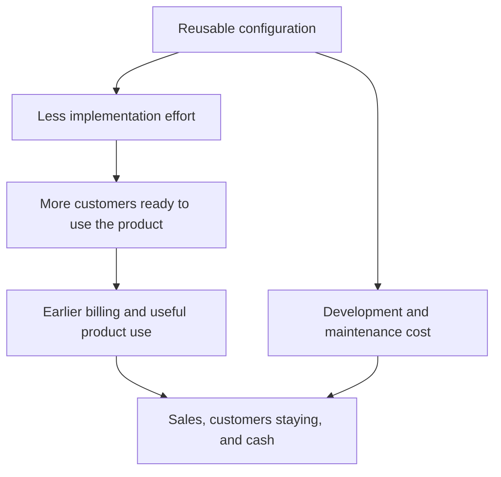

{id: roadmap-to-revenue}
# 12. The Chain From Roadmap to Revenue Breaks Easily

> **IN THIS SECTION, YOU WILL:** Learn to trace a product change from customer need through customer behavior to a business result, and let the measured result revise the next commitment.

> **WHY INVESTORS CARE:** An investor puts money into a company and expects a financial result in return. They judge the result at the end of the chain, not the feature at the start. Staff time freed by a product change can count in their calculations before it changes spending, but only with a plan that says what the time will be used for, and by when. A proposal that stops at freed hours gives them nothing to use when they estimate what the company is worth, or check whether its cash will cover its loan payments.

> **WHY YOU SHOULD CARE:** A technology benefit reaches the company’s financial plan, its expected income and spending, through a mechanism: more sales income, a payment avoided, staff time released for other work, or a lower risk. The mechanism needs evidence. The link from freed effort to a financial result is the one to test hardest.

> **KEY POINTS:**
>
> * Start from a **customer need worth serving**. A faster process is only worth building when customers are waiting for what it produces. If an investor expects something from it, write that expectation down.
> * Distinguish **freed time from money saved**. If the same people are still paid, less effort frees time for other work but does not reduce spending. It becomes a result only when a plan puts the time to use.
> * Check the **whole chain against evidence**. Count the full cost, both what has been agreed and what has been used so far. Compare like groups. Keep measured hours apart from yearly estimates, name the explanations you can’t rule out, and let the measured result change the next commitment.

A product team proposes making customer setup faster. That sounds useful, but what is the benefit? Customers might start using the product sooner. Staff might serve more customers. The company might collect payment earlier. Each possibility needs a different piece of evidence.

A **product roadmap** sets out intended product changes and priorities. A roadmap item describes work. Its **business case** explains the useful result expected from that work, what it will cost and how uncertain it is. This chapter follows one item from the proposed change to its measured effect, and ends with what the measurement changed.

A product leader normally has to show that a change is useful. An investor, someone who has put money into the company in return for a share of it, may expect more: that the change supports a particular financial target. Four plain terms describe such targets:

- **Revenue** is the income a company earns from selling its product. It is recorded when it is earned, which can be before the customer pays.
- **Profit** is what is left of revenue after the costs of the same period.
- **Margin** is a stated profit measure divided by revenue. A profit of €20 on revenue of €100 is a 20% margin.
- **Retention** means keeping customers, or their revenue, over a stated period.

The investor’s target might be faster revenue growth, a higher margin or better retention. Make that expectation explicit, then test whether the benefit and its timing are credible. The chain from work to result is the part an investor’s adviser will examine, so it is the part the proposal must demonstrate rather than assume.

**The example.** Larkspur is a fictional company selling scheduling software. **Onboarding** is the setup and help a customer needs before using that software successfully. One customer’s setup is called an **implementation**. [You Cannot Fund Every Good Project at Once](#cannot-fund-everything) chose a smaller setup change over a full customer portal because customer evidence supported it. Here we look at that one change: how could it produce a useful customer and business result, and did it?

**The people.** Priya leads product and is accountable for the setup change. Alex leads engineering. Sam leads finance. Morgan advises the investor on technology. The **board**, the directors who oversee the company’s major decisions, approves the money. Days are counted from **day zero**, the board meeting, held when the investment was completed, that adopted the company’s operating plan.

**Two kinds of work.** Engineers build the setup change; their effort is counted in **engineer-weeks**, one engineer’s work for one week. The implementation team sets customers up; its effort is counted in staff hours per customer. The two are different people and different budgets, so the chapter keeps them apart.

{id: roadmap-to-revenue--start-with-a-need-worth-serving}
## Start With a Need Worth Serving

A company can efficiently build features customers don’t need. It can cut the cost of its servers for a product whose market is shrinking. It can release software faster while its sales team promises custom work the product can’t support. **Product strategy** is the choice of which customer needs the product will serve. It decides where effort should go, so the need comes before the arithmetic.

Begin with the customers the company intends to serve, and the groups with shared needs among them, called **segments**. What progress are they paying for? Why do they choose this product? Which needs remain poorly served? Which requests look attractive individually but undermine a repeatable product?

At Larkspur the need is a queue. Customers who have already bought are waiting for setup. Most of them need the same implementation specialist to enter their settings by hand before they can use the product. The investor’s growth funding assumes the number of new customers will rise without a matching rise in implementation staff. So the setup change serves customers who exist now and a target the investor has stated. That is the expectation to make explicit: more customers set up, less staff effort per customer, within the plan’s first year.

When owners press for results, product management can turn into a desk that takes orders: from the investor, from sales, from a business the company has just bought. The remedy isn’t to reject those voices. It is to apply the same customer and economic test to each.

An introduction from an investor is a potential customer to test, not a product strategy. Suppose the investor introduces three potential customers. Priya tests the same things she would examine with anyone else: is there an unmet need, and will they pay to have it met? Building three unrelated demonstrations could impress the investor while producing little evidence of a product that can be sold repeatedly.

If the investor wants a different priority, **make the displaced work** and the proposed commercial benefit explicit. A requested feature should carry a testable expectation about who will buy it and what it will earn, not just the name of the person who asked for it.

**DORA** (DevOps Research and Assessment), a research program studying how organizations build and run software and how well they perform, emphasizes user focus and stable priorities in its 2024 report. Its survey-based relationships give useful direction, but they don’t establish the monetary value of a specific company’s roadmap. [S15: DORA 2024 report](https://dora.dev/research/2024/dora-report/)

{id: roadmap-to-revenue--follow-the-steps-from-change-to-outcome}
## Follow the Steps From Change to Outcome

An **investment thesis** is the investor’s explanation of why the investment should succeed. It is a prediction that can be revised, not an instruction, and it identifies which result matters most. A thesis built on growth needs evidence that the product can win and serve more customers at acceptable cost. A thesis built on existing profit needs evidence that the profit survives once the company pays to maintain the product and puts money back into developing it ([A Valuation Is an Estimate, Not a Fact](#valuation-is-an-estimate)). Both depend on a product that works.

**Reusable configuration** means settings and setup steps that can serve several customers, reducing the custom work each time. A **hypothesis** is an expectation stated so that it can be tested. Here the hypothesis is that one reusable setup step will shorten implementation, reduce effort and let more customers start useful work.

The proposed chain runs like this. Reusable configuration should mean less implementation effort. Less effort should mean more customers ready to use the product, then earlier billing and useful product use, and in the end more sales, more customers staying and more cash. The same change also brings a development and maintenance cost, which takes away from that final result. The diagram shows the same chain:

Each arrow is a hypothesis. Faster implementation may not increase sales if few people want to buy. **Billing**, sending the customer an invoice, may start earlier without keeping customers who don’t receive value. Reduced effort may free staff time without reducing the money the company spends. The new setup step will itself need upkeep, and that cost absorbs part of the benefit.

**Read each arrow as a question to test.** If staff effort per customer setup falls but customers wait just as long, find out what else is keeping them waiting. The last section of this chapter is that case.

{id: roadmap-to-revenue--six-kinds-of-benefit-to-examine}
## Six Kinds of Benefit to Examine

A product change can help the business in six different ways. The table uses revenue, margin and retention as defined at the start of the chapter, and needs two more terms. **Cash** is money actually received or paid, which is not the same as revenue: a customer can be invoiced in March and pay in May. **Financial contribution** is the revenue from an activity less the costs included in serving it. Say which costs are included, because this isn’t necessarily the company’s final profit. (Later in the chapter, “helped produce” or “contributed to” describes a claim about cause; the two uses are kept apart.)

| Kind of benefit | Example change | Evidence to seek |
| --- | --- | --- |
| Revenue growth | Remove a product limit that stops an attractive group of customers from buying | Potential customers the change can help, actual purchases, use of the product and the additional financial contribution |
| Retention | Improve a task that customers who leave often struggled with | Contract renewals in comparable customer groups, reasons for leaving and whether customers got the result they wanted |
| Margin | Reduce the staff effort needed to set up or support each customer | Hours per customer, quality, and the full cost of those hours, including employment costs |
| Cash received sooner | Shorten the time from a signed contract to a customer who is using the product and can be invoiced | When invoices can be sent, invoices still unpaid and cash actually received |
| Lower risk | Make sure a critical service can be restored after a failure | Restore tests actually run, the failures the company has planned for and how long recovery really took |
| More future choices | Separate the part of the product that would have to change for a new country | The new choices this opens, what each would cost to use and how long it would take |

These benefits overlap, but **their financial effects should not simply be added**. Earlier billing can bring cash in sooner, but only if the customer’s payment also moves earlier. A customer invoiced in March instead of April who pays in May either way has paid no sooner, which is why the table asks for cash actually received. Even when the payment does move, the customer pays the same total over the contract. A customer who stays may already be counted in the forecast of future revenue. When one company buys another, the same saving can be counted twice: once as a lower cost and again inside the bought company’s reported profit. Count it once.

{id: roadmap-to-revenue--the-arithmetic-worked-through}
## The Arithmetic, Worked Through

This is a **separate, smaller pilot example**. A **pilot** is a limited trial run before a wider commitment. We are testing the benefit of one reusable setup step, not costing the €1 million onboarding program in [Confirm the Cash Before You Commit](#obligations-before-budget).

**The assumptions.** Larkspur performs 100 customer implementations a year. That is a round planning assumption for this model, not Larkspur’s measured workload; the measured records used later cover twelve implementations in two quarters. Each implementation uses 80 hours of Larkspur staff time. The hours count everyone’s work on that customer’s setup, not only the specialist’s. The specialist’s manual configuration is only part of them, but it is the part that holds the queue, because only one person can do it.

**The price of an hour.** The model uses a **fully loaded planning cost** of €75 per hour: pay plus the other costs of employing someone. At 2,000 working hours a year, that prices one full-time implementation specialist at €150,000 a year and two at €300,000. This book uses the same basis wherever it costs the pilot, the hires it defers and the time it releases.

**The sum.** One hundred implementations at 80 hours is 8,000 hours, worth €600,000 a year at the planning rate. On this basis that is the work of four full-time people. It is a model of total team effort, not a count of Larkspur’s staff. The proposal assumes the step reduces effort to 50 hours, which brings the requirement down to €375,000. The difference is 3,000 hours, or €225,000.

That figure is an estimate of **capacity**: staff time available for work. It is not cash. If the same staff are employed and the same suppliers are paid, Larkspur has not spent €225,000 less. The company could use the time to serve more customers, reduce overtime, improve quality or, eventually, avoid hiring. Each of these has a different financial meaning.

The pilot has costs of its own. Building it is a commitment of €180,000 and twelve engineer-weeks. Maintaining it costs €30,000 a year, starting in the **financial year**, the company’s twelve-month accounting period, after it ships. Reporting €225,000 of yearly profit without showing those costs, and without showing whether the freed time produced anything, would mislead. So would dismissing the work because the **payroll**, the money paid to employees, didn’t immediately fall. Serving more paying customers can be the more valuable use of the freed time.

A usable proposal therefore includes a **conversion plan**: how the released time will produce a customer or business benefit, and by when. Each person checks one part:

- Priya checks whether customers are waiting who can use the improved setup.
- Alex establishes which work the 3,000 hours could actually support.
- Sam tests when money would reach the **cash forecast**, the dated projection of money coming in and going out: either more money received from customers or a supplier payment avoided.

The plan names three possible conversions, and the review has to say which one happened. The released time serves waiting customers. Or it avoids a supplier’s invoice or a hire. Or it stays unused, because something else is holding customers up. The step that limits how fast the whole process can go is called the **bottleneck**.

**Figure 1:** *Time saved becomes useful capacity through a plan; it does not automatically reduce the payroll bill.*

{id: roadmap-to-revenue--check-whether-the-change-explains-the-result}
## Check Whether the Change Explains the Result

A **baseline** records the starting situation used for comparison. Establish it before implementation when you can. Define which customers are included, the time period, exclusions and how costs are calculated. A **cohort** is a defined group tracked over time, such as customers starting in the same quarter. Keep raw counts alongside percentages. Overall retention can rise because the company has more customers from a segment that already renews reliably, even if retention within each segment is unchanged. Compare like groups so a change in customer mix isn’t mistaken for a product improvement.

Where practical, introduce the change to one group of customers first and compare them with a similar group that hasn’t received it yet. Where that isn’t possible, document the timing and the competing explanations. A **counterfactual** is an estimate of what would have happened without the change; finance can check the calculation, but it can’t supply a missing comparison by reviewing the numbers.

Larkspur’s pilot is the realistic small-company case. The comparison is eight pilot customers against the twelve implementations from the two quarters (six months) before, in one country. The baseline of 80 hours was reconstructed at day 20 from the specialist’s time records; it was not measured in advance for all twelve.

That comparison leaves differences that “comparable customers” does not remove:

- The sales team chose which new customers went through the pilot first, so their data may have been cleaner or their contracts smaller.
- The same specialist served both groups and may simply have become faster with repetition.
- The earlier group included a rush at the end of a quarter.

None of this makes the result useless. It means the honest claim is “the setup step plausibly helped produce the reduction, with these measurements and these unresolved differences”. It is not a precise claim that the product change alone caused it. Interviews can explain how the change helped; an enthusiastic testimonial is not a financial calculation.

**Figure 2:** *An observed improvement needs a comparison that can reveal other explanations.*

{id: roadmap-to-revenue--protect-the-product-you-have-not-built-yet}
## Protect the Product You Have Not Built Yet

A margin improvement that depends on postponing necessary maintenance carries a future bill. A retention result that relies on customers being unable to leave can be fragile. A faster release process that makes the product less reliable moves costs onto users and support teams.

For each major change, choose a few measures that could reveal damage. This chapter calls them **guardrail indicators**. For onboarding, they are customers giving up during setup, error rates, requests for help and the time until the customer first gets something useful from the product. The indicators should follow the way the change is meant to work, not a universal template. Useful benefits include service continuity and reduced exposure to harm as well as growth and savings.

{id: roadmap-to-revenue--what-the-pilot-showed-and-what-changed}
## What the Pilot Showed, and What Changed

The same pilot is the funded first-hundred-days commitment ONB-1 in [The First Hundred Days: Turn Expectations Into a Funded Plan](#first-hundred-days). Priya measured the first cohort at day 90; the board decided at its day-100 review. All figures are fictional.

**Observed.** The cohort was eight customers. Average effort per implementation fell from 80 hours to 62, not to the 50 the proposal assumed. About 40% of the remaining hours traced to poor customer data rather than to the product, which partly supports Alex’s explanation of where the effort goes. The guardrail indicators did not move: error rates and requests for help were not up.

**Customer waiting time was unchanged.** Waiting time runs from the day the customer signs the contract to the day the customer first schedules real work in the product. This chapter reports it as the **median** wait: line a group’s customers up from the shortest wait to the longest, and the median is the wait of the customer in the middle. With an even number of customers it is halfway between the two in the middle. The median was about ten weeks in the earlier group and about ten weeks in the pilot group.

**Observed versus projected.** Eight customers at 18 hours less each is 144 hours released in the cohort, about €10,800 at the planning rate. The 1,800 hours and €135,000 a year quoted for the pilot (100 × 18 × €75) are a **projection**. It assumes 100 comparable implementations in a year, which is the model’s planning assumption. The caveats from the comparison travel with it: sales chose the pilot customers, the same specialist served both groups and may have grown faster with practice, and the baseline was reconstructed from time records. The evidence supports a promising association between the setup step and the reduction. It does not isolate the step as the cause, and a projection built on it inherits the same limits.

Against the conversion plan:

- **Serving waiting customers:** no. The team spent 18 fewer hours on each setup, but customers still waited for their own data to be ready, so the queue moved no faster. The bottleneck is somewhere else.
- **Avoiding a supplier’s invoice or a hire:** not yet. No contract spending had been cancelled by day 100. Larkspur has engaged a contract implementation specialist, an outside person who works through the queue for twelve months while the step is built and proved. The saving the plan puts a date on is not extending that contract after month twelve, and only if the queue is moving by then. At day 100 it wasn’t, so the specialist was still needed. Ending the work earlier would not by itself avoid a payment: that depends on the contract’s notice and payment terms, which this scenario does not set. The hire of two specialists was already deferred, which is spending avoided, not spending reduced.

**Where the contract specialist’s cost sits.** The contract specialist is an extra person who works alongside Larkspur’s own implementation specialist. The twelve months cost €150,000, one full-time year at the planning rate. The figure is imported from [Match the Funding to the Work](#raise-what-you-need), which prices the same engagement inside its own, separate financing example. Here the engagement was agreed before day zero and is paid from the **operating budget**, the money for the company’s ordinary running costs. It is not part of the pilot’s €180,000 and takes nothing from the board’s first-hundred-days money described below. So the costs quoted for the pilot leave it out.

That does not tip the day-100 choice, because the engagement runs to month twelve under every option the board weighed. It matters afterwards: extending it would cost a further €150,000 a year, and not extending it is the first real reduction in spending the pilot could produce.

**Cash and commitments at day 100.** Four things need keeping apart:

- **Committed** spending is what the company has agreed to spend: €180,000 for the pilot.
- **Incurred** cost is the part for which work or services have already been received: about €90,000 by day 100, for ten days of advice from a specialist the investor introduced, tooling and services, and contractor time on the setup templates. None of it is the contract implementation specialist, whose cost sits in the operating budget. Incurred does not mean paid. A supplier’s invoice can arrive in one month and be paid in the next, and this scenario does not give the payment dates for that €90,000.
- **Still to come** is the other €90,000. It falls due over the next two quarters, for the reusable setup templates that serve less common types of customer. Maintenance of €30,000 a year is also committed, from the next financial year, and is paid from the operating budget. None of it had been incurred by day 90.
- **Cash benefit** is money received or kept because of the change. There is none yet. The cash forecast carries the pilot’s payments, but no benefit from the released time, because that time has not been converted.

**The rule.** The board decided at day 100, on Priya’s proposal as the accountable leader. It followed the rule set when the pilot was funded, which looks at the cohort’s average hours per setup:

- **Under 60 hours** supports requesting the second stage, the next priced piece of onboarding work, which would still need its own approval, and bringing the expansion decision forward at the next review.
- **From 60 to 70 hours** funds the data-quality step and keeps expansion and hiring deferred.
- **Above 70 hours, or no reduction,** reopens hiring, a narrower target, or the financing conversation: how the work is paid for ([Match the Funding to the Work](#raise-what-you-need)).

Sixty-two hours is the middle band.

**Chosen.** Fund a data-quality step: checking and correcting each customer’s data before setup begins. It costs €40,000 and four engineer-weeks, drawn from the **reserve**. The reserve is the part of the board’s **envelope** that was held back for later decisions. The envelope is the overall limit the board set at day zero for the first hundred days: €500,000 of additional cash and 24 engineer-weeks ([You Cannot Fund Every Good Project at Once](#cannot-fund-everything)). Before this decision the reserve held €200,000 and four engineer-weeks, so the step uses the last engineer-weeks available.

**Who pays for what.** Each cost in this example has one budget, and none is counted twice:

| Cost | Amount | Paid from |
| --- | ---: | --- |
| Building the setup step (the pilot) | €180,000 | The board’s envelope, in the plan approved at day zero |
| Data-quality step | €40,000 | The envelope’s reserve, approved at day 100 |
| Upkeep of the setup step, from the next financial year | €30,000 a year | Operating budget |
| Contract implementation specialist, months 1 to 12 | €150,000 | Operating budget, agreed before day zero; not a pilot cost |

The reserve still reconciles: €200,000 before this decision and €160,000 after it. The contract specialist touches neither figure.

The case for the step looks forward. The €90,000 already incurred cannot be recovered and argues neither way. What argues for the step is that the measurement points at one specific remaining bottleneck: about 40% of the remaining hours and the unchanged waiting time both sit with customer data. The test is also small beside the alternatives on the table. Two hires cost €300,000 a year, every year. The full customer portal costs €220,000 and twelve engineer-weeks, which the envelope no longer has.

**The threshold for continuing.** A second cohort is set up after the data-quality step and measured at about month six. It must pass two tests:

- **Effort:** an average of 50 hours or less per setup. The hours are counted end to end, and they count whoever works them. They include all time spent checking and correcting customer data, before or during setup: by Larkspur’s staff, by the contract specialist, or by bought-in help.
- **Waiting time:** a median wait of eight weeks or less, against about ten weeks now. It is the same measure as the ten weeks above. The board uses the median, not the average, because in a group of eight one very slow customer would drag an average a long way. Two weeks is the smallest improvement the board judged worth a further stage.

**Bought-in work.** In [Match the Funding to the Work](#raise-what-you-need) the €40,000 buys an outside data-checking service and temporary data-entry help. Paying someone else to do the same work buys capacity; it does not reduce effort. So the helpers’ hours go into the 50: fifty staff hours plus 20 bought-in hours per customer is 70, and fails. Checking that the service does by machine has no hours, so it is counted as money. Priya reports what keeping the service and any help would cost per customer and per year. A request for a further stage must carry that cost, beside the €30,000 of upkeep.

**Who is in the group.** The second cohort is the first eight customers whose setup starts after the data-quality step is in service, taken in the order they signed. Nobody is removed later. A customer who has not finished by the review stays in the count at the hours and weeks reached so far, and both can only grow. If the unfinished customers could still change either result, the board waits for them. It does not decide on the customers who happened to finish first.

Both tests must be met. Fifty hours with a median wait of nine weeks fails. So does a result that reaches 50 hours only by leaving data work uncounted, or by moving it to a supplier. Passing does not approve the next stage; it allows Priya to request it, with its full cost. If the cohort fails, the board approves no further stage. Commitments already made are handled separately: whatever remains of the pilot’s €90,000 is still owed. Hiring, narrowing the first-year target to customers with standard data, or reopening the financing conversation come back onto the table.

The rest of the decision record:

- **Rejected:** hiring two implementation specialists now, €300,000 a year on the cost basis above, against a benefit that has not yet converted. Also rejected: stopping the pilot, which would give up an observed 18-hour reduction whose shortfall has a specific explanation that €40,000 can test. The money already spent is not the reason to continue.
- **Deferred with a date:** the decision on expanding to a second country moves to the next quarterly review, around day 190. The condition is that the next cohort’s effort split and waiting time support 1.5 times the volume with the same team. The expansion itself starts no earlier than month 13.
- **Funding and scarce capacity:** after this draw the reserve keeps €160,000 of cash and no uncommitted engineer-weeks. The other scarce resource is the implementation specialist’s time for the next cohort.
- **Evidence that would change it:** the second cohort’s hours and waiting time against the two tests. If the data-quality step does not move waiting time, Morgan’s structural explanation gains weight: that a process depending on one specialist cannot keep up as sales grow.

That is the chain breaking in the ordinary way. The link from setup step to effort held as far as the comparison can show: the reduction can’t be credited to the product change alone, but the evidence supports it. The link from released effort to customers served did not hold. The measurement did its job, because it changed the next commitment instead of decorating the last one. The [Practical Tools for Ownership and Technology Decisions](#toolkit)’s outcome and contribution ledger (Tool 6) is where the baseline, the committed and incurred cost, the observed result, the projection and the open work are recorded so the next review starts from them.

The pilot’s result raises the next constraint. The remaining hours sit with customer data and with one specialist’s knowledge, and the plan still assumes onboarding volume grows. Whether the software and the team can deliver repeatable setup at that volume is the question of [Can the Software and the Team Deliver What Was Promised?](#can-the-team-deliver); the organizational response, [Headcount Is Not Capacity: Trace the Work Before You Hire](#fix-decisions-before-hiring), now follows it directly in Part III.

{id: roadmap-to-revenue--questions-to-consider}
## Questions to Consider

1. *For your most important roadmap item, which customer need does it serve now, and what target has the investor stated that it is expected to support?*
2. *When your team saves effort, what is the conversion plan, and at the last review could you say which conversion actually happened: customers served, spending avoided or capacity absorbed by another bottleneck?*
3. *For the last improvement you reported, what comparison did you use, and which differences between the groups remain unresolved?*
4. *What constraint did the last measured result reveal next, and has the next commitment changed because of it?*

{id: roadmap-to-revenue--to-probe-further}
## To Probe Further

- **[Escaping the Build Trap](https://melissaperri.com/book)** — Melissa Perri, O'Reilly, 2018.  
  *A case for judging product work by outcomes rather than shipped features, which is the chain this chapter asks you to draw for one roadmap item.*
- **[Product vs Feature Teams](https://www.svpg.com/product-vs-feature-teams/)** — Marty Cagan, Silicon Valley Product Group, 2019.  
  *Names the failure mode this chapter warns about, where product management becomes an intake process for whoever asks loudest instead of a team handed outcomes.*
- **[Impact Mapping: Making a Big Impact with Software Products and Projects](https://www.impactmapping.org/book.html)** — Gojko Adzic, 2012.  
  *A drawing technique for the goal-to-deliverable chain that gives you a practical way to write down the arrows in this chapter's onboarding example before work starts.*
- **[Trustworthy Online Controlled Experiments: A Practical Guide to A/B Testing](https://www.cambridge.org/core/books/trustworthy-online-controlled-experiments/D97B26382EB0EB2DC2019A7A7B518F59)** — Ron Kohavi, Diane Tang and Ya Xu, Cambridge University Press, 2020.  
  *A thorough treatment of the comparison this chapter recommends. An A/B test gives version A to one randomly chosen group and version B to another, then compares the results. Many of its examples come from large online services. Check whether your customer sample is large enough for the method rather than copying their testing setup: with eight customers, a controlled experiment can detect only a very large effect.*
- **[The Magenta Book](https://www.gov.uk/government/publications/the-magenta-book)** — HM Treasury (the UK government’s finance ministry), 2020 edition with later updates.  
  *Annex A works through methods for estimating the counterfactual when assigning customers at random is impractical. One is difference-in-differences: compare the before-and-after change in the group that received the change with the change in a group that did not. It still needs a comparison group, and it assumes the two groups were following similar trends beforehand.*
